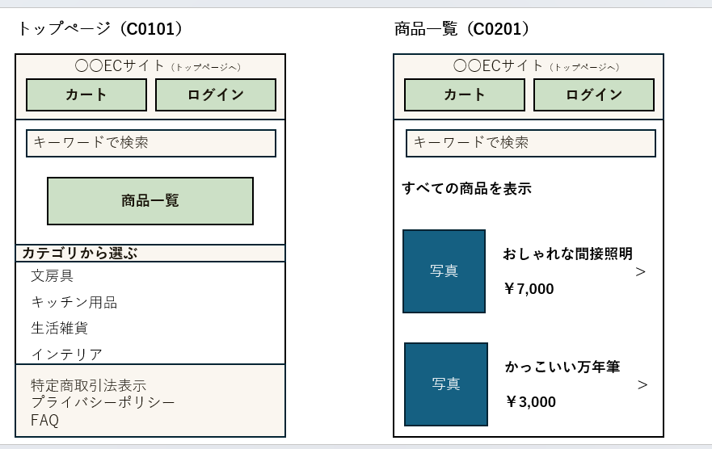

## 4 画面設計
本章では、想定している主要画面のレイアウトや画面間の遷移など、UI設計の概要を示す。

### 4.1. 画面一覧

- **C0101: トップページ**
  - アクセス時最初に表示されるメイン画面。
  - カート、ログイン、商品一覧、特定商取引法表示、プライバシーポリシー、FAQなど各ページにアクセス可能。
  - 商品のキーワード検索やカテゴリから選ぶこともできる。

- **C0201: 商品一覧**
  - 商品の画像、商品名、価格（基本情報）が表示される。
  - キーワード検索も可能。

- **C0202: 商品詳細**
  - 商品一覧から選択した商品について、一覧での情報に加えて詳細情報（素材、サイズなど）を確認できる。
  - カートに追加することができる。

- **C0301: カート**
  - カートに追加された商品の基本情報、数量、合計金額が表示される。
  - 購入手続きに進むことができる。

- **C0401: 注文情報入力**
  - 注文商品の商品名、数量、価格、送料、合計金額を確認。
  - お届け先情報（氏名、郵便番号、住所、電話番号、メールアドレス）を入力する。
  - 会員としてログインしている場合は自動入力される。
  - 支払方法を選択する。
  
- **C0402: 注文確認**
  - 入力した注文情報を確認し、注文を確定する。
  
- **C0403: 注文完了**
  - 注文完了の旨と注文番号を表示。

- **C0501: 会員登録**
  - 会員情報としてメールアドレス、パスワード（確認のため２回）、氏名、郵便番号、住所、電話番号、メールアドレスを入力する。
  - 会員情報を変更したいときは、現在の情報が自動入力され、編集して再登録することで更新できる。
   
- **C0601: ログイン**
  - 登録済みのメールアドレス、パスワードを入力してログインする。
  - 新規登録の場合は会員登録画面へ。
  
- **C0603: マイページ**
  - 会員がログイン状態でできる操作を選択する。
  - 注文履歴の確認、登録情報の確認・変更、ログアウトができる。

 - **C0604: 注文履歴**
  - 注文日、注文番号、配達状況、購入した商品の基本情報と数量を確認できる。
   
- **C0605: 購入前ログイン**
  - 非ログイン状態で購入手続きに進んだ際に表示され、ログインして購入、会員登録して購入、会員登録しないで購入から選択できる。

- **C0701: 特定商取引法表示**
  - 特定商取引法に関する表示。

- **C0801: プライバシーポリシー**
  - プライバシーポリシーを表示。

- **C0901: FAQ**
  - よくある質問とその回答を表示。

- **C1001: 共通エラー画面**
  - エラーが発生した旨と対処方、トップページに戻ることができる。

### 4.2. 画面遷移図

以下に、主要な画面遷移を示す。
顧客画面はスマートフォン、管理者画面はPCでの使用機会が多いことを想定して作成しているが、どちらでも問題なく表示できるようにする。

- 顧客画面

graph TD
    A[C0101: トップページ]  --> B(C0601: ログイン);
    A --> C(C0201: 商品一覧);
    A --> D(C0701: 特定商取引法表示)
    A --> E(C0801: プライバシーポリシー)
    A --> F(C0901: FAQ)

   
    
    H --> G
    B -- 既存会員 --> G(C0603:マイページ)
    B -- 新規会員 --> H(C0501:会員登録)
  
    

    G --> I(C0604:注文履歴)
    G -- 登録情報の確認・変更 --> H

    C --> J(C0202:商品詳細)
    J --> K(C0301:カート)
    K -- 買い物を続ける --> C
    K -- ログアウト状態 --> P(C0605:購入前ログイン)

   
    K -- ログイン状態 --> L
    L --> M(C0402:注文確認)
    M --> N[C0403:注文完了]

    P -- 新規登録 -->H
    H -.->L
     P -- ログイン --> L(C0401:注文情報入力)
     P -- ログインせずに購入 --> L

    dummy[ ] --エラー発生 --> O(C1001:共通エラー画面)

    style dummy fill:#fff,stroke:#fff,stroke-width:1px
     style A fill:#e0f7fa,stroke:#0097a7
    style D fill:#e0f7fa,stroke:#0097a7
    style E fill:#e0f7fa,stroke:#0097a7
    style F fill:#e0f7fa,stroke:#

    style B fill:#e8f5e9,stroke:#2e7d32
    style G fill:#e8f5e9,stroke:#2e7d32
    style H fill:#e8f5e9,stroke:#2e7d32
    style I fill:#e8f5e9,stroke:#2e7d32

    style C fill:#fff3e0,stroke:#ef6c00
    style J fill:#fff3e0,stroke:#ef6c00

    style K fill:#ede7f6,stroke:#5e35b1
    style L fill:#ede7f6,stroke:#5e35b1
    style M fill:#ede7f6,stroke:#5e35b1
    style N fill:#ede7f6,stroke:#5e35b1
    style P fill:#ede7f6,stroke:#5e35b1
    style O fill:#d3d3d3,stroke:#808080

- どの画面からでもトップページ(C0101)に戻ることができる。
- 何かしらのエラーが発生場合は共通エラー画面(C1001)に遷移する。

### 4.3. UI/UX基本方針

- **デザインの方向性**: 「丁寧な暮らし」を好む層に向けて、シンプルで余白のある画面、落ち着いた色味にする。
- **操作性**: 直感的に操作できるよう、画面構成や操作手順はシンプルにする。
- **一貫性**: ボタンの配置、ラベルの命名規則、エラーメッセージの表示形式などをシステム全体で統一する。
- **視認性**: 文字サイズや色使いに配慮し、情報が読みやすく、重要な情報が目立つようにする。
- **フィードバック**: ユーザーの操作に対して、処理中であることや処理結果（成功、エラー）を明確に表示する。
- **レスポンシブ**: スマートフォン、PCブラウザのどちらで表示しても画面レイアウトが崩れないよう配慮を行う。

### 4.4. 主要画面のワイヤーフレーム

ここでは主要画面のワイヤーフレーム（骨組み）を簡易的に示す。

#### 4.4.1. 顧客向け画面ワイヤーフレーム

トップページ(C0101)
- **○○ECサイト**:トップページに遷移
-  **カート**: カート画面に遷移
-  **ログイン**:ログイン画面に遷移 
-  **検索**:キーワードで商品を部分一致検索
-  **商品一覧**:商品一覧画面に遷移
-  **カテゴリから選ぶ**:カテゴリごとに絞り込みされた商品一覧を表示  
-  **特定商取引法表示**:特定商取引法に関する表示
-  **プライバシーポリシー**:プライバシーポリシーを表示
-  **FAQ**:よくある質問と回答を表示 
    
商品一覧(C0201)
- **○○ECサイト**:トップページに遷移
-  **カート**: カート画面に遷移
-  **ログイン**:ログイン画面に遷移 
-  **検索**:キーワードで商品を部分一致検索
- **状態**:現在の絞り込み状態を表示 
-  **商品の基本情報**:画像、商品名、価格を表示。クリックすると商品詳細を表示
  
 
 ### 4.5. 主要画面項目定義

ワイヤーフレームで定義した要素について、補足情報や入力形式などを記述します。ここではトップページ画面の例を記載。
- **画面ID**: C0101
- **画面名**: トップページ
- **表示項目・入力項目**:
  - **○○ECサイト**
    - **要素**:ボタン
    - **動作**:トップページ(C0101)に遷移
  -  **カート**
     - **要素**:ボタン
      - **動作**:カート(C0301)に遷移
  -  **ログイン** 
     -  **要素**:ボタン
       - **動作**:ログイン(C0601)に遷移
  -  **検索**
        - **要素**: テキスト入力ボックス
        - **入力形式**: 文字列
        - **桁数**: 最大50文字
        - **補足**: 備品名に対する部分一致検索を行う
  -  **商品一覧**
      - **要素**:ボタン
       - **動作**:商品一覧(C0201)に遷移
  -  **カテゴリから選ぶ**
      - **要素**:ボタン
      - **補足**:カテゴリごとに絞り込みされた商品一覧を表示  
       - **動作**:商品一覧(C0201)（絞り込み後）に遷移
  -  **特定商取引法表示**
       -  **要素**:ボタン
       - **動作**:特定商取引法表示(C0701)画面に遷移
  -  **プライバシーポリシー**
        -  **要素**:ボタン
       - **動作**:プライバシーポリシー(C0801)に遷移
  -  **FAQ**
       -  **要素**:ボタン
       - **動作**:FAQ(C0901)に遷移