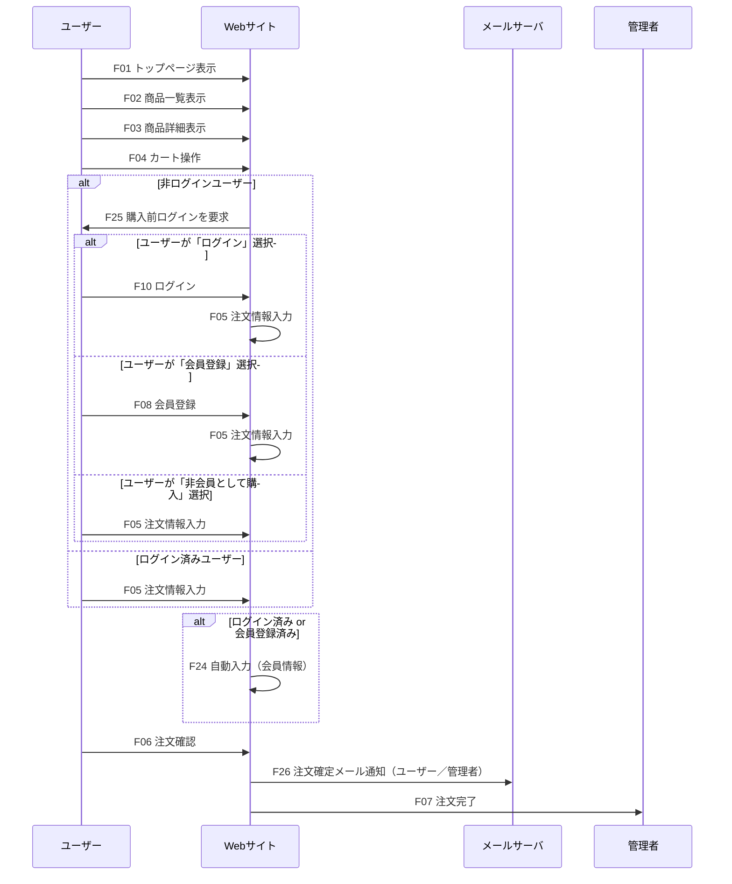
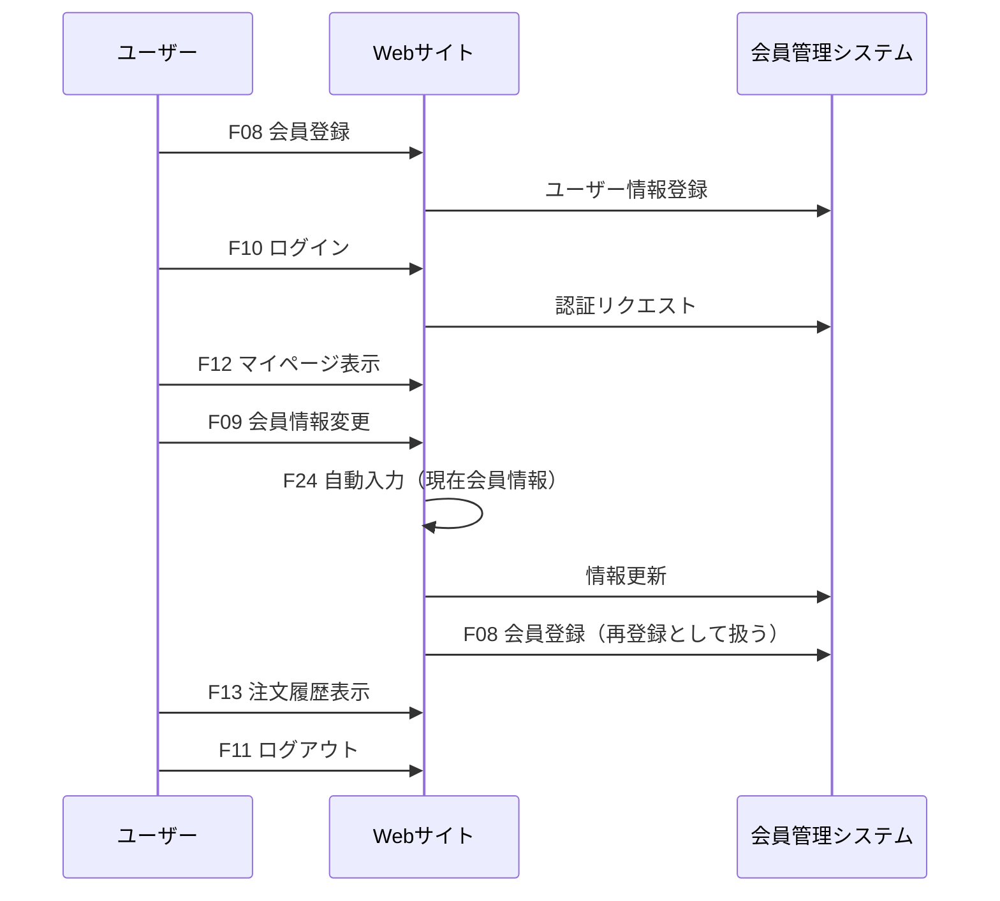
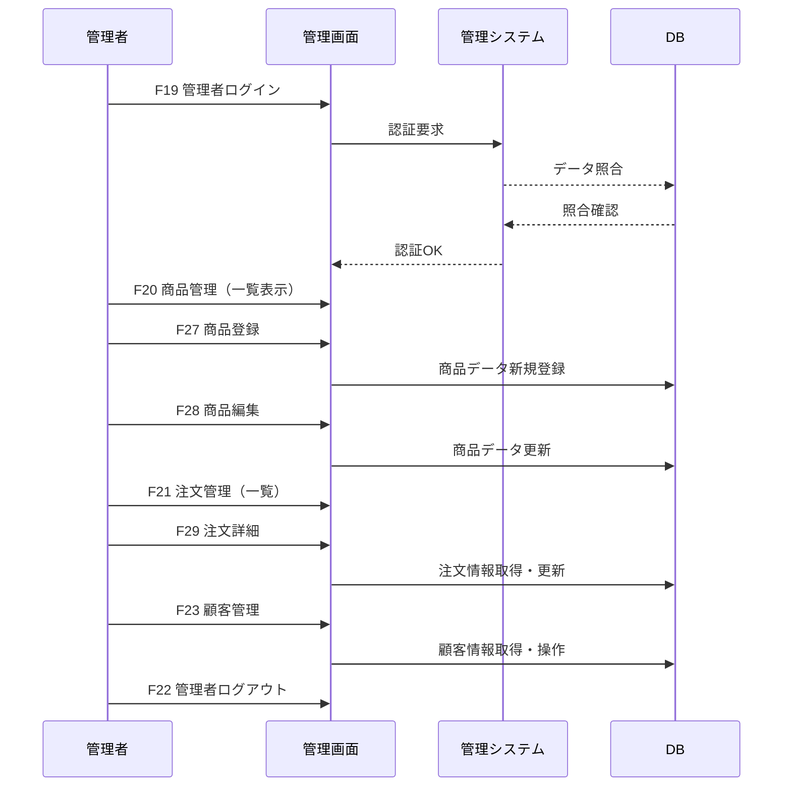

=======
## 3. 機能設計
## 3.1 機能一覧（ID付）

| 機能ID | 機能名                       | 対応画面ID         | 機能概要                                           |
|---------|------------------------------|---------------------|----------------------------------------------------|
| F01     | トップページ表示             | C01                 | サイトのトップページを表示する                   |
| F02     | 商品一覧表示                 | C02                 | 商品の一覧情報を表示する                         |
| F03     | 商品詳細表示                 | C03                 | 選択した商品の詳細情報を表示する                 |
| F04     | カート操作                   | C04                 | カート内商品の確認・編集                         |
| F05     | 注文情報入力                 | C05                 | 配送先や支払い方法の入力画面                     |
| F06     | 注文確認                     | C06                 | 入力内容の最終確認画面                           |
| F07     | 注文完了                     | C07                 | 注文完了メッセージ表示                           |
| F08     | 会員登録                     | C08                 | 新規会員登録機能（会員情報入力）                 |
| F09     | 会員情報変更                 | C11                 | 会員情報の変更機能                               |
| F10     | ログイン                     | C09                 | 顧客ログイン機能                                 |
| F11     | ログアウト                   | -                   | 顧客ログアウト機能                               |
| F12     | マイページ表示               | C10                 | 会員情報や登録情報の表示                         |
| F13     | 注文履歴表示                 | C12                 | 過去の注文履歴を表示                             |
| F14     | 特定商取引法表示             | C13                 | 特商法に基づく表記の表示                         |
| F15     | プライバシーポリシー表示     | C14                 | プライバシーポリシーの表示                       |
| F16     | FAQ表示                      | C15                 | よくある質問の表示                               |
| F17     | 共通エラーページ表示         | C16                 | 404・サーバーエラー時の表示                      |
| F19     | 管理者ログイン               | A01                 | 管理者のログイン機能                             |
| F20     | 商品管理（一覧）             | A02                 | 商品情報の一覧表示                               |
| F21     | 注文管理（一覧）             | A05                 | 注文情報の一覧表示                               |
| F22     | 管理者ログアウト             | -                   | 管理者のログアウト機能                           |
| F23     | 顧客管理                     | A08                 | 顧客情報の一覧・編集機能                         |
| F24     | 自動入力                     | -                   | 会員情報の自動入力                               |
| F25     | 購入前ログイン               | C09                 | ログイン、新規登録、ゲストで購入を選択           |
| F26     | 注文確定メール通知（銀行口座） | -                 | 注文確定時のメール送信（ユーザー／管理者）       |
| F27     | 商品登録                     | A02                 | 新規商品データ登録                               |
| F28     | 商品編集                     | A02                 | 既存商品データの部分編集                         |
| F29     | 注文詳細（詳細）             | A06                 | 注文日、購入者情報等の詳細情報                   |

---

## 3.2 機能構成図

### 3.2.1【顧客向け機能】
F01 トップページ表示
├─ F02 商品一覧表示
│   └─ F03 商品詳細表示
│       └─ F04 カート操作
├─ F04 カート操作
│   ├─ F25 購入前ログイン（非ログイン時）
│   │   ├─ F10 ログイン → F05 注文情報入力
│   │   ├─ F08 会員登録 → F05 注文情報入力
│   │   └─ F05 注文情報入力
│   ├─ F05 注文情報入力（ログイン時）
│   │   └─ F24 自動入力
│   ├─ F06 注文確認
│   │   └─ F26 注文確定メール通知
│   └─ F07 注文完了
├─ F08 会員登録
├─ F10 ログイン
│   ├─ F12 マイページ表示
│   │   ├─ F09 会員情報変更
│   │   │   ├─ F08 会員登録（再登録）
│   │   │   └─ F24 自動入力（変更時に反映）
│   │   └─ F13 注文履歴表示
│   └─ F11 ログアウト
├─ F14 特定商取引法表示
├─ F15 プライバシーポリシー表示
├─ F16 FAQ表示
└─ F17 共通エラーページ表示

### 3.2.2【管理者向け機能】
F19 管理者ログイン
├─ F20 商品管理（一覧）
│   ├─ F27 商品登録
│   └─ F28 商品編集
├─ F21 注文管理（一覧）
│   └─ F29 注文詳細（詳細）
├─ F23 顧客管理
└─ F22 管理者ログアウト

※F10とF08はF25から遷移している場合、F05に遷移する

---

### 3.3 主要機能フロー（画面）
#### 3.3.1 購入フロー

#### 3.3.2 会員登録・ログインフロー

#### 3.3.3 管理者フロー

---
