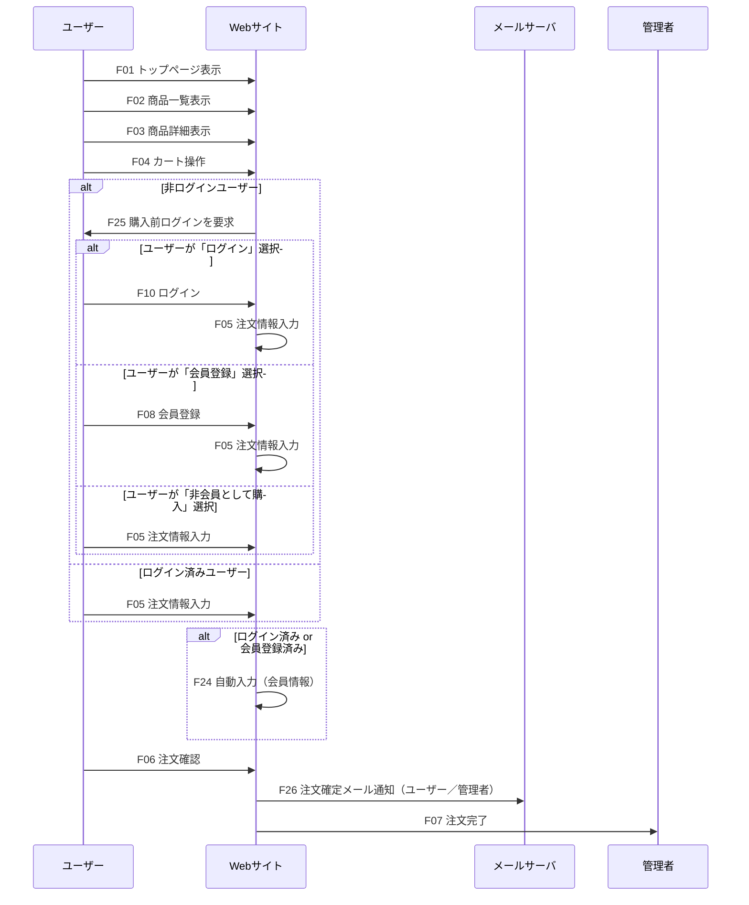
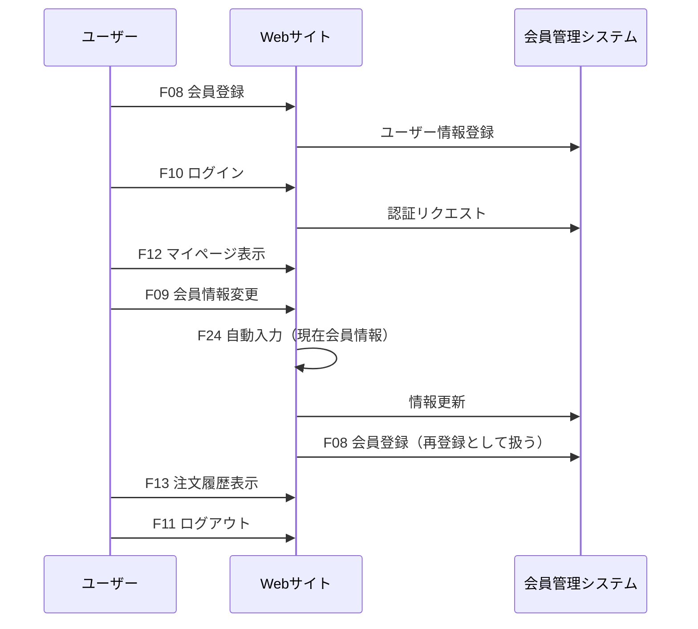
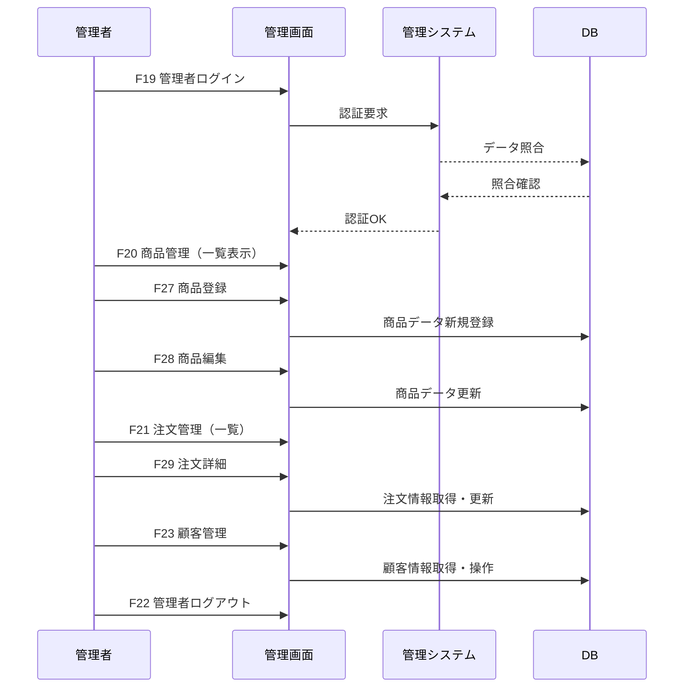

# オンライン販売サイト 基本設計書
 
| ドキュメントバージョン | 1.0                                    |
| :------------------- | :------------------------------------- |
| 作成日               | 2025年7月2日                           |
| 作成チーム           | チームBacon                               |
| 更新履歴             | 2025/07/2: Ver.1.0 初版作成 (チームBacon) |

## 1. はじめに

### 1.1. 本書の目的

本書は、株式会社〇〇が展開する雑貨ブランドのECサイト構築プロジェクトにおける基本設計の内容を定義するものである。  
要件定義書に記載された要件をもとに、システム全体の構成、主要機能、画面、データ、非機能要件への対応方針を明確化し、  
後続の詳細設計、実装、テスト工程における参照資料とすることを目的とする。

### 1.2. プロジェクト概要

本プロジェクトは、実店舗およびSNSを中心に販売を行ってきた株式会社〇〇の雑貨ブランドにおいて、  
オンライン販売チャネル（ECサイト）を新たに構築するものである。  
顧客ニーズの多様化、販売機会の最大化、地理的制約の克服、収益構造の多様化などの経営課題に対応し、  
ブランドイメージとユーザビリティを両立させたECサイトの構築を通じて、事業の更なる成長を図る。

### 1.3. 前提知識

本書を読むにあたり、以下の知識を有していることを前提とする。

- 本プロジェクトの要件定義書の内容
- ECサイトに関する一般的な知識（商品検索、カート、決済等）
- Webアプリケーション開発の基本的な知識 (HTTP, HTML, CSS, JavaScript)
- REST API の基本的な概念
- Java および Spring Boot フレームワークの基本的な知識
- リレーショナルデータベースの基本的な知識

## 2. システム概要

### 2.1 システム構成の全体像

#### 2.1.1 提供するシステム
株式会社〇〇が展開する雑貨ブランド向けのオンライン販売サイト（ECサイト）。  
商品の閲覧、検索、購入、注文管理をオンラインで完結できる仕組みを構築する。

### 2.1.2 主なユーザー区分と利用形態

このシステムでは、大きく以下の2種類のユーザーを想定している。

- **一般顧客（エンドユーザー）**  
  - 属性: 20代後半～40代の男女。丁寧な暮らしや雑貨・インテリアへの関心が高い層。  
  - 利用目的: 商品の閲覧、検索、購入、配送先入力、注文確定など。  
  - 利用形態: PC・スマートフォンからのアクセス。会員登録は任意、非会員でも購入可能。

- **サイト運営者（株式会社〇〇 管理担当者）**  
  - 利用目的: 商品情報の登録・更新、カテゴリ・在庫管理、受注確認、注文ステータス管理等。  
  - 利用形態: 管理画面を通じた社内PCからの利用を想定。

### 2.1.3 利用チャネル
- インターネット経由で公開（HTTPS対応）
- モバイルファーストのレスポンシブデザイン

#### 2.1.4 インフラ構成（想定）
- クラウド環境（AWS, GCP 等）
- Webアプリケーションサーバ、DBサーバ
- SSL/TLS による暗号化通信

###　2.2 システム概要図

graph TD
    subgraph ユーザー環境
        Client[一般顧客 （スマホ・PC・タブレット）]
        Admin[管理者 （PCブラウザ）]
    end

    subgraph インターネット
        Firewall[ファイアウォール]
        LoadBalancer[ロードバランサー]
        CDN[CDN（画像配信）]
    end

    subgraph クラウド環境
        subgraph Webサーバー
            WebServer1[Webサーバー1]
            WebServer2[Webサーバー2]
        end

        subgraph アプリケーションサーバー
            AppServer1[Appサーバー1]
            AppServer2[Appサーバー2]
        end

        subgraph DBサーバー
            DB[DBサーバー ]
            end

        Storage[S3互換ストレージ]
        ExternalAPI[外部APIサービス]
    end

    %% ユーザーからインターネット
    Client --> Firewall
    Admin --> Firewall

    %% インターネット内部の流れ
    Firewall --> LoadBalancer
    LoadBalancer --> WebServer1
    LoadBalancer --> WebServer2
    WebServer1 --> CDN
    WebServer2 --> CDN

    %% Webサーバーからアプリサーバー
    WebServer1 --> AppServer1
    WebServer2 --> AppServer2

    %% アプリサーバーからDBサーバー
    AppServer1 --> DB
    AppServer2 --> DB

    %% アプリサーバーから外部ストレージ・API
    AppServer1 --> Storage
    AppServer2 --> ExternalAPI

  
    
    style Client fill:#f9f,stroke:#333,stroke-width:1.5px
    style Admin fill:#f9f,stroke:#333,stroke-width:1.5px
    style Firewall fill:#ffcc99,stroke:#333,stroke-width:1.5px
    style LoadBalancer fill:#ffcc99,stroke:#333,stroke-width:1.5px
    style CDN fill:#ccffcc,stroke:#333,stroke-width:1.5px
    style WebServer1 fill:#99ccff,stroke:#333,stroke-width:1.5px
    style WebServer2 fill:#99ccff,stroke:#333,stroke-width:1.5px
    style AppServer1 fill:#6699cc,stroke:#333,stroke-width:1.5px
    style AppServer2 fill:#6699cc,stroke:#333,stroke-width:1.5px
    style DB fill:#99ff99,stroke:#333,stroke-width:1.5px
    style Storage fill:#cccccc,stroke:#333,stroke-width:1.5px
    style ExternalAPI fill:#ff9999,stroke:#333,stroke-width:1.5px

---

###  2.3 各項目の説明

#### 2.3.1 ユーザー環境
- **一般顧客（スマホ・PC・タブレット）**
  - Webブラウザを通じてサービスを利用するエンドユーザー。
- **管理者（PCブラウザ）**
  - 管理画面にログインし、ユーザー管理や商品管理を行う。

---

#### 2.3.2 インターネット
- **ファイアウォール**
  - 外部からの不正アクセスを遮断する。
- **ロードバランサー**
  - 複数のWebサーバーへの負荷分散を行い、可用性を確保。
- **CDN（画像配信）**
  - 静的コンテンツ（画像・CSS・JS）を高速配信するためのネットワーク。

---

### 2.4 クラウド環境
#### 2.4.1 Webサーバー
- **Webサーバー1, Webサーバー2**
  - ユーザーからのHTTP(S)リクエストを受け付け、HTML等を返却。
  - 負荷分散によりスケールアウト可能。

#### 2.4.2 アプリケーションサーバー
- **Appサーバー1, Appサーバー2**
  - ビジネスロジックを実行し、データベースとの橋渡しを行う。

#### 2.4.3 DBサーバー
- **DBサーバー**
 -データを整合性を取って管理する。

#### 2.4.4 その他サービス
- **S3互換ストレージ**
  - 画像やファイルなどを保存する。
- **外部APIサービス**
  - 他サービスとの連携を行う。

---

=======
## 3. 機能設計
### 3.1 機能一覧（ID付）

| 機能ID | 機能名                       | 対応画面ID         | 機能概要                                           |
|---------|------------------------------|---------------------|----------------------------------------------------|
| F01     | トップページ表示             | C01                 | サイトのトップページを表示する                   |
| F02     | 商品一覧表示                 | C02                 | 商品の一覧情報を表示する                         |
| F03     | 商品詳細表示                 | C03                 | 選択した商品の詳細情報を表示する                 |
| F04     | カート操作                   | C04                 | カート内商品の確認・編集                         |
| F05     | 注文情報入力                 | C05                 | 配送先や支払い方法の入力画面                     |
| F06     | 注文確認                     | C06                 | 入力内容の最終確認画面                           |
| F07     | 注文完了                     | C07                 | 注文完了メッセージ表示                           |
| F08     | 会員登録                     | C08                 | 新規会員登録機能（会員情報入力）                 |
| F09     | 会員情報変更                 | C11                 | 会員情報の変更機能                               |
| F10     | ログイン                     | C09                 | 顧客ログイン機能                                 |
| F11     | ログアウト                   | -                   | 顧客ログアウト機能                               |
| F12     | マイページ表示               | C10                 | 会員情報や登録情報の表示                         |
| F13     | 注文履歴表示                 | C12                 | 過去の注文履歴を表示                             |
| F14     | 特定商取引法表示             | C13                 | 特商法に基づく表記の表示                         |
| F15     | プライバシーポリシー表示     | C14                 | プライバシーポリシーの表示                       |
| F16     | FAQ表示                      | C15                 | よくある質問の表示                               |
| F17     | 共通エラーページ表示         | C16                 | 404・サーバーエラー時の表示                      |
| F19     | 管理者ログイン               | A01                 | 管理者のログイン機能                             |
| F20     | 商品管理（一覧）             | A02                 | 商品情報の一覧表示                               |
| F21     | 注文管理（一覧）             | A05                 | 注文情報の一覧表示                               |
| F22     | 管理者ログアウト             | -                   | 管理者のログアウト機能                           |
| F23     | 顧客管理                     | A08                 | 顧客情報の一覧・編集機能                         |
| F24     | 自動入力                     | -                   | 会員情報の自動入力                               |
| F25     | 購入前ログイン               | C09                 | ログイン、新規登録、ゲストで購入を選択           |
| F26     | 注文確定メール通知（銀行口座） | -                 | 注文確定時のメール送信（ユーザー／管理者）       |
| F27     | 商品登録                     | A02                 | 新規商品データ登録                               |
| F28     | 商品編集                     | A02                 | 既存商品データの部分編集                         |
| F29     | 注文詳細（詳細）             | A06                 | 注文日、購入者情報等の詳細情報                   |

---

### 3.2 機能構成図

#### 3.2.1【顧客向け機能】
F01 トップページ表示
├─ F02 商品一覧表示
│   └─ F03 商品詳細表示
│       └─ F04 カート操作
├─ F04 カート操作
│   ├─ F25 購入前ログイン（非ログイン時）
│   │   ├─ F10 ログイン → F05 注文情報入力
│   │   ├─ F08 会員登録 → F05 注文情報入力
│   │   └─ F05 注文情報入力
│   ├─ F05 注文情報入力（ログイン時）
│   │   └─ F24 自動入力
│   ├─ F06 注文確認
│   │   └─ F26 注文確定メール通知
│   └─ F07 注文完了
├─ F08 会員登録
├─ F10 ログイン
│   ├─ F12 マイページ表示
│   │   ├─ F09 会員情報変更
│   │   │   ├─ F08 会員登録（再登録）
│   │   │   └─ F24 自動入力（変更時に反映）
│   │   └─ F13 注文履歴表示
│   └─ F11 ログアウト
├─ F14 特定商取引法表示
├─ F15 プライバシーポリシー表示
├─ F16 FAQ表示
└─ F17 共通エラーページ表示

#### 3.2.2【管理者向け機能】
F19 管理者ログイン
├─ F20 商品管理（一覧）
│   ├─ F27 商品登録
│   └─ F28 商品編集
├─ F21 注文管理（一覧）
│   └─ F29 注文詳細（詳細）
├─ F23 顧客管理
└─ F22 管理者ログアウト

※F10とF08はF25から遷移している場合、F05に遷移する

---

### 3.3 主要機能フロー（画面）
#### 3.3.1 購入フロー

#### 3.3.2 会員登録・ログインフロー

#### 3.3.3 管理者フロー

---
## 4 画面設計
本章では、想定している主要画面のレイアウトや画面間の遷移など、UI設計の概要を示す。

### 4.1. 画面一覧

- **C01: トップページ**
  - アクセス時最初に表示されるメイン画面。
  - カート、ログイン、商品一覧、特定商取引法表示、プライバシーポリシー、FAQなど各ページにアクセス可能。
  - 商品のキーワード検索やカテゴリから選ぶこともできる。

- **C02: 商品一覧**
  - 商品の画像、商品名、価格（基本情報）が表示される。
  - キーワード検索も可能。

- **C03: 商品詳細**
  - 商品一覧から選択した商品について、一覧での情報に加えて詳細情報（素材、サイズなど）を確認できる。
  - カートに追加することができる。

- **C04: カート**
  - カートに追加された商品の基本情報、数量、合計金額が表示される。
  - 購入手続きに進むことができる。

- **C05: 注文情報入力**
  - 注文商品の商品名、数量、価格、送料、合計金額を確認。
  - お届け先情報（氏名、郵便番号、住所、電話番号、メールアドレス）を入力する。
  - 会員としてログインしている場合は自動入力される。
  - 支払方法を選択する。
  
- **C06: 注文確認**
  - 入力した注文情報を確認し、注文を確定する。
  
- **C07: 注文完了**

- **C08: 会員登録**

- **C09: 購入前ログイン**

- **C10: ログイン**

- **C12: マイページ**

- **C13: 注文履歴**

- **C14: 特定商取引法表示**

- **C15: プライバシーポリシー**

- **C16: FAQ**

- **C17: エラー画面**

- **A01: 管理者ログイン**

- **A02: 商品管理（一覧）**

- **A03: 商品登録**

- **A04: 商品編集**

- **A05: 注文管理（一覧）**

- **A06: 注文詳細**

- **A07: 管理者一覧**

- **A08: 会員一覧**

- **A09: 管理者メニュー**

### 4.2. 画面遷移図

以下に、主要な画面遷移を示す。

- 顧客画面

graph TD
    A[C01: トップページ]  --> B(C10: ログイン);
    A --> C(C02: 商品一覧);
    A --> D(C14: 特定商取引法表示)
    A --> E(C15: プライバシーポリシー)
    A --> F(C16: FAQ)

   
    
    H --> G
    B -- 既存会員 --> G(C12:マイページ)
    B -- 新規会員 --> H(C08:会員登録)
  
    

    G --> I(C13:注文履歴)
    G -- 登録情報の確認・変更 --> H

    C --> J(C03:商品詳細)
    J --> K(C04:カート)
    K -- 買い物を続ける --> C
    K -- ログアウト状態 --> P(C09:購入前ログイン)

   
    K -- ログイン状態 --> L
    L --> M(C06:注文確認)
    M --> N[C07:注文完了]

    P -- 新規登録 -->H
    H -.->L
     P -- ログイン --> L(C05:注文情報入力)

    dummy[ ] --エラー発生 --> O(C17:共通エラー画面)

    style dummy fill:#fff,stroke:#fff,stroke-width:1px
     style A fill:#e0f7fa,stroke:#0097a7
    style D fill:#e0f7fa,stroke:#0097a7
    style E fill:#e0f7fa,stroke:#0097a7
    style F fill:#e0f7fa,stroke:#

    style B fill:#e8f5e9,stroke:#2e7d32
    style G fill:#e8f5e9,stroke:#2e7d32
    style H fill:#e8f5e9,stroke:#2e7d32
    style I fill:#e8f5e9,stroke:#2e7d32

    style C fill:#fff3e0,stroke:#ef6c00
    style J fill:#fff3e0,stroke:#ef6c00

    style K fill:#ede7f6,stroke:#5e35b1
    style L fill:#ede7f6,stroke:#5e35b1
    style M fill:#ede7f6,stroke:#5e35b1
    style N fill:#ede7f6,stroke:#5e35b1
    style P fill:#ede7f6,stroke:#5e35b1
    style O fill:#d3d3d3,stroke:#808080

どの画面からでもトップページに戻れる。

- 管理者画面

graph TD
  A[A01:管理者ログイン] -->B(A09:管理者メニュー)
  B --> C(C02:商品管理)
  C --> D(A03:商品登録)
  C --> E(A04:商品編集)
  B --> F(A05:注文管理)
  F --> G(A06:注文詳細)
  B --> H(A08:会員管理)

 dummy[ ] --エラー発生 --> O(C17:共通エラー画面)

    style dummy fill:#fff,stroke:#fff,stroke-width:1px
      style O fill:#d3d3d3,stroke:#808080
      style A fill:#cfd8dc,stroke:#455a64
  style B fill:#b0bec5,stroke:#37474f

  style C fill:#e0f2f1,stroke:#00796b
  style D fill:#e0f2f1,stroke:#00796b
  style E fill:#e0f2f1,stroke:#00796b

  style F fill:#f3e5f5,stroke:#8e24aa
  style G fill:#f3e5f5,stroke:#8e24aa
  style H fill:#e8f5e9,stroke:#2e7d32

### 4.3. UI/UX基本方針

- **デザインの方向性**: 「丁寧な暮らし」を好む層に向けて、シンプルで余白のある画面、落ち着いた色味にする。
- **操作性**: 直感的に操作できるよう、画面構成や操作手順はシンプルにする。
- **一貫性**: ボタンの配置、ラベルの命名規則、エラーメッセージの表示形式などをシステム全体で統一する。
- **視認性**: 文字サイズや色使いに配慮し、情報が読みやすく、重要な情報が目立つようにする。
- **フィードバック**: ユーザーの操作に対して、処理中であることや処理結果（成功、エラー）を明確に表示する。
- **レスポンシブ**: スマートフォン、PCブラウザのどちらで表示しても画面レイアウトが崩れないよう配慮を行う。

### 4.4. 主要画面のワイヤーフレーム

ここでは主要画面のワイヤーフレーム（骨組み）を簡易的に示す。

#### 4.4.1. 顧客向け画面ワイヤーフレーム

トップページ
- **○○ECサイト**:トップページに遷移
-  **カート**: カート画面に遷移
-  **ログイン**:ログイン画面に遷移 
-  **検索**:キーワードで商品を部分一致検索
-  **商品一覧**:商品一覧画面に遷移
-  **カテゴリから選ぶ**:カテゴリごとに絞り込みされた商品一覧を表示  
-  **特定商取引法表示**:特定商取引法に関する表示
-  **プライバシーポリシー**:プライバシーポリシーを表示
-  **FAQ**:よくある質問と回答を表示 
    
商品一覧
- **○○ECサイト**:トップページに遷移
-  **カート**: カート画面に遷移
-  **ログイン**:ログイン画面に遷移 
-  **検索**:キーワードで商品を部分一致検索
- **状態**:現在の絞り込み状態を表示 
-  **商品の基本情報**:画像、商品名、価格を表示。クリックすると商品詳細を表示
  
#### 4.4.2. 管理者向け画面ワイヤーフレーム

注文管理
- **管理者メニューへ**:管理者メニュー画面に遷移
- **注文一覧**:注文番号、購入者、注文日、支払方法、発送状態、操作を一覧表示（注文番号の降順）
- **操作**:詳細をクリックすると注文詳細を表示
 
 ### 4.5. 主要画面項目定義

ワイヤーフレームで定義した要素について、補足情報や入力形式などを記述します。ここではトップページ画面の例を記載。
- **画面ID**: C01
- **画面名**: トップページ
- **表示項目・入力項目**:
  - **○○ECサイト**
    - **要素**:ボタン
    - **動作**:トップページ(C01)に遷移
  -  **カート**
     - **要素**:ボタン
      - **動作**:カート(C04)に遷移
  -  **ログイン** 
     -  **要素**:ボタン
       - **動作**:ログイン(C10)に遷移
  -  **検索**
        - **要素**: テキスト入力ボックス
        - **入力形式**: 文字列
        - **桁数**: 最大50文字
        - **補足**: 備品名に対する部分一致検索を行う
  -  **商品一覧**
      - **要素**:ボタン
       - **動作**:商品一覧(C02)に遷移
  -  **カテゴリから選ぶ**
      - **要素**:ボタン
      - **補足**::カテゴリごとに絞り込みされた商品一覧を表示  
       - **動作**:商品一覧(C02)（絞り込み後）に遷移
  -  **特定商取引法表示**
       -  **要素**:ボタン
       - **動作**:特定商取引法表示(C14)画面に遷移
  -  **プライバシーポリシー**
        -  **要素**:ボタン
       - **動作**:プライバシーポリシー(C15)に遷移
  -  **FAQ**
       -  **要素**:ボタン
       - **動作**:FAQ(C16)に遷移

## 5. データ設計
本節では、システムにおける主なエンティティ間の関係と、主要なデータの流れの概要を示す。

### 5.1. 概念データモデル（ER図）

erDiagram
    CUSTOMER ||--o{ ORDER : has
    ORDER ||--o{ ORDER_DETAIL : contains
    PRODUCT ||--o{ ORDER_DETAIL : has
    PRODUCT ||--o{ CATEGORY : belongs_to
    ADMIN ||--o{ PRODUCT : manages
    ADMIN ||--o{ ORDER : manages
    ORDER ||--o{ PAYMENT_METHOD : uses
    ORDER ||--o{ ORDER_STATUS : has

    CUSTOMER {
        string customer_id PK "顧客ID"
        string email UK "メールアドレス"
        string password "パスワード (ハッシュ化)"
        string last_name "姓"
        string first_name "名"
        string phone_number "電話番号"
        string address "住所"
        datetime created_at "登録日時"
        datetime updated_at "更新日時"
    }

    PRODUCT {
        string product_id PK "商品ID"
        string product_name "商品名"
        string description "商品説明"
        decimal price "単価"
        string image_url "画像URL"
        string material "素材"
        string size "サイズ"
        string category_id FK "カテゴリID"
        int stock_quantity "在庫数"
        datetime created_at "登録日時"
        datetime updated_at "更新日時"
    }

    CATEGORY {
        string category_id PK "カテゴリID"
        string category_name "カテゴリ名"
        datetime created_at "登録日時"
        datetime updated_at "更新日時"
    }

    ORDER {
        string order_id PK "注文ID"
        string customer_id FK "顧客ID（会員のみ）"
        string order_email "注文者メールアドレス"
        string order_name "注文者氏名"
        string order_phone_number "注文者電話番号"
        string order_address "注文者住所"
        decimal total_price "合計金額"
        decimal shipping_fee "配送料"
        string payment_method_code FK "支払い方法コード"
        string order_status_code FK "注文ステータスコード"
        datetime payment_confirmed_at "入金確認日時"
        datetime order_date "注文日時"
        datetime created_at "登録日時"
        datetime updated_at "更新日時"
    }

    ORDER_DETAIL {
        string order_detail_id PK "注文明細ID"
        string order_id FK "注文ID"
        string product_id FK "商品ID"
        int quantity "数量"
        decimal unit_price "購入時単価"
        datetime created_at "登録日時"
        datetime updated_at "更新日時"
    }

    ADMIN {
        string admin_id PK "管理者ID"
        string email UK "メールアドレス"
        string password "パスワード (ハッシュ化)"
        string user_name "ユーザー名"
        datetime created_at "登録日時"
        datetime updated_at "更新日時"
    }

    PAYMENT_METHOD {
        string payment_method_code PK "支払い方法コード"
        string label "表示名"
        int sort_order "表示順"
        bool is_active "有効フラグ"
        datetime created_at "登録日時"
        datetime updated_at "更新日時"
    }

    ORDER_STATUS {
        string order_status_code PK "注文ステータスコード"
        string label "表示名"
        string description "ステータス説明"
        int sort_order "表示順"
        bool is_active "有効フラグ"
        datetime created_at "登録日時"
        datetime updated_at "更新日時"
    }

- **エンティティ**: CUSTOMER(顧客), PRODUCT(商品), CATEGORY(カテゴリ), ORDER(注文), ORDER_DETAIL(注文明細), ADMIN(管理者),PAYMENT_METHOD (支払い方法マスタ),ORDER_STATUS (注文ステータスマスタ) 

- **リレーション**:
  - 顧客は注文を行う (1対多、CUSTOMER -> ORDER)
  - 注文は注文明細を含む (1対多、ORDER -> ORDER_DETAIL)
  - 商品は注文明細に含まれる (1対多、PRODUCT -> ORDER_DETAIL)
  - 商品はカテゴリに属する (1対多、PRODUCT -> CATEGORY)
  - 管理者は商品を管理する (1対多、ADMIN -> PRODUCT)
  - 管理者は注文を管理する (1対多、ADMIN -> ORDER)
  - 注文は支払い方法を利用する (1対多、ORDER -> PAYMENT_METHOD)
  - 注文は注文ステータスを持つ (1対多、ORDER -> ORDER_STATUS)

### 5.2. 主要テーブル概要
  - **CUSTOMER (顧客情報テーブル)**
    - 会員登録を行った顧客の基本情報を保持する。
    - `customer_id`を主キーとし、`email`はユニーク制約を持つ。
    - パスワードはハッシュ化して保存する。
    - ログイン認証、注文履歴の紐付け、配送先情報の自動入力、管理者による顧客情報参照に利用される。
  - **PRODUCT (商品情報テーブル)**
    - オンライン販売する各商品の詳細情報を管理する。
    - `product_id`を主キーとする。
    - `商品名`、`価格`、`画像URL`、素材、サイズなどの詳細情報を保持する。
    - `category_id`でカテゴリ情報に紐づく。
    - 商品一覧表示、商品詳細表示、カートへの追加、注文明細での参照、管理者による商品登録・編集に利用される。
  - **CATEGORY (カテゴリ情報テーブル)**   
    - 商品を分類するためのカテゴリ情報を管理するマスタテーブル。
    - `category_id`を主キーとする。
    - 商品一覧のカテゴリ絞り込み、商品登録時のカテゴリ選択に利用される。
  - **ORDER (注文情報テーブル)**
    - 顧客からの注文全体に関する情報を管理する。会員・非会員問わず、全ての注文が記録される
    - `order_id`を主キーとする。
    - 会員の場合は`customer_id`でCUSTOMERテーブルに紐づくが、非会員の場合はNULLとなり、order_email、order_nameなどに直接情報が格納される。
    - total_price、shipping_fee（アプリケーションロジックで計算）、payment_method_code（支払い方法マスタ参照）、order_status_code（注文ステータスマスタ参照）などの情報を保持する。
    - payment_confirmed_at は、銀行振込や代引きにおける入金確認日時を記録する。
    - 注文履歴の表示、管理者による注文管理、注文確認メールのトリガーに利用される。

  - **ORDER_DETAIL (注文明細情報テーブル)**
    - 各注文に含まれる個々の商品の詳細（どの商品をいくつ購入したか、その時点の単価）を管理する。
    - order_detail_idを主キーとし、order_idでORDERテーブルに、product_idでPRODUCTテーブルにそれぞれ紐づく。
    - 注文内容の詳細表示、注文合計金額の算出に利用される。
  - **ADMIN (管理者情報テーブル)**
    - ECサイトの運営・管理を行う担当者の情報を管理する。
    - admin_idを主キーとし、emailはユニーク制約を持つ。
    - パスワードはハッシュ化して保存する。
    - 管理者ログイン認証、管理画面へのアクセス制御に利用される。
  - **PAYMENT_METHOD** (支払い方法マスタテーブル) 
    - ECサイトで利用できる支払い方法の種類を定義・管理する。
    - payment_method_codeを主キーとする。
    - 表示名（label）、表示順（sort_order）、有効無効フラグ（is_active）を保持する。
    - ORDERテーブルのpayment_method_codeがこのテーブルを参照する。
  - ORDER_STATUS (注文ステータスマスタテーブル) 
    - 注文が現在どの段階にあるかを示すステータスの種類を定義・管理する。
    - order_status_codeを主キーとする。
    - 表示名（label）、詳細説明（description）、表示順（sort_order）、有効無効フラグ（is_active）を保持する。
    - ORDERテーブルのorder_status_codeがこのテーブルを参照する。
### 5.3. データフロー概要
本節では、主要な機能におけるデータの流れを詳細に記述します。
**商品一覧表示**

1. **画面(C02)**:
    - 顧客がカテゴリ選択や検索ワード・絞り込み条件を指定して商品一覧を表示。
2. **アプリケーション(Backend)**:
    - カテゴリID、検索ワード、絞り込み条件を受け取る。
    - `PRODUCT`テーブルから該当商品の一覧を取得。
    - `CATEGORY`テーブルからカテゴリ名を取得し、商品に紐づける。
3. **データベース(DB)**: 
    - `PRODUCT`テーブル、`CATEGORY`テーブルを参照。
4. **アプリケーション(Backend)**:
    - 取得した商品リストを画面に返す。
5. **画面(C02)**: 商品一覧を表示。

**商品詳細表示**

1. **画面(C02)**: 顧客が商品一覧から商品を選択。
2. **アプリケーション(Backend)**:
    - `product_id`を受け取り、該当商品の詳細情報を取得。
3. **データベース(DB)**: `PRODUCT`テーブルを参照。
4. **アプリケーション(Backend)**: 商品詳細を返却。
5. **画面(C03)**: 商品詳細画面を表示。

**カート管理（セッション使用）**

1. **画面(C03)**: 顧客が商品をカートに追加・削除・数量変更。
2. **アプリケーション(Backend)**:
    - `product_id`、数量、操作タイプ（追加/削除/数量変更）を受け取り、
    - セッション（ユーザー別の一時記憶）に格納されたカートデータを更新。
3. **データベース(DB)**: DBは使用せず、サーバー側セッションストレージを使用。
4. **アプリケーション(Backend)**: 更新後のカート情報をセッションから取得して返却。
5. **画面(C04)**: カート内容を表示。

**購入フロー（注文情報入力～完了）**

1. **画面(C04)**: カート画面から「購入手続き」を選択。
2. **アプリケーション(Backend)**:
    - ログイン状態をチェック。
    - 非ログイン時はログイン(C10)、会員登録(C08)、非会員購入(C05)のいずれかへ遷移。
3. **画面(C05)**: ユーザーが注文情報を入力。
    - 入力項目（変数）:
        - 氏名 (`name`)
        - メールアドレス (`email`)
        - 電話番号 (`phone`)
        - 配送先住所 (`address`)
        - 支払い方法 (`payment_method_id`)
        - 備考欄 (`notes`)
4. **アプリケーション(Backend)**:
    - 会員の場合、`CUSTOMER`テーブルから上記情報を自動入力。
    - 送料・合計金額を計算し、セッションに保存。
5. **画面(C06)**: ユーザーが最終確認。
6. **アプリケーション(Backend)**:
    - 注文内容をもとにトランザクション開始。
    - `ORDER`, `ORDER_DETAIL`に保存。
    - メール通知（ユーザーと管理者）を送信。
7. **データベース(DB)**:
    - `ORDER`, `ORDER_DETAIL`テーブルにINSERT。
8. **画面(C07)**: 注文完了画面を表示。

**会員登録・認証**

1. **画面(C08)**: 会員登録フォームを表示、顧客情報入力。
2. **アプリケーション(Backend)**:
    - 入力情報を`CUSTOMER`テーブルに保存（パスワードはハッシュ化）。
    - 認証メール送信（必要に応じて）。
3. **データベース(DB)**: `CUSTOMER`テーブルにINSERT。
4. **画面(C09)**: 認証完了 or 案内を表示。

**ログイン処理**

1. **画面(C10)**: 顧客がログイン情報を入力。
2. **アプリケーション(Backend)**:
    - `CUSTOMER`テーブル照合し、セッション／トークンを生成。
3. **データベース(DB)**: `CUSTOMER`を参照。
4. **アプリケーション(Backend)**: 認証成功／失敗を返す。
5. **画面(C01 または C12)**: トップページまたはマイページへ遷移。

**マイページと注文履歴**

1. **画面(C12)**: マイページ表示。
2. **画面(C09)**: 会員情報変更。
3. **アプリケーション(Backend)**:
    - 現在の会員情報を取得して自動入力。
    - 更新情報を`CUSTOMER`テーブルに保存。
4. **画面(C13)**: 注文履歴表示。
5. **アプリケーション(Backend)**:
    - `ORDER`, `ORDER_DETAIL`, `PRODUCT`を参照し履歴情報を返却。
6. **データベース(DB)**: 上記テーブルをSELECT。

**ログアウト**

1. **画面(C11)**: ログアウト操作。
2. **アプリケーション(Backend)**:
    - セッション破棄。
3. **画面(C01)**: トップページに遷移。

**管理者ログイン**

1. **画面(A01)**: 管理者がログイン情報を入力。
2. **アプリケーション(Backend)**:
    - `ADMIN`テーブルを認証。
3. **データベース(DB)**: `ADMIN`テーブルを参照。
4. **画面(A02)**: 管理トップ表示。

**商品管理**

1. **画面(A02)**: 商品管理一覧表示。
2. **アプリケーション(Backend)**:
    - `PRODUCT`を全件取得。
3. **データベース(DB)**: `PRODUCT`テーブルをSELECT。
4. **画面(A02)**: 商品データ一覧を表示。
5. **画面(A03)**: 新規商品登録。
6. **アプリケーション(Backend)**:
    - 入力データを検証し、`PRODUCT`テーブルにINSERT。
7. **データベース(DB)**: `PRODUCT`にINSERT。
8. **画面(A04)**: 商品編集。
9. **アプリケーション(Backend)**:
    - 入力データを検証し、`PRODUCT`テーブルをUPDATE。
10. **データベース(DB)**: `PRODUCT`にUPDATE。

**注文管理**

1. **画面(A05)**: 注文管理一覧表示。
2. **アプリケーション(Backend)**:
    - `ORDER`, `ORDER_DETAIL`, `CUSTOMER`, `PAYMENT_METHOD`, `ORDER_STATUS`などを参照。
3. **データベース(DB)**: 上記テーブルをSELECT。
4. **画面(A05)**: 一覧データを表示。
5. **画面(A06)**: 注文詳細確認。
6. **アプリケーション(Backend)**:
    - 注文情報の取得。
    - ステータス変更時、在庫の戻しや入金確認などの処理。
7. **データベース(DB)**: `ORDER`などをUPDATE。
8. **画面(A06)**: 注文詳細情報を表示。

**顧客管理**

1. **画面(A08)**: 顧客一覧／詳細表示。
2. **アプリケーション(Backend)**:
    - `CUSTOMER`, `ORDER`を取得。
3. **データベース(DB)**: 顧客・注文データをSELECT。
4. **画面(A08)**: 顧客情報と注文履歴を表示。

**管理者ログアウト**

1. **画面(A07)**: ログアウト操作。
2. **アプリケーション(Backend)**:
    - セッション破棄。
3. **画面(A01)**: 管理者ログイン画面に遷移。

# 6. 非機能要件への対応方針

## 6.1 性能・拡張性

### 表示速度
- 商品一覧、商品詳細、カート、注文確定処理について、通常時は3秒以内の応答を実現するようAPI設計・DB設計を行う。
- 画像はCDN利用等により配信を最適化し、モバイル回線でもストレスのない速度を確保。

### 将来拡張性
- 決済機能追加（クレカ・コンビニ）、レビュー機能、在庫管理機能など将来の追加を想定。
- MVCやサービス指向の構成で機能を疎結合にする。
- データスキーマやAPI仕様は追加に耐えうる汎用設計を行う。

### 稼働率
- SLAとして月間稼働率99.5%以上を目標。
- クラウドのマネージドサービス活用、障害監視設定でこれを達成。

### バックアップ・リカバリ
- DBとファイル（商品画像等）の1日1回自動バックアップ。
- RTO:2時間以内 / RPO:24時間以内 を目標に手順を策定。

### 冗長化
- 初期はシングル構成＋バックアップで開始。
- 将来トラフィック増加時にロードバランサ・オートスケーリング導入を想定。

## 6.2 セキュリティ

### 通信の暗号化
- 全ページHTTPSを強制適用（HSTSも利用想定）。

### 認証・アクセス制御
- 会員・管理者ともにID/パスワード方式。
- 管理画面は強固なパスワードポリシーとログイン試行制限を適用。

### 脆弱性対策
- SQLインジェクション・XSS対策をORM/テンプレートで確実に。
- OSSライブラリは脆弱性情報を継続ウォッチし、定期的にアップデート。

### 監査ログ
- 管理画面のログイン履歴、商品・注文データ更新の操作履歴をDBまたはログ基盤に蓄積。
- 障害・不正調査に備える。

### 個人情報保護
- 個人情報保護方針を反映し、DBでは必要最低限の個人情報のみ保持する。

## 6.3 操作性・ユーザビリティ

### UI/UX
- モバイルファースト設計（レスポンシブ）。
- 直感的な導線で「商品選択 → カート → 購入確定」まで最小手順で完結。
- エラー時のメッセージもユーザー視点で分かりやすく表記。

### デザイン
- 白基調・シンプルで商品写真が際立つデザイン。
- ブランドイメージに合うフォント・カラーを基本設計で定義。

### サポート
- FAQ・操作ガイドページをサイト内に設置。

## 6.4 運用性・保守性

### 管理画面
- 商品登録・編集、注文状況管理をブラウザ上で完結。
- 管理画面にID/パスワード必須。操作ログを取得。
- 管理タスクの90%以上をこの画面で完結できるよう設計。

### 可読性・保守性
- フレームワークは保守人材確保が容易なものを採用（例: Laravel、Django、Node.js系）。
- コードレビュー・バージョン管理をGitで徹底。

### セキュリティ更新
- 使用するOSSライブラリは定期的に脆弱性スキャンを行いアップデート。

# 7. 運用・保守設計への対応

## 7.1 運用体制・ルール
- 管理者IDを最小限に限定し、運用負担・リスクを低減。
- 注文処理（銀行振込・代引きの確認や発送）は手動だが、管理画面で一元的に確認可能。
- 管理者には注文時に自動通知メールが届くため、迅速に手動処理へ移行可能。

## 7.2 監視・障害対応
- サーバ監視（リソース・稼働監視）とアプリケーションログ監視を導入。
- 障害時は即時アラート → 運用担当者が対応。
- データ障害時は前述のバックアップからのリストア手順で対応。

## 7.3 保守計画
- 定期的（例えば四半期ごと）に脆弱性診断ツールを用いてアプリケーションをチェック。
- 小規模改修やコンテンツ追加は運用チーム主体で可能なようCMS機能（またはCSVインポート）も検討。

## 7.4 法令・ポリシー遵守
- 特定商取引法、個人情報保護法、プライバシーポリシーを運用開始前にサイト内で適切に掲示。
- 消費税法に基づき、税込・税抜の金額を表示。
