# 3. 機能仕様
## 3.1. 機能一覧

本システムが提供する必須機能は以下の通りです。

| 機能ID | 機能名                   |
|--------|--------------------------|
| F0101  | トップページ表示          |
| F0201  | 商品一覧表示              |
| F0202  | 商品詳細表示              |
| F0301  | カート操作                |
| F0401  | 注文情報入力              |
| F0402  | 注文確認                  |
| F0403  | 注文完了                  |
| F0501  | 会員登録                  |
| F0502  | 会員情報変更              |
| F0601  | ログイン                  |
| F0602  | ログアウト                |
| F0603  | マイページ表示            |
| F0604  | 注文履歴表示              |
| F0605  | 購入前ログイン            |
| F0701  | 特定商取引法表示          |
| F0801  | プライバシーポリシー表示  |
| F0901  | FAQ表示                   |
| F1001  | 共通エラーページ表示      |
| F1101  | 自動入力                  |
| F1201  | 注文確定メール通知（銀行口座） |

---

## 3.2. 機能詳細

### 3.2.1. 商品一覧表示フロー

```mermaid
sequenceDiagram
    participant U as ユーザー
    participant B as ブラウザ
    participant CuC as CustomerController
    participant S as HttpSession

    # 添削・修正済みシークエンス図 - パッケージ構造対応版

## 🔍 主な問題点と修正

### 1. **DTOの不整合**
- パッケージ構造に `OrderPreview` が存在しない → `OrderResponseDto` で代用
- `OrderInput` が存在しない → 削除またはDTOで代用

### 2. **例外処理の問題**
- `ResourceNotFoundException` は商品・顧客が見つからない場合のみ
- セッション関連は `IllegalStateException` が適切

### 3. **Controller略語の不統一**
- `CartC` → `CC` に統一（CustomerControllerと重複回避）

### 4. **不足しているDTO**
- `OrderSummaryDto` → `OrderSummary` (パッケージ構造通り)
- `OrderItemSummaryDto` → `OrderItemSummary` (パッケージ構造通り)

---

## 3.2.1. 商品一覧表示フロー

```mermaid
sequenceDiagram
    participant U as ユーザー
    participant B as ブラウザ
    participant PC as ProductController
    participant PS as ProductService
    participant PR as ProductRepository
    participant DB as データベース

    U->>B: サイト訪問/メニュー選択
    B->>PC: GET /api/products/all
    PC->>PS: findAllProducts()
    PS->>PR: findAll()
    PR->>DB: SELECT * FROM PRODUCT
    
    alt 正常処理
        DB-->>PR: Product[]
        PR-->>PS: Product[]
        PS-->>PC: ProductListItemDto[]
        PC-->>B: ResponseEntity<List<ProductListItemDto>>
        B-->>U: 商品一覧画面表示
    else DBエラー
        DB-->>PR: SQLException
        PR-->>PS: DataAccessException
        PS-->>PC: ResourceNotFoundException
        PC-->>B: ResponseEntity<ErrorResponse>(500)
        B-->>U: システムエラー画面表示
    end
```


### 3.2.2. カテゴリ別一覧表示フロー

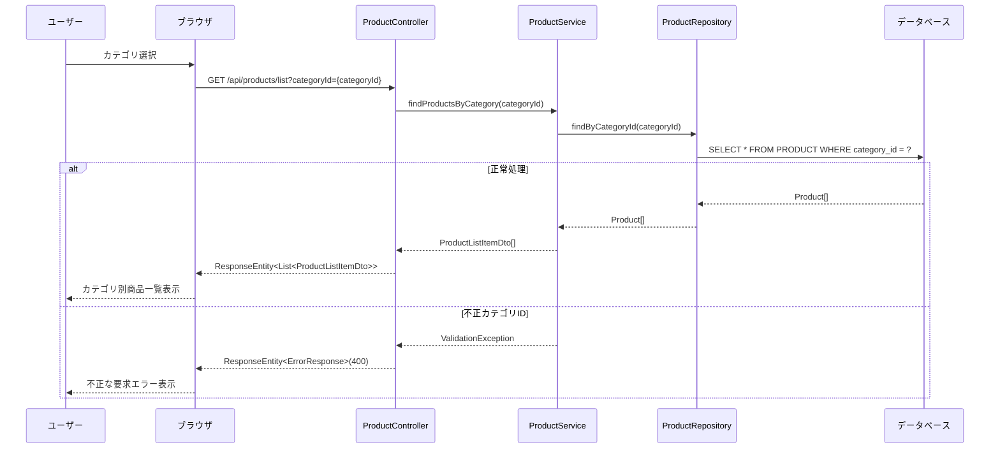

### 3.2.3. 商品検索フロー

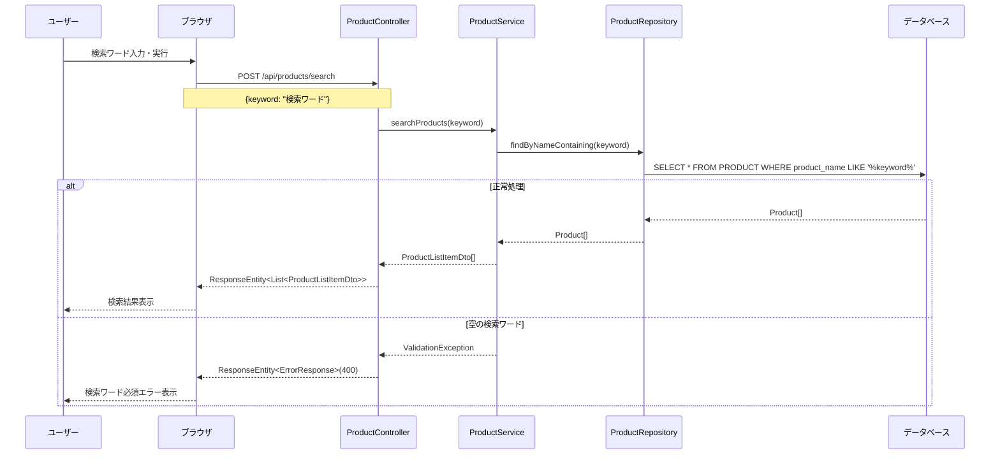

### 3.2.4. 商品詳細表示フロー

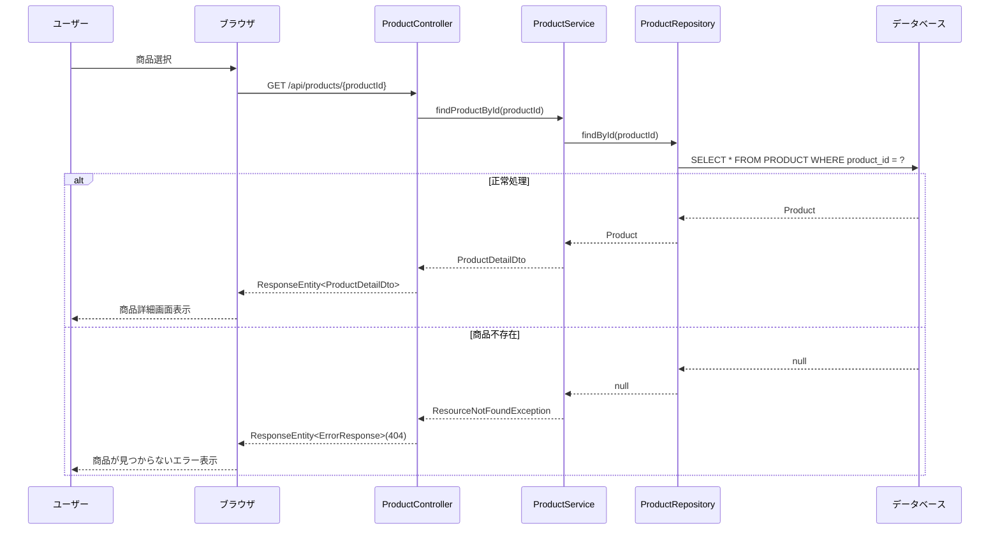

### 3.2.5. カート追加フロー

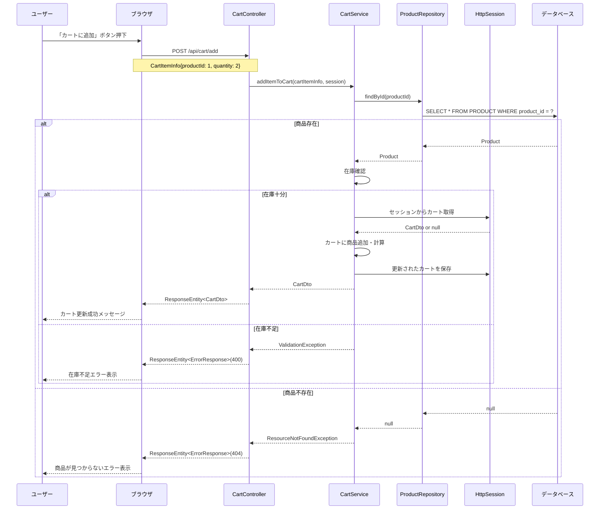

### 3.2.6. カート内容確認・編集フロー

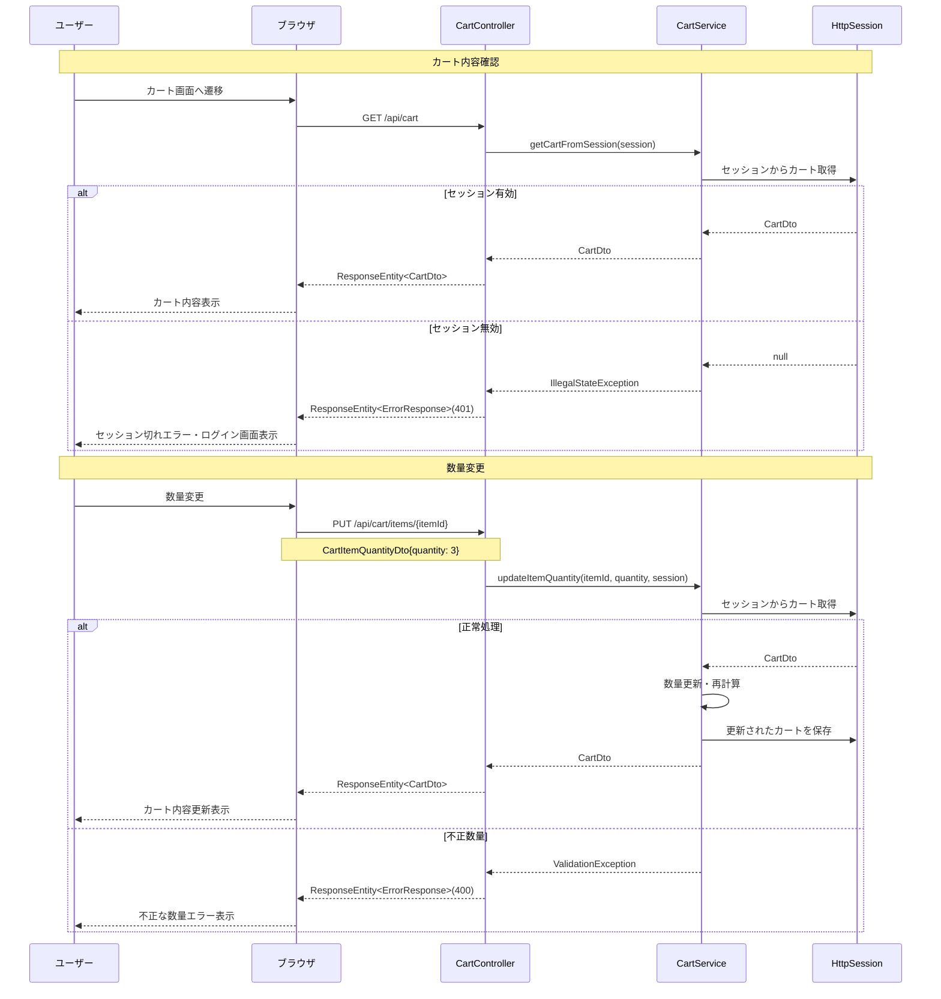

### 3.2.7. 注文情報入力フロー
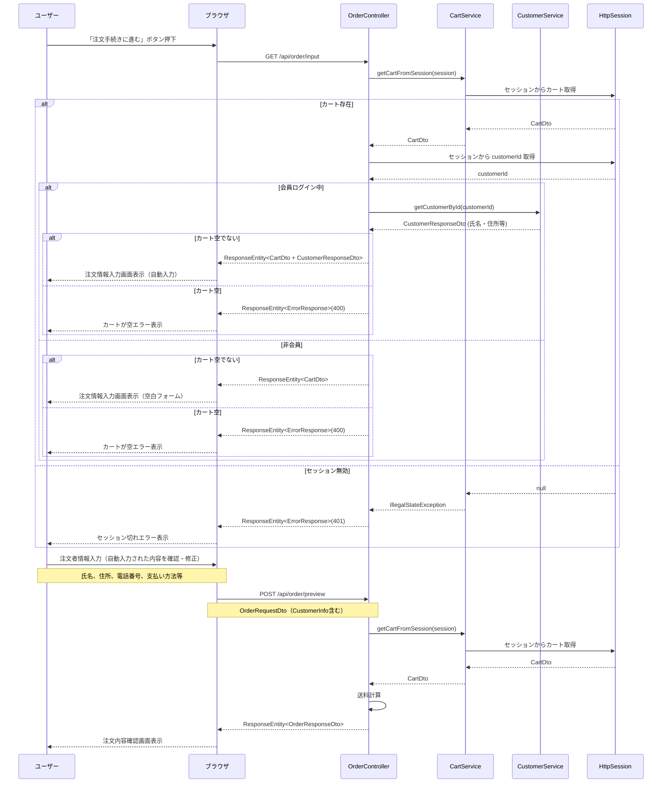

### 3.2.8. 注文確認・確定フロー

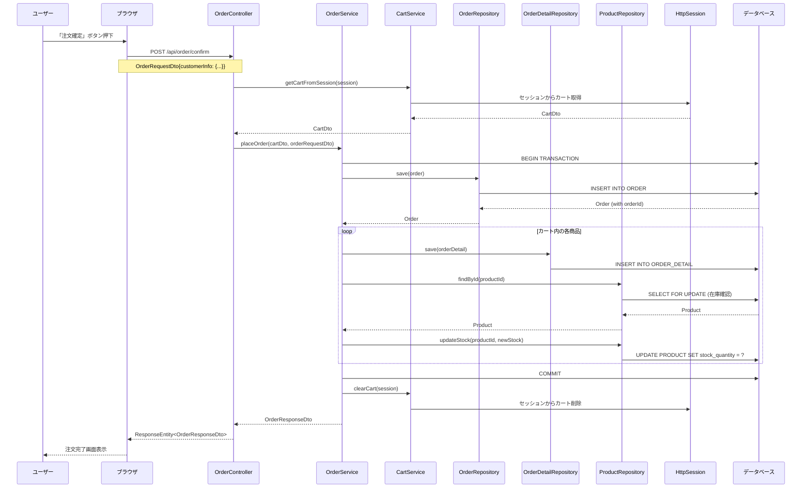
### 3.2.9. 非会員購入フロー**

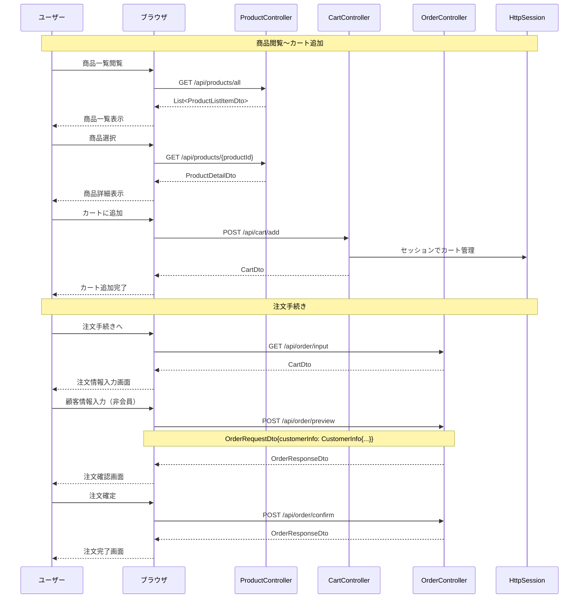

### 3.2.10. 会員購入フロー

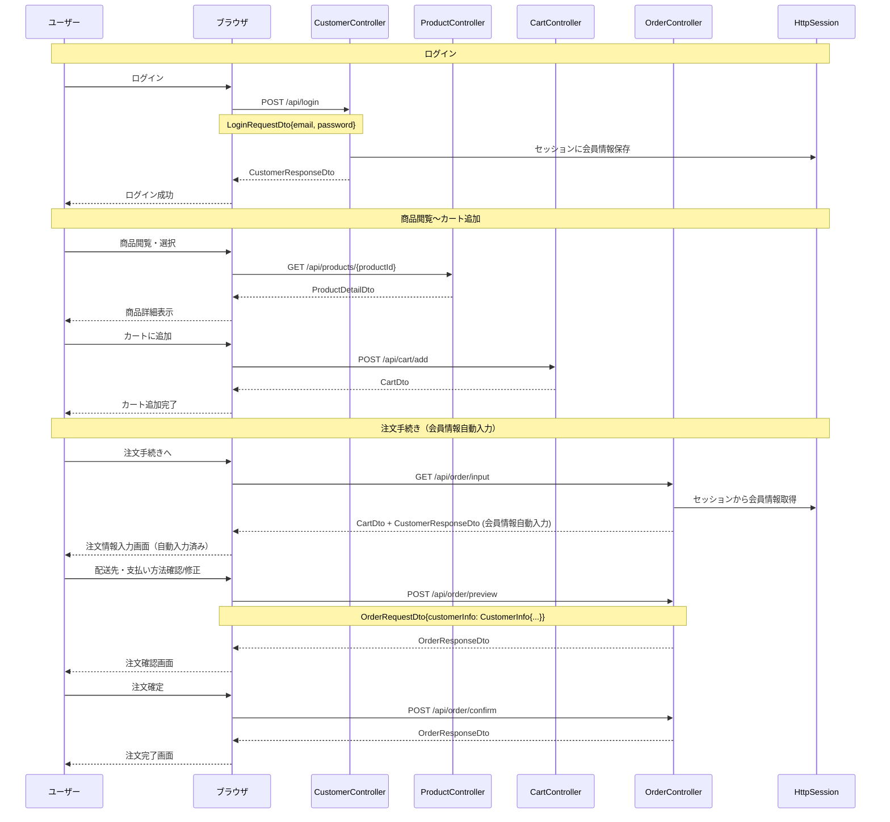
### 3.2.11. 注文完了・通知フロー

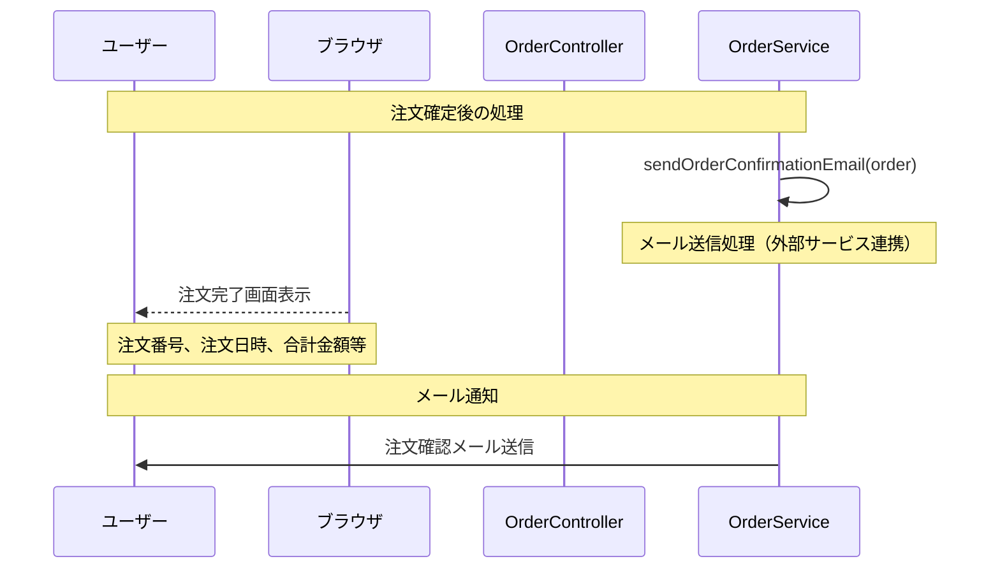


### 3.2.12. 会員登録フロー

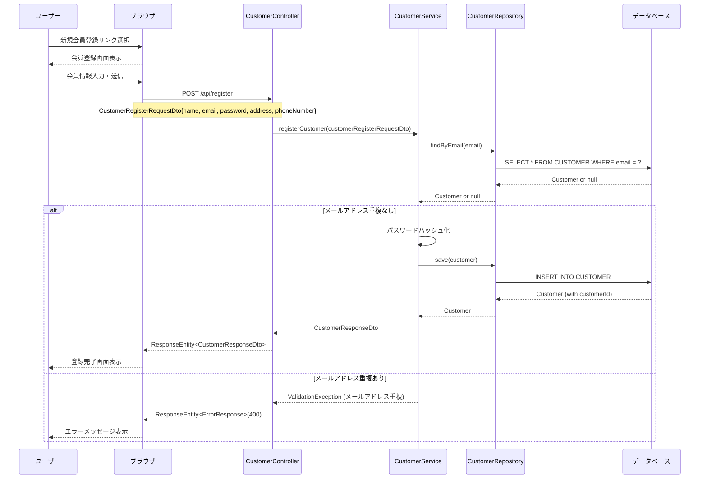

### 3.2.13. ログインフロー

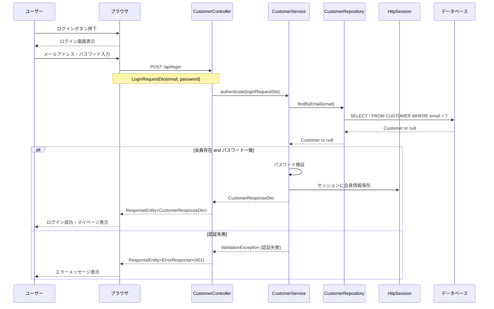

### 3.2.14. ログアウトフロー

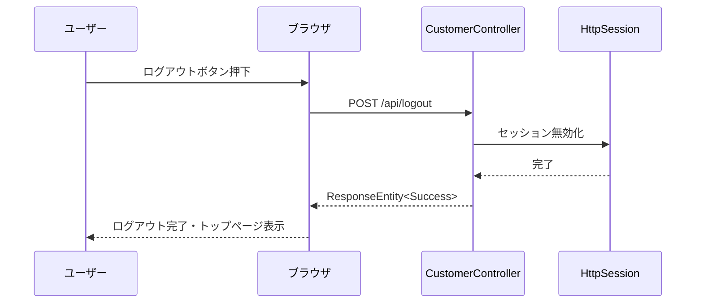

### 3.2.15. 注文履歴閲覧フロー

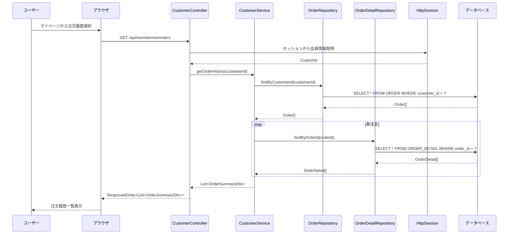


### 3.2.16. 支払い方法選択フロー

```mermaid
sequenceDiagram
sequenceDiagram
    participant U as ユーザー
    participant B as ブラウザ
    participant OC as OrderController
    participant OS as OrderService

    U->>B: 注文情報入力画面表示
    B-->>U: 支払い方法選択肢表示
    Note over B,U: 代引き、銀行振込
    
    U->>B: 支払い方法選択
    B->>OC: POST /api/order/preview
    Note over B,OC: OrderRequestDto{paymentMethod: "cash"}
    OC->>OS: validatePaymentMethod(paymentMethod)
    OS->>OS: 支払い方法検証
    OS-->>OC: 検証結果
    OC-->>B: ResponseEntity<OrderPreview>
    B-->>U: 選択した支払い方法反映
```

### 3.2.17. 配送料計算フロー

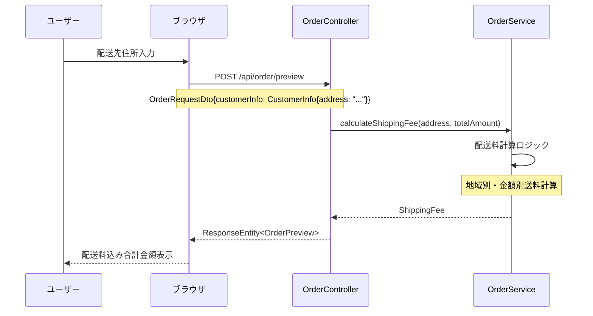

