# 3. 機能仕様
## 3.1. 機能一覧

本システムが提供する必須機能は以下の通りです。

| 機能ID | 機能名                   |
|--------|--------------------------|
| F0101  | トップページ表示          |
| F0201  | 商品一覧表示              |
| F0202  | 商品詳細表示              |
| F0301  | カート操作                |
| F0401  | 注文情報入力              |
| F0402  | 注文確認                  |
| F0403  | 注文完了                  |
| F0501  | 会員登録                  |
| F0502  | 会員情報変更              |
| F0601  | ログイン                  |
| F0602  | ログアウト                |
| F0603  | マイページ表示            |
| F0604  | 注文履歴表示              |
| F0605  | 購入前ログイン            |
| F0701  | 特定商取引法表示          |
| F0801  | プライバシーポリシー表示  |
| F0901  | FAQ表示                   |
| F1001  | 共通エラーページ表示      |
| F1101  | 自動入力                  |
| F1201  | 注文確定メール通知（銀行口座） |

---

## 3.2. 機能詳細

### 3.2.1. 購入フローシーケンス図

sequenceDiagram
    %% 4.5.1: 購入フローシーケンス図（修正版）
    participant User as ユーザー (Browser)
    participant FE as フロントエンド (JS)
    participant CartController
    participant CartService
    participant ProductRepository
    participant OrderController
    participant OrderService
    participant OrderRepository
    participant OrderDetailRepository
    participant MailService
    participant Session as セッション管理
    participant DB as データベース

    %% カートに商品追加
    User->>FE: 商品をカートに追加
    FE->>CartController: POST /api/cart/add
    CartController->>CartService: addItem(productId, qty, session)
    CartService->>ProductRepository: findById(productId)
    ProductRepository->>DB: SELECT * FROM products WHERE id=?
    DB-->>ProductRepository: Product
    ProductRepository-->>CartService: Product
    CartService-->>CartController: Updated Cart
    CartController-->>FE: JSON (Updated Cart)
    FE-->>User: カートを表示

    %% 購入手続き開始
    User->>FE: 購入手続き
    FE->>OrderController: POST /api/orders

    %% セッションから顧客ID取得
    OrderController->>Session: セッションから顧客ID取得
    Session-->>OrderController: customerId

    %% カート情報をサーバー側で取得（明示）
    OrderController->>CartService: getCart(customerId)
    CartService-->>OrderController: Cart

    %% 注文処理開始
    OrderController->>OrderService: placeOrder(cart, orderRequest, customerId)

    %% 注文エンティティ生成
    OrderService->>OrderService: Orderを生成（cart, orderRequest, customerId）

    %% 注文保存
    OrderService->>OrderRepository: save(Order)
    OrderRepository->>DB: INSERT INTO orders ...
    DB-->>OrderRepository: Order ID
    OrderRepository-->>OrderService: Order ID

    %% 注文詳細生成・設定
    OrderService->>OrderService: OrderDetails = createOrderDetailsFromCart(cart)
    OrderService->>OrderService: Order IDをOrderDetailsに設定

    %% 注文詳細保存
    OrderService->>OrderDetailRepository: saveAll(OrderDetails)
    OrderDetailRepository->>DB: INSERT INTO order_details ...
    DB-->>OrderDetailRepository: Insert Success
    OrderDetailRepository-->>OrderService: Insert Result

    %% 注文確認メール送信
    OrderService->>MailService: sendOrderConfirmationEmail(order)
    MailService->>User: 注文確認メール送信（注文番号、合計金額、配送予定日などを含む）
    MailService-->>OrderService: メール送信完了

    %% OrderResponse生成（注文番号、合計金額、配送予定日など含む）
    OrderService->>OrderService: OrderResponseを生成(orderNo, totalPrice, deliveryDate, ...)

    %% 応答返却
    OrderService-->>OrderController: OrderResponse
    OrderController-->>FE: JSON (OrderResponse)
    FE-->>User: 購入確定画面を表示

### 3.2.2. ログイン・ログアウトシーケンス図 (セッション管理)

sequenceDiagram
    %% No.1: 購入フロー一式
    participant User as ユーザー (Browser)
    participant FE as フロントエンド (JS)
    participant CartController
    participant CartService
    participant ProductRepository
    participant OrderController
    participant OrderService
    participant OrderRepository
    participant OrderDetailRepository
    participant MailService
    participant DB as データベース

    User->>FE: 商品をカートに追加
    FE->>CartController: POST /api/cart/add
    CartController->>CartService: addItem(productId, qty, session)
    CartService->>ProductRepository: findById(productId)
    ProductRepository->>DB: SELECT * FROM products WHERE id=?
    DB-->>ProductRepository: Product
    ProductRepository-->>CartService: Product
    CartService-->>CartController: Updated Cart
    CartController-->>FE: JSON (Updated Cart)
    FE-->>User: カートを表示

    User->>FE: 購入手続き
    FE->>OrderController: POST /api/orders
    OrderController->>OrderService: placeOrder(cart, orderRequest)
    OrderService->>OrderRepository: save(Order)
    OrderRepository->>DB: INSERT INTO orders ...
    DB-->>OrderRepository: Order ID
    OrderService->>OrderDetailRepository: saveAll(OrderDetails)
    OrderDetailRepository->>DB: INSERT INTO order_details ...
    DB-->>OrderDetailRepository: Success
    OrderService->>MailService: sendOrderConfirmationEmail()
    MailService->>User: 確認メール送信
    OrderService-->>OrderController: OrderResponse
    OrderController-->>FE: JSON (OrderResponse)
    FE-->>User: 購入確定画面を表示

    %% No.2: 会員登録、ログイン・ログアウト機能
    participant User as ユーザー (Browser)
    participant FE as フロントエンド (JS)
    participant CustomerController
    participant CustomerService
    participant CustomerRepository
    participant Session as セッション管理
    participant DB as データベース

    User->>FE: 会員登録フォーム入力
    FE->>CustomerController: POST /api/customers/register
    CustomerController->>CustomerService: registerCustomer(request)
    CustomerService->>CustomerRepository: save(Customer)
    CustomerRepository->>DB: INSERT INTO customers ...
    DB-->>CustomerRepository: 保存成功
    CustomerService-->>CustomerController: CustomerResponse
    CustomerController-->>FE: JSON (CustomerResponse)
    FE-->>User: 会員登録完了画面を表示

    User->>FE: ログイン情報入力
    FE->>CustomerController: POST /api/customers/login
    CustomerController->>CustomerService: authenticate(request)
    CustomerService->>CustomerRepository: findByEmail()
    CustomerRepository->>DB: SELECT * FROM customers WHERE email=?
    DB-->>CustomerRepository: Customer
    CustomerRepository-->>CustomerService: Customer
    CustomerService->>Session: セッションへ会員情報保存
    CustomerService-->>CustomerController: CustomerResponse
    CustomerController-->>FE: JSON (CustomerResponse)
    FE-->>User: マイページ表示

    User->>FE: ログアウト操作
    FE->>CustomerController: POST /api/customers/logout
    CustomerController->>Session: セッション破棄
    Session-->>CustomerController: OK
    CustomerController-->>FE: OK
    FE-->>User: ログイン画面を表示

### 3.2.3. マイページ・注文履歴・会員情報変更シーケンス図 

sequenceDiagram
    %% No.1: 購入フロー一式
    participant User as ユーザー (Browser)
    participant FE as フロントエンド (JS)
    participant CartController
    participant CartService
    participant ProductRepository
    participant OrderController
    participant OrderService
    participant OrderRepository
    participant OrderDetailRepository
    participant MailService
    participant DB as データベース

    User->>FE: 商品をカートに追加
    FE->>CartController: POST /api/cart/add
    CartController->>CartService: addItem(productId, qty, session)
    CartService->>ProductRepository: findById(productId)
    ProductRepository->>DB: SELECT * FROM products WHERE id=?
    DB-->>ProductRepository: Product
    ProductRepository-->>CartService: Product
    CartService-->>CartController: Updated Cart
    CartController-->>FE: JSON (Updated Cart)
    FE-->>User: カートを表示

    User->>FE: 購入手続き
    FE->>OrderController: POST /api/orders
    OrderController->>OrderService: placeOrder(cart, orderRequest)
    OrderService->>OrderRepository: save(Order)
    OrderRepository->>DB: INSERT INTO orders ...
    DB-->>OrderRepository: Order ID
    OrderService->>OrderDetailRepository: saveAll(OrderDetails)
    OrderDetailRepository->>DB: INSERT INTO order_details ...
    DB-->>OrderDetailRepository: Success
    OrderService->>MailService: sendOrderConfirmationEmail()
    MailService->>User: 確認メール送信
    OrderService-->>OrderController: OrderResponse
    OrderController-->>FE: JSON (OrderResponse)
    FE-->>User: 購入確定画面を表示

    %% No.2: 会員登録、ログイン・ログアウト機能
    participant User as ユーザー (Browser)
    participant FE as フロントエンド (JS)
    participant CustomerController
    participant CustomerService
    participant CustomerRepository
    participant Session as セッション管理
    participant DB as データベース

    User->>FE: 会員登録フォーム入力
    FE->>CustomerController: POST /api/customers/register
    CustomerController->>CustomerService: registerCustomer(request)
    CustomerService->>CustomerRepository: save(Customer)
    CustomerRepository->>DB: INSERT INTO customers ...
    DB-->>CustomerRepository: 保存成功
    CustomerService-->>CustomerController: CustomerResponse
    CustomerController-->>FE: JSON (CustomerResponse)
    FE-->>User: 会員登録完了画面を表示

    User->>FE: ログイン情報入力
    FE->>CustomerController: POST /api/customers/login
    CustomerController->>CustomerService: authenticate(request)
    CustomerService->>CustomerRepository: findByEmail()
    CustomerRepository->>DB: SELECT * FROM customers WHERE email=?
    DB-->>CustomerRepository: Customer
    CustomerRepository-->>CustomerService: Customer
    CustomerService->>Session: セッションへ会員情報保存
    CustomerService-->>CustomerController: CustomerResponse
    CustomerController-->>FE: JSON (CustomerResponse)
    FE-->>User: マイページ表示

    User->>FE: ログアウト操作
    FE->>CustomerController: POST /api/customers/logout
    CustomerController->>Session: セッション破棄
    Session-->>CustomerController: OK
    CustomerController-->>FE: OK
    FE-->>User: ログイン画面を表示

    %% No.3: マイページ・注文履歴・会員情報変更
    participant User as ユーザー (Browser)
    participant FE as フロントエンド (JS)
    participant CustomerController
    participant CustomerService
    participant OrderRepository
    participant CustomerRepository
    participant Session as セッション管理
    participant DB as データベース

    User->>FE: マイページアクセス
    FE->>CustomerController: GET /api/customers/mypage
    CustomerController->>Session: 顧客IDを取得
    Session-->>CustomerController: customerId
    CustomerController->>CustomerService: getCustomerProfile(customerId)
    CustomerService->>CustomerRepository: findById(customerId)
    CustomerRepository->>DB: SELECT * FROM customers WHERE id=?
    DB-->>CustomerRepository: Customer
    CustomerRepository-->>CustomerService: Customer
    CustomerService-->>CustomerController: CustomerResponse
    CustomerController-->>FE: JSON (CustomerResponse)
    FE-->>User: プロフィール表示

    User->>FE: 注文履歴の表示
    FE->>CustomerController: GET /api/customers/orders
    CustomerController->>Session: 顧客IDを取得
    Session-->>CustomerController: customerId
    CustomerController->>CustomerService: getOrderHistory(customerId)
    CustomerService->>OrderRepository: findByCustomerId(customerId)
    OrderRepository->>DB: SELECT * FROM orders WHERE customer_id=?
    DB-->>OrderRepository: List<Order>
    OrderRepository-->>CustomerService: List<Order>
    CustomerService-->>CustomerController: List<OrderSummary>
    CustomerController-->>FE: JSON (OrderSummary List)
    FE-->>User: 注文履歴を表示

    User->>FE: 会員情報の変更を入力
    FE->>CustomerController: PUT /api/customers/update
    CustomerController->>Session: 顧客IDを取得
    Session-->>CustomerController: customerId
    CustomerController->>CustomerService: updateCustomerInfo(request)
    CustomerService->>CustomerRepository: save(updatedCustomer)
    CustomerRepository->>DB: UPDATE customers SET ...
    DB-->>CustomerRepository: 更新成功
    CustomerRepository-->>CustomerService: 更新後Customer
    CustomerService-->>CustomerController: CustomerResponse
    CustomerController-->>FE: JSON (CustomerResponse)
    FE-->>User: 更新完了メッセージ表示

### 3.2.4.  カート操作・購入前ログインシーケンス図

sequenceDiagram
    %% No.4: カート操作・購入前ログイン
    participant User as ユーザー (Browser)
    participant FE as フロントエンド (JS)
    participant CartController
    participant CartService
    participant ProductRepository
    participant Session as セッション管理
    participant DB as データベース
    participant CustomerController
    participant CustomerService
    participant CustomerRepository

    User->>FE: 商品をカートに追加
    FE->>CartController: POST /api/cart/add
    CartController->>CartService: addItemToCart(productId, quantity, session)
    CartService->>ProductRepository: findById(productId)
    ProductRepository->>DB: SELECT * FROM products WHERE id=?
    DB-->>ProductRepository: Product
    ProductRepository-->>CartService: Product
    CartService-->>CartController: Updated Cart
    CartController-->>FE: JSON (Cart)
    FE-->>User: カートを表示

    User->>FE: ログイン操作
    FE->>CustomerController: POST /api/customers/login
    CustomerController->>CustomerService: authenticate(request)
    CustomerService->>CustomerRepository: findByEmail()
    CustomerRepository->>DB: SELECT * FROM customers WHERE email=?
    DB-->>CustomerRepository: Customer
    CustomerRepository-->>CustomerService: Customer
    CustomerService->>Session: セッションへ会員情報保存
    CustomerService-->>CustomerController: CustomerResponse
    CustomerController-->>FE: JSON (CustomerResponse)
    FE-->>User: ログイン完了後にカート画面を再表示

### 3.2.5.  商品一覧・詳細表示シーケンス図 

%% No.5: 商品一覧・詳細表示
sequenceDiagram
    participant User as ユーザー (Browser)
    participant FE as フロントエンド (JS)
    participant ProductController
    participant ProductService
    participant ProductRepository
    participant DB as データベース

    User->>FE: 商品一覧ページへアクセス
    FE->>ProductController: GET /api/products
    ProductController->>ProductService: getAllProducts()
    ProductService->>ProductRepository: findAll()
    ProductRepository->>DB: SELECT * FROM products
    DB-->>ProductRepository: 商品データリスト
    ProductRepository-->>ProductService: List<Product>
    ProductService->>ProductService: ProductエンティティからProductListItem DTOへ変換
    ProductService-->>ProductController: List<ProductListItem>
    ProductController-->>FE: 商品リスト (JSON)
    FE-->>User: 商品一覧画面を表示

    User->>FE: 商品詳細をクリック
    FE->>ProductController: GET /api/products/{id}
    ProductController->>ProductService: getProductById(id)
    ProductService->>ProductRepository: findById(id)
    ProductRepository->>DB: SELECT * FROM products WHERE id=?
    DB-->>ProductRepository: Product
    ProductRepository-->>ProductService: Product
    ProductService->>ProductService: ProductエンティティからProductDetail DTOへ変換
    ProductService-->>ProductController: ProductDetail
    ProductController-->>FE: JSON (ProductDetail)
    FE-->>User: 商品詳細画面を表示

### 3.2.6. 自動入力シーケンス図

sequenceDiagram
    participant User as ユーザー (Browser)
    participant FE as フロントエンド (JS)
    participant CustomerController
    participant CustomerService
    participant CustomerRepository
    participant Session as セッション (HttpSession)

    User->>FE: 注文フォームを開く
    FE->>CustomerController: GET /api/customers/me
    CustomerController->>Session: セッションからcustomerIdを取得
    Session-->>CustomerController: customerId

    CustomerController->>CustomerService: getCustomerById(customerId)
    CustomerService->>CustomerRepository: findById(customerId)
    CustomerRepository-->>CustomerService: Customerエンティティ
    CustomerService-->>CustomerController: CustomerResponse DTO
    CustomerController-->>FE: JSON(CustomerResponse)

    FE-->>User: 注文フォームに自動入力表示

### 3.2.7. 注文確定通知シーケンス図

sequenceDiagram
    participant OrderService
    participant MailService
    participant User as ユーザー (メール受信者)
    participant Admin as 管理者 (メール受信者)

    OrderService->>MailService: sendOrderConfirmationEmail(order)

    MailService->>User: 注文確定メール送信 (注文内容)
    MailService->>Admin: 注文通知メール送信 (注文内容)

    MailService-->>OrderService: メール送信完了（ユーザー・管理者）

## 別バージョン

**商品一覧表示フロー**

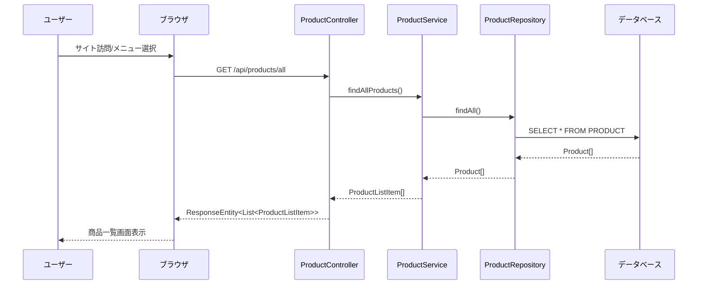

**カテゴリ別一覧表示フロー**

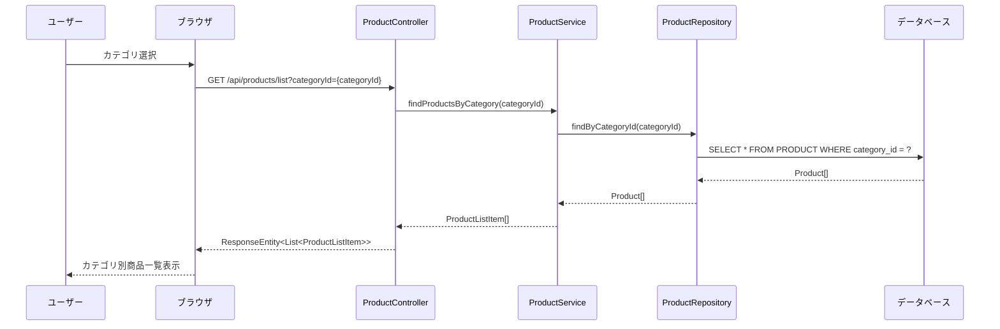

**商品検索フロー**

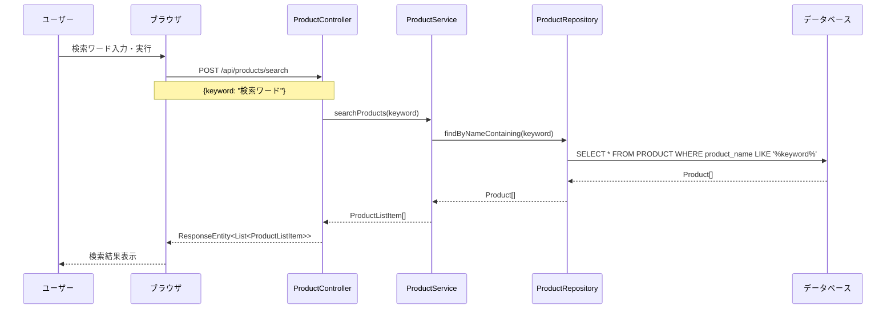

**商品詳細表示フロー**

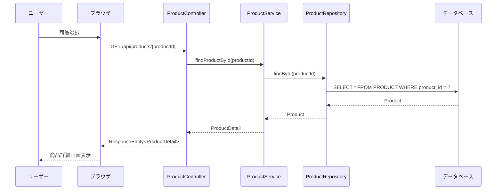

**カート追加フロー**

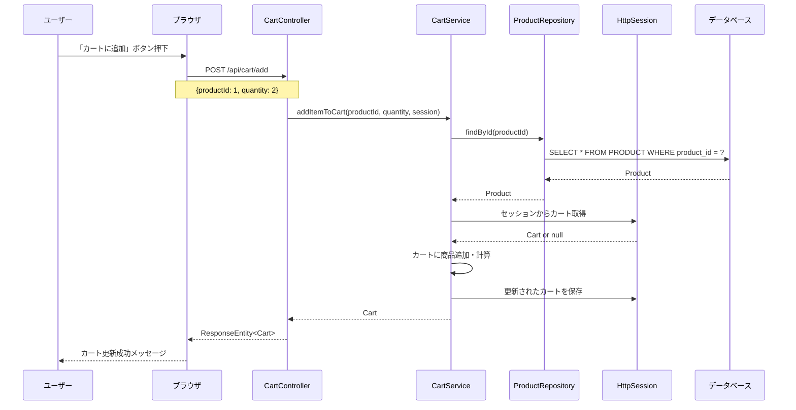

**カート内容確認・編集フロー**

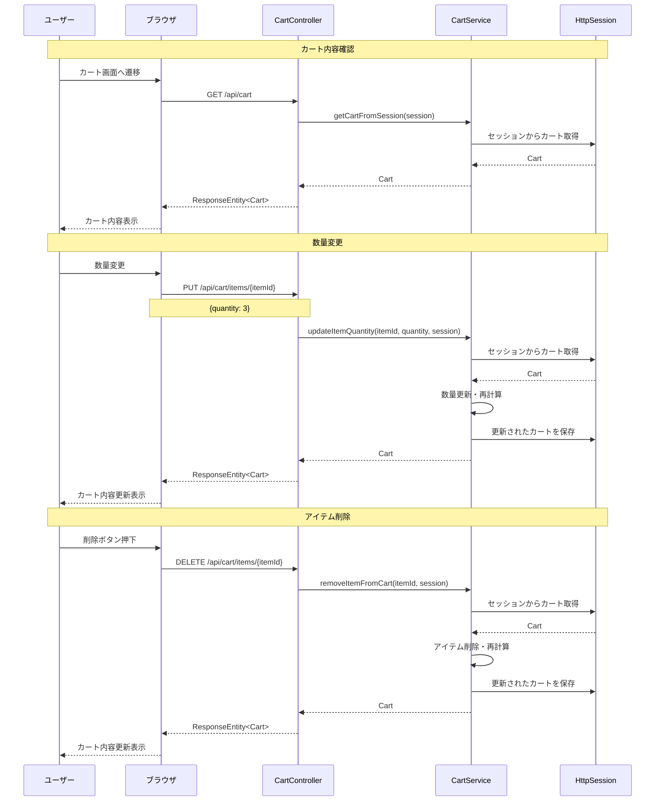

**注文情報入力フロー**

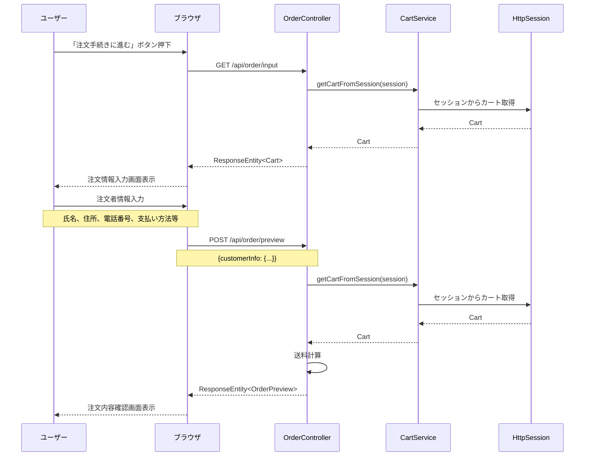

**注文確認・確定フロー**

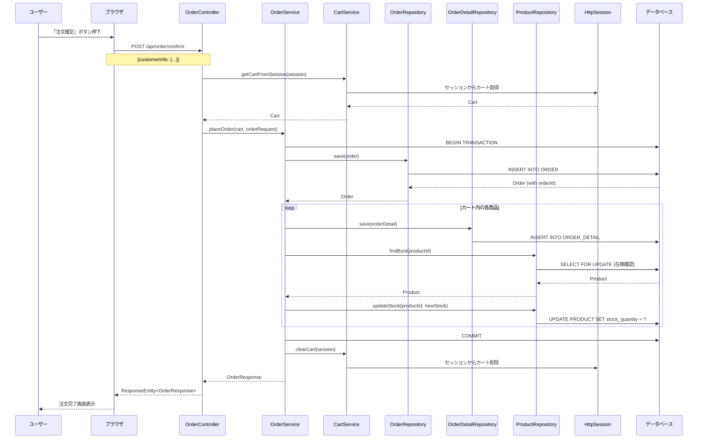
**非会員購入フロー**

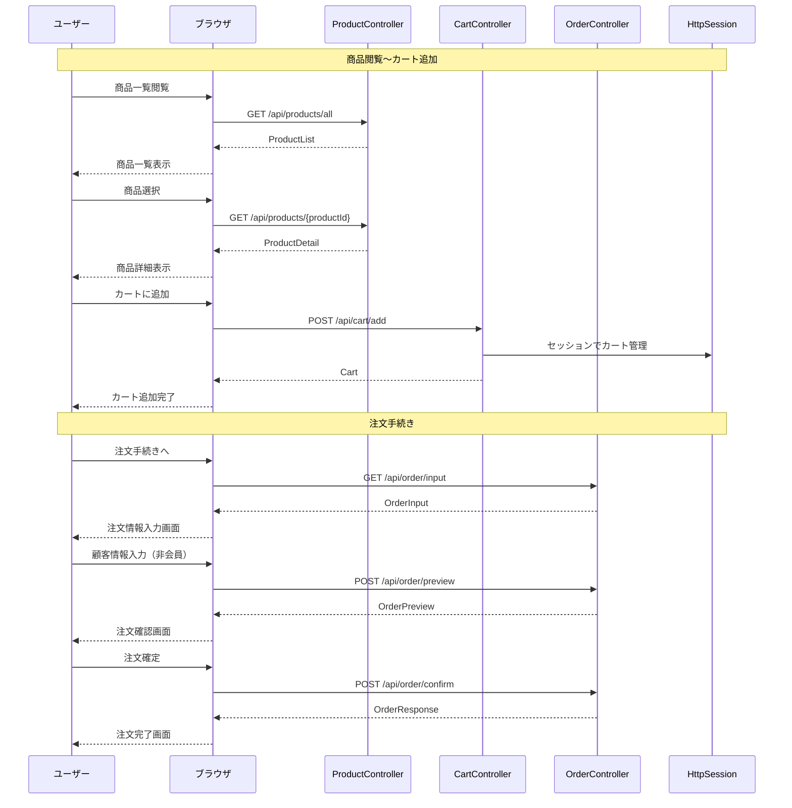

 **会員購入フロー**

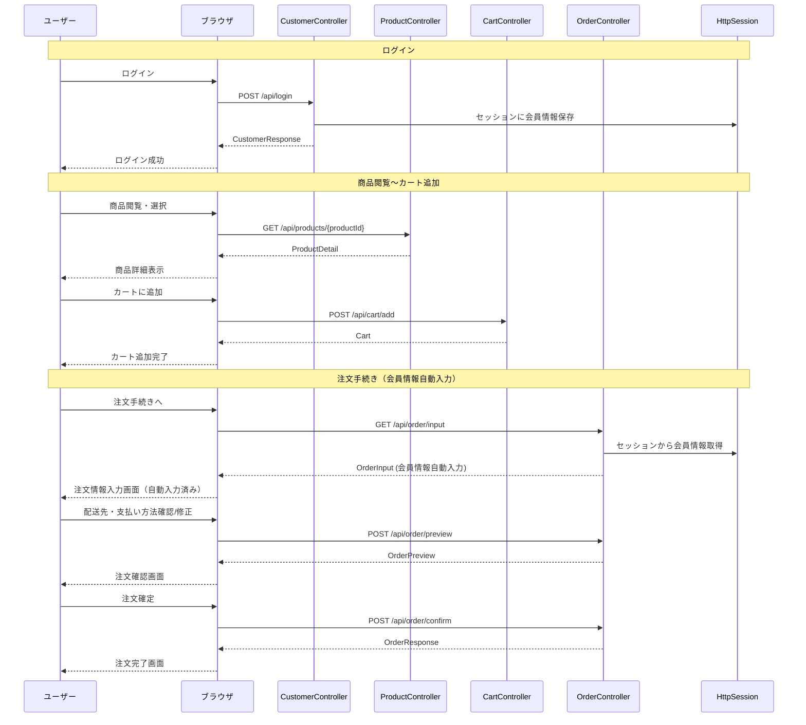
**注文完了・通知フロー**

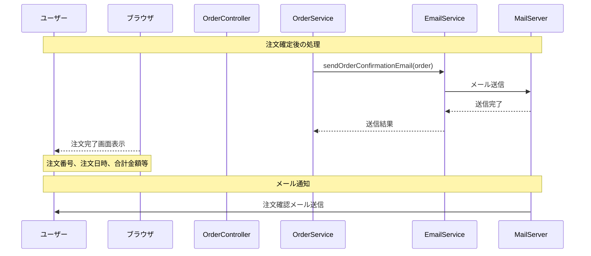

**会員登録フロー**

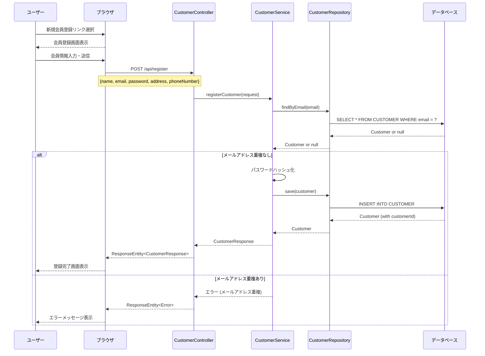

**ログインフロー**

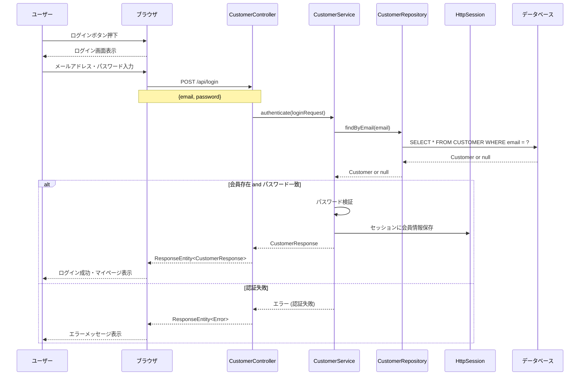

**ログアウトフロー**

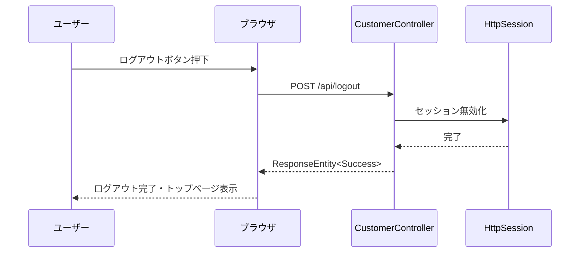

**注文履歴閲覧フロー**

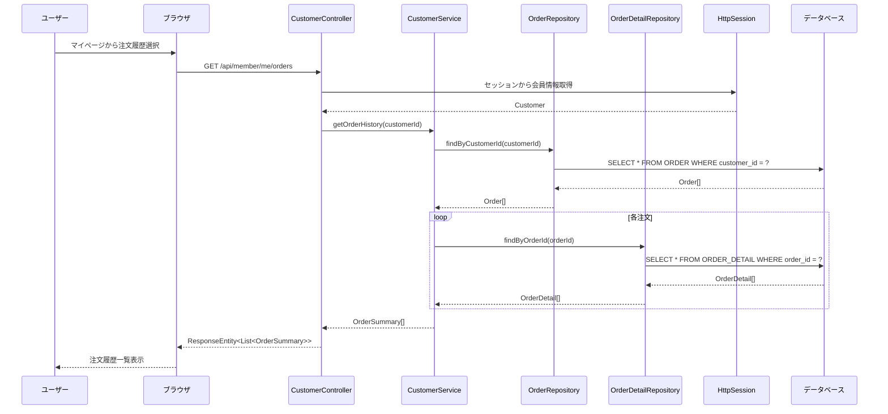

**支払い方法選択フロー**

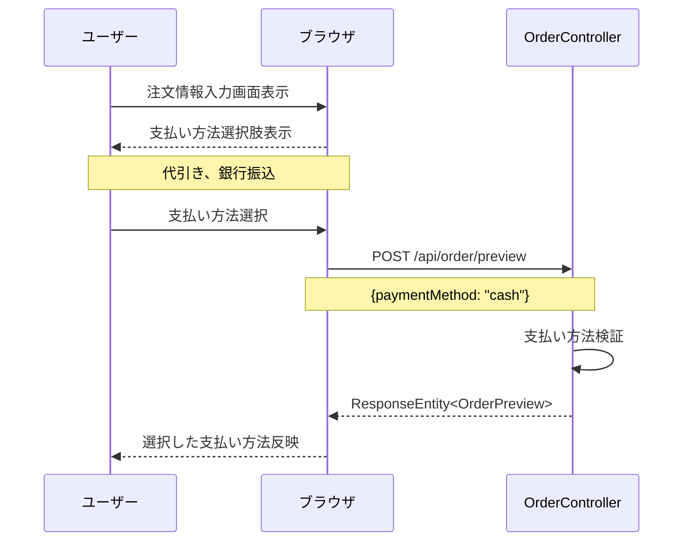

**配送料計算フロー**

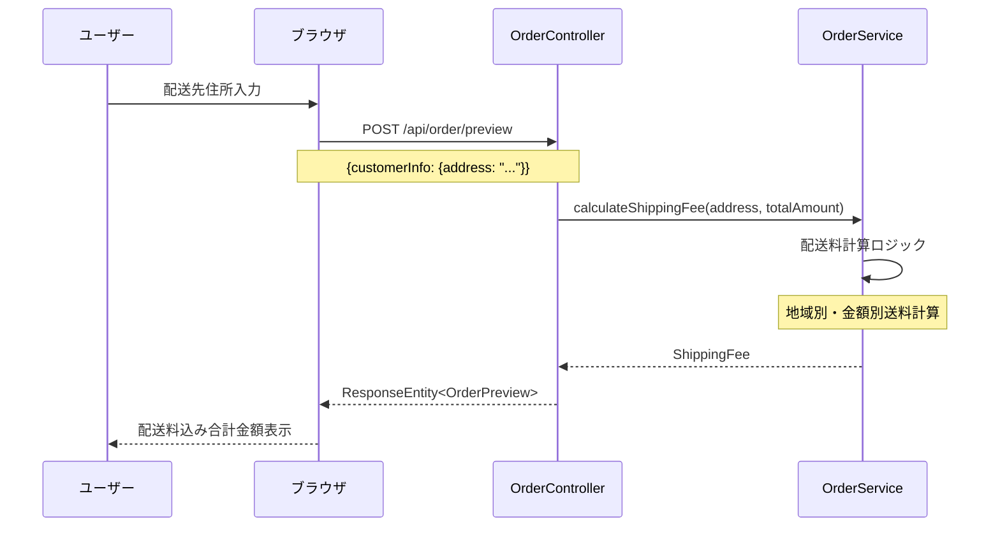

