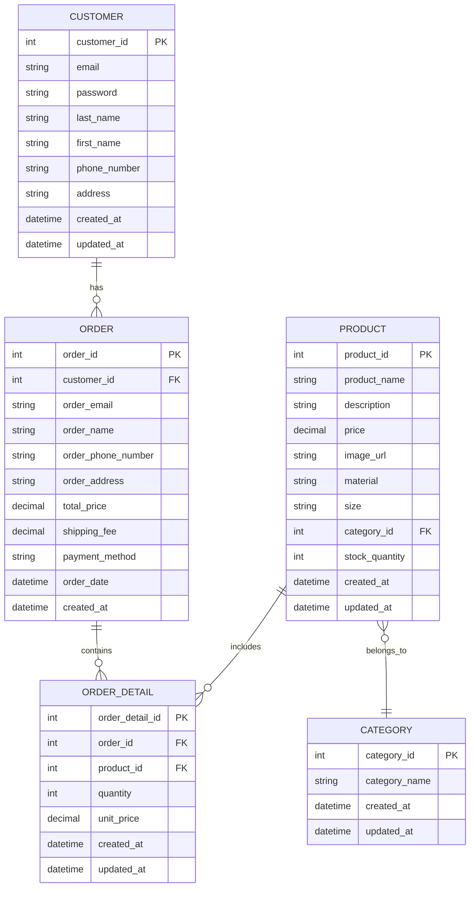

## 6. DB定義
本章では、本システムで使用するデータベース構造およびその設計方針を示す。以下の4つの項目で構成する。

### 6.1 テーブル定義書
本システムで使用する主要テーブルの物理設計を以下に示す。

**CUSTOMER（顧客情報）**

| 倫理名     　  | 物理名        | 型        | サイズ | PK | NN | UQ | FK | CHK | Index　|　デフォルト値　| 備考                      |
|---------------|---------------|----------|--------|----|----|----|----|-----|--------|--------------|---------------------------|
|　顧客番号　    | customer_id   | INT      | -    | ○    | ○   |   |     |  |      |　(自動採番) | 主キー  |
|　メールアドレス | email         | VARCHAR | 255  |      | ○  | ○  |     |  |      |            |
|　パスワード　   | password      | VARCHAR | 255  |       | ○  |    |     |   |      |            |     |
|　姓　          | last_name     | VARCHAR | 50   |       | ○  |    |     |   |      |            |      |
|　名　          | first_name    | VARCHAR | 50   |       | ○  |    |     |   |      |            |         |
|　電話番号　    | phone_number  | VARCHAR  | 20   |       | ○  |    |     |  |       |            |          |
|　配達先住所　  | address       | TEXT     | -    |       | ○  |    |     |   |      |            |          |
| 登録日時　     | created_at    | TIMESTANP | -    |       | ○  |    |     |  |       |           |          |
|　更新日時　    | updated_at    | TIMESTANP | -    |       | ○  |    |     |  |       |            |         |

---

**PRODUCT（商品情報）**

| 倫理名     　   | 物理名        | 型        | サイズ | PK | NN | UQ | FK | CHK | Index　|　デフォルト値　| 備考                      |
|--------------- |---------------|----------|--------|----|----|----|----|-----|----|--------------|---------------------------|
| 商品ID　　　　　| product_id     | INT       |     | ○   | ○ | | | | ○ | (自動採番)    |   |
| 商品名　　　　　| product_name   | VARCHAR   | 255  |     | ○ | | | | ○ |               |   |
| 商品説明　　　　| description    | TEXT      |     |     |   | | | |   |              |   |
| 価格　　　　　　| price          | DECIMAL   |     |     | ○ | | |○|   |              | price > 0 |
| 画像URL　　　　 | image_url      | VARCHAR   | 500 |     |   | | | |   |              |   |
| 素材　         | material       | VARCHAR   | 100  |     |   | | | |   |              |   |
| サイズ　　　　　| size           | VARCHAR   | 100  |     |   | | | |   |              |   |
| カテゴリID　　　| category_id    | INT       |      |     | ○ | | | | ○ |             |   |
| 在庫数　　　　　| stock_quantity | INT       |      |     | ○ | |○|○|   | 0       |  stock_quantity >= 0 |
| 登録日時　　　　| created_at     | TIMESTANP |      |     | ○ ||||| (現在時刻)   |  |
| 更新日時　　　　| updated_at     | TIMESTANP |      |     | ○ ||||| (現在時刻)   |  |

---

- CATEGORY（カテゴリ情報）

| 項目名        | データ型  | 桁数 | 主キー | NOT NULL | 備考               |
|---------------|-----------|------|--------|----------|--------------------|
| category_id   | INT       | -    | ○      | ○        | カテゴリID（自動採番） |
| category_name | VARCHAR   | 100  |        | ○        | カテゴリ名         |
| created_at    | DATETIME  | -    |        | ○        | 登録日時           |
| updated_at    | DATETIME  | -    |        | ○        | 更新日時           |

---

- ORDER（注文情報）

| 項目名             | データ型  | 桁数 | 主キー | NOT NULL | 備考                         |
|--------------------|-----------|------|--------|----------|------------------------------|
| order_id           | INT       | -    | ○      | ○        | 注文ID（自動採番）           |
| customer_id        | INT       | -    |        | ○        | 顧客ID（非会員は0）          |
| order_email        | VARCHAR   | 255  |        | ○        | 注文者メールアドレス         |
| order_name         | VARCHAR   | 100  |        | ○        | 注文者氏名                   |
| order_phone_number | VARCHAR   | 20   |        | ○        | 注文者電話番号               |
| order_address      | TEXT      | -    |        | ○        | 注文者住所                   |
| total_price        | DECIMAL   | 10,2 |        | ○        | 合計金額                     |
| shipping_fee       | DECIMAL   | 10,2 |        | ○        | 配送料                       |
| payment_method     | VARCHAR   | 50   |        | ○        | 支払い方法                   |
| order_date         | DATETIME  | -    |        | ○        | 注文日時                     |
| created_at         | DATETIME  | -    |        | ○        | データ登録日時               |

---

- ORDER_DETAIL（注文明細情報）

| 項目名          | データ型  | 桁数 | 主キー | NOT NULL | 備考                        |
|-----------------|-----------|------|--------|----------|-----------------------------|
| order_detail_id | INT       | -    | ○      | ○        | 注文明細ID（自動採番）      |
| order_id        | INT       | -    |        | ○        | 注文ID（外部キー）          |
| product_id      | INT       | -    |        | ○        | 商品ID（外部キー）          |
| quantity        | INT       | -    |        | ○        | 数量                        |
| unit_price      | DECIMAL   | 10,2 |        | ○        | 購入時単価                  |
| created_at      | DATETIME  | -    |        | ○        | 登録日時                    |
| updated_at      | DATETIME  | -    |        | ○        | 更新日時                    |

### 6.2 ER図

### 6.3 インデックス一覧

| テーブル名   | インデックス名       | 対象カラム   | 用途・補足                       |
|--------------|----------------------|--------------|---------------------------------|
| CUSTOMER     | idx_customer_email   | email        | ログイン認証用ユニーク検索       |
| PRODUCT      | idx_product_category | category_id  | 商品一覧のカテゴリ絞り込み       |
| ORDER        | idx_order_customer   | customer_id  | 顧客別注文履歴の高速検索         |
| ORDER_DETAIL | idx_detail_order     | order_id     | 注文明細の注文単位検索           |
| ORDER_DETAIL | idx_detail_product   | product_id   | 商品別の注文明細検索             |

※ 主キーに対してはデフォルトでユニークインデックスが作成される。

---

### 6.4 トランザクション設計方針(内容精査中)

**基本方針**
- 一連の関連データ操作（特に注文処理や会員登録）においては、**データ整合性を担保するためトランザクションを利用**する。
- 複数テーブルにまたがる操作は原子性（Atomicity）を確保し、途中で失敗した場合はすべての変更をロールバックする。
- 適切な排他制御を行い、**データ競合や不整合の防止**を図る。

**トランザクション対象処理例**

| 処理名       | 対象テーブル            | ロールバック条件                       |
|--------------|-------------------------|--------------------------------------|
| 注文確定処理 | ORDER, ORDER_DETAIL     | いずれかのINSERT失敗                  |
| 会員登録処理 | CUSTOMER                | INSERT失敗（重複、通信障害など）      |
| 会員情報更新 | CUSTOMER                | UPDATE失敗                           |
| 在庫更新     | PRODUCT                 | UPDATE失敗                           |

**排他制御**

- 商品の在庫数更新時は、`SELECT FOR UPDATE` 等を利用し**同時更新による競合を防止**する。
- トランザクションの粒度は画面単位（例：注文完了までの一連処理）とし、必要最小限の範囲でロックを保持する。

---
