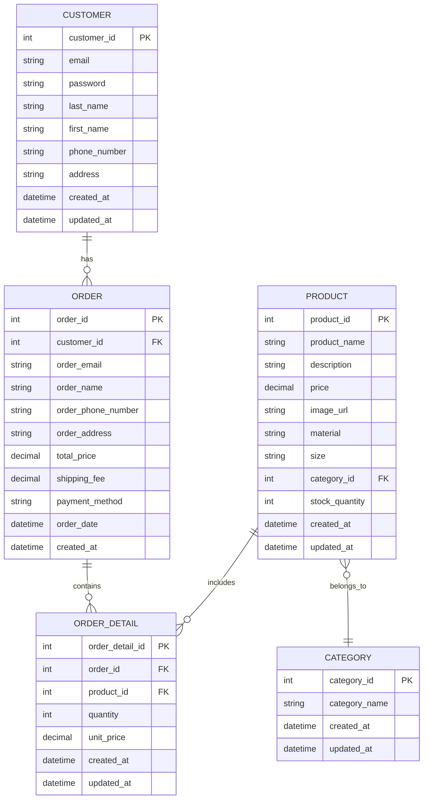

## 6. DB定義

本章では、本システムで使用するデータベース構造およびその設計方針を示す。以下の4つの項目で構成する。

---

### 6.1 テーブル定義書

本システムで使用する主要テーブルの物理設計を以下に示す。

---

#### CUSTOMER（顧客情報）

| 論理名           | 物理名        | 型        | サイズ | PK | NN | UQ | FK | CHK | デフォルト値      | 備考             |
|------------------|---------------|-----------|--------|----|----|----|----|-----|-------------------|------------------|
| 顧客ID           | customer_id   | INT       | -      | ○  | ○  |    |    |     | 自動採番          | 主キー           |
| ログイン用メールアドレス | email         | VARCHAR   | 255    |    | ○  | ○  |    |     |                   |                  |
| パスワード       | password      | VARCHAR   | 255    |    | ○  |    |    |     |                   | ハッシュ前提     |
| 姓               | last_name     | VARCHAR   | 50     |    | ○  |    |    |     |                   |                  |
| 名               | first_name    | VARCHAR   | 50     |    | ○  |    |    |     |                   |                  |
| 電話番号         | phone_number  | VARCHAR   | 20     |    | ○  |    |    |     |                   |                  |
| 配達先住所       | address       | TEXT      | -      |    | ○  |    |    |     |                   |                  |
| 登録日時         | created_at    | TIMESTAMP | -      |    | ○  |    |    |     | CURRENT_TIMESTAMP | 自動設定         |
| 更新日時         | updated_at    | TIMESTAMP | -      |    | ○  |    |    |     | CURRENT_TIMESTAMP | 自動更新（トリガ等） |

---

#### PRODUCT（商品情報）

| 論理名           | 物理名         | 型        | サイズ | PK | NN | UQ | FK | CHK                    | デフォルト値      | 備考                   |
|------------------|----------------|-----------|--------|----|----|----|----|-------------------------|-------------------|------------------------|
| 商品ID           | product_id     | INT       | -      | ○  | ○  |    |    |                         | 自動採番          |                        |
| 商品名           | product_name   | VARCHAR   | 255    |    | ○  |    |    |                         |                   |                        |
| 商品説明         | description    | TEXT      | -      |    |    |    |    |                         |                   |                        |
| 価格             | price          | DECIMAL   | 10     |    | ○  |    |    | price > 0               |                   |                        |
| 画像URL          | image_url      | VARCHAR   | 500    |    |    |    |    |                         |                   |                        |
| 素材             | material       | VARCHAR   | 100    |    |    |    |    |                         |                   |                        |
| サイズ           | size           | VARCHAR   | 100    |    |    |    |    |                         |                   |                        |
| カテゴリID       | category_id    | INT       | -      |    | ○  |    | ○  |                         |                   | → CATEGORY(category_id) |
| 在庫数           | stock_quantity | INT       | -      |    | ○  |    |    | stock_quantity >= 0     | 0                 |                        |
| 登録日時         | created_at     | TIMESTAMP | -      |    | ○  |    |    |                         | CURRENT_TIMESTAMP |                        |
| 更新日時         | updated_at     | TIMESTAMP | -      |    | ○  |    |    |                         | CURRENT_TIMESTAMP |                        |

---

#### CATEGORY（カテゴリ情報）

| 論理名           | 物理名        | 型        | サイズ | PK | NN | UQ | FK | CHK | デフォルト値      | 備考             |
|------------------|---------------|-----------|--------|----|----|----|----|-----|-------------------|------------------|
| カテゴリID       | category_id   | INT       | -      | ○  | ○  |    |    |     | 自動採番          | 主キー           |
| カテゴリ名       | category_name | VARCHAR   | 100    |    | ○  | ○  |    |     |                   | 一意制約あり     |
| 登録日時         | created_at    | TIMESTAMP | -      |    | ○  |    |    |     | CURRENT_TIMESTAMP |                  |
| 更新日時         | updated_at    | TIMESTAMP | -      |    | ○  |    |    |     | CURRENT_TIMESTAMP |                  |

---

#### ORDER（注文情報）

| 論理名              | 物理名           | 型        | サイズ | PK | NN | UQ | FK | CHK                         | デフォルト値      | 備考                      |
|---------------------|------------------|-----------|--------|----|----|----|----|------------------------------|-------------------|---------------------------|
| 注文ID              | order_id         | INT       | -      | ○  | ○  |    |    |                              | 自動採番          | 主キー                    |
| 顧客ID              | customer_id      | INT       | -      |    | ○  |    | ○  |                              |                   | → CUSTOMER(customer_id)   |
| 注文者メールアドレス | order_email      | VARCHAR   | 255    |    | ○  |    |    |                              |                   | 顧客情報のコピー          |
| 注文者氏名          | order_name       | VARCHAR   | 100    |    | ○  |    |    |                              |                   |                            |
| 注文者電話番号      | order_phone_number | VARCHAR | 20     |    | ○  |    |    |                              |                   |                            |
| 注文者住所          | order_address    | TEXT      | -      |    | ○  |    |    |                              |                   |                            |
| 合計金額            | total_price      | DECIMAL   | 10     |    | ○  |    |    | total_price > 0              |                   |                            |
| 配送料              | shipping_fee     | DECIMAL   | 10     |    | ○  |    |    |                              |                   |                            |
| 支払方法            | payment_method   | VARCHAR   | 50     |    | ○  |    |    | payment_method IN ('credit', 'bank', 'cash') | | |
| 注文日時            | order_date       | TIMESTAMP | -      |    | ○  |    |    |                              | CURRENT_TIMESTAMP |                            |
| データ登録日時      | created_at       | TIMESTAMP | -      |    | ○  |    |    |                              | CURRENT_TIMESTAMP |                            |

---

#### ORDER_DETAIL（注文明細情報）

| 論理名      | 物理名          | 型        | サイズ | PK | NN | UQ | FK | CHK                 | デフォルト値      | 備考                        |
|-------------|-----------------|-----------|--------|----|----|----|----|----------------------|-------------------|-----------------------------|
| 注文明細ID  | order_detail_id | INT       | -      | ○  | ○  |    |    |                      | 自動採番          | 主キー                      |
| 注文ID      | order_id        | INT       | -      |    | ○  |    | ○  |                      |                   | → ORDER(order_id)          |
| 商品ID      | product_id      | INT       | -      |    | ○  |    | ○  |                      |                   | → PRODUCT(product_id)      |
| 数量        | quantity        | INT       | -      |    | ○  |    |    | quantity > 0         |                   |                            |
| 購入時価格  | unit_price      | DECIMAL   | 10     |    | ○  |    |    | unit_price > 0       |                   |                            |
| 登録日時    | created_at      | TIMESTAMP | -      |    | ○  |    |    |                      | CURRENT_TIMESTAMP |                            |
| 更新日時    | updated_at      | TIMESTAMP | -      |    | ○  |    |    |                      | CURRENT_TIMESTAMP |                            |

---

### 6.2 ER図

### 6.3 インデックス一覧

| テーブル名   | インデックス名       | 対象カラム   | 用途・補足                     |
|--------------|----------------------|--------------|-------------------------------|
| CUSTOMER     | idx_customer_email   | email        | ログイン認証用ユニーク検索     |
| PRODUCT      | idx_product_category | category_id  | 商品一覧のカテゴリ絞り込み     |
| ORDER        | idx_order_customer   | customer_id  | 顧客別注文履歴の高速検索       |
| ORDER_DETAIL | idx_detail_order     | order_id     | 注文明細の注文単位検索         |
| ORDER_DETAIL | idx_detail_product   | product_id   | 商品別の注文明細検索           |

※ 主キーにはデフォルトでユニークインデックスが作成される。

---

### 6.4 トランザクション設計方針

#### 基本方針

- 関連データ操作（特に注文処理・会員登録）においては、**トランザクション処理で整合性を担保**
- 複数テーブルにまたがる処理は原子性（Atomicity）を確保し、**失敗時にはロールバック**
- **排他制御（SELECT FOR UPDATEなど）**　を用いて同時更新を防止

#### トランザクション対象処理例

| 処理名       | 対象テーブル              | ロールバック条件             |
|--------------|---------------------------|------------------------------|
| 注文確定処理 | ORDER, ORDER_DETAIL       | いずれかのINSERT失敗         |
| 会員登録処理 | CUSTOMER                  | INSERT失敗                   |
| 会員情報更新 | CUSTOMER                  | UPDATE失敗                   |
| 在庫更新     | PRODUCT                   | UPDATE失敗                   |

#### 排他制御

- 商品在庫の更新には `SELECT FOR UPDATE` を使用
- トランザクションの粒度は「画面単位」とし、ロックは必要最小限に限定

