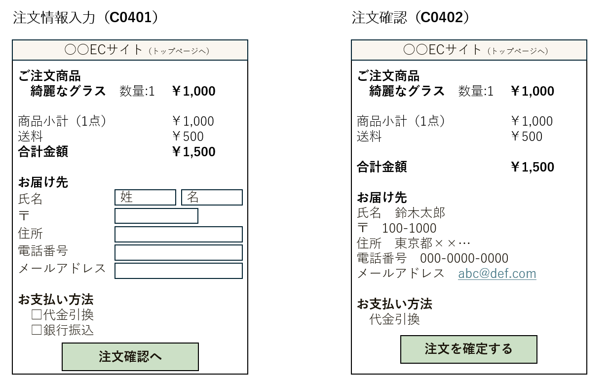
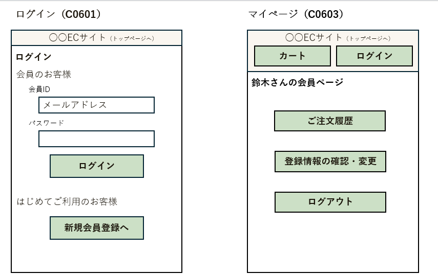
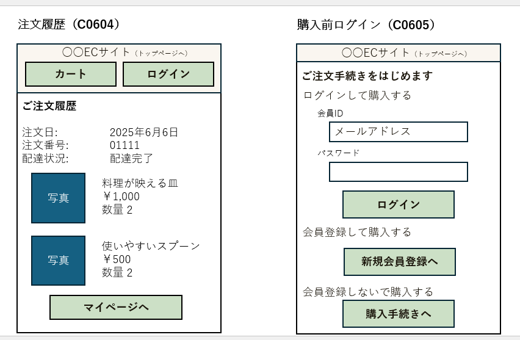

## 7. 画面項目定義
### 7.1 画面一覧

### 7.2 画面項目定義書
| 要素ID       | 画面ID | 項目名               | 要素種別           | 動作・備考                                   | 桁数制限     | バリデーションルール                               | エラーメッセージ                          |
|--------------|--------|----------------------|--------------------|----------------------------------------------|--------------|----------------------------------------------------|-------------------------------------------|
| C0101_L01    | C0101  | ○○ECサイト           | リンク             | トップページ(C0101)に遷移                    | なし         |                                                    |                                           |
| C0101_L02    | C0101  | カート               | リンク             | カート(C0301)に遷移                          | なし         |                                                    |                                           |
| C0101_L03    | C0101  | ログイン             | リンク             | ログイン(C0601)に遷移                        | なし         |                                                    |                                           |
| C0101_TI01   | C0101  | キーワード検索       | テキスト入力       | 入力内容を検索条件として送信                  | 最大50文字   | 全角・半角文字、数字を許容。記号（"・"など）も可 | キーワードは50文字以内で入力してください |
| C0101_B01    | C0101  | 検索                 | ボタン             | 入力値をパラメータとして送信、商品一覧（C0201）に遷移 | なし         |                                                    |                                           |
| C0101_D01    | C0101  | カテゴリから選ぶ     | 表示項目           | ラベル                                       | なし         |                                                    |                                           |
| C0101_L04    | C0101  | 文房具               | リンク             | カテゴリ絞り込みで商品一覧（C0201）に遷移   | なし         |                                                    |                                           |
| C0101_L05    | C0101  | キッチン用品         | リンク             | カテゴリ絞り込みで商品一覧（C0201）に遷移   | なし         |                                                    |                                           |
| C0101_L06    | C0101  | 生活雑貨             | リンク             | カテゴリ絞り込みで商品一覧（C0201）に遷移   | なし         |                                                    |                                           |
| C0101_L07    | C0101  | インテリア           | リンク             | カテゴリ絞り込みで商品一覧（C0201）に遷移   | なし         |                                                    |                                           |
| C0101_L08    | C0101  | 特定商取引法表示     | リンク             | 特定商取引法表示(C0701)に遷移                | なし         |                                                    |                                           |
| C0101_L09    | C0101  | プライバシーポリシー | リンク             | プライバシーポリシー(C0801)に遷移            | なし         |                                                    |                                           |
| C0101_L10    | C0101  | FAQ                  | リンク             | FAQ(C0901)に遷移                            | なし         |                                                    |                                           |
| C0201_L01    | C0201  | ○○ECサイト           | リンク             | トップページ(C0101)に遷移                    | なし         |                                                    |                                           |
| C0201_L02    | C0201  | カート               | リンク             | カート(C0301)に遷移                          | なし         |                                                    |                                           |
| C0201_L03    | C0201  | ログイン             | リンク             | ログイン(C0601)に遷移                        | なし         |                                                    |                                           |
| C0201_TI01   | C0201  | キーワード検索       | テキスト入力       | 入力内容を検索条件として送信                  | 最大50文字   | 全角・半角文字、数字を許容。記号（"・"など）も可 | キーワードは50文字以内で入力してください |
| C0201_B01    | C0201  | 検索                 | ボタン             | 入力値をパラメータとして送信、商品一覧再表示 | なし         |                                                    |                                           |
| C0201_SB01   | C0201  | カテゴリを絞り込む   | セレクトボックス   | 選択後、カテゴリに応じて商品一覧に遷移       | なし         |                                                    |                                           |
| C0201_L04    | C0201  | すべての商品を表示   | リンク             | 絞り込み解除、全商品一覧を表示               | なし         |                                                    |                                           |
| C0201_L05    | C0201  | 商品一覧リスト       | 繰り返しリンク     | 各商品ブロックリンクを繰り返し表示           | なし         |                                                    |                                           |
| C0201_D01    | C0201  | 画像                 | 表示項目           | 商品画像表示                                 | なし         |                                                    |                                           |
| C0201_D02    | C0201  | 商品名               | 表示項目           | 商品名テキスト表示                           | なし         |                                                    |                                           |
| C0201_D03    | C0201  | 価格                 | 表示項目           | 価格表示（税込）                             | なし         |                                                    |                                           |
| C0201_L06    | C0201  | >                    | リンク             | 商品詳細(0202)に遷移                         | なし         |                                                    |                                           |
| C0202_L01    | C0202  | ○○ECサイト           | リンク             | トップページ(C0101)に遷移                    | なし         |                                                    |                                           |
| C0202_L02    | C0202  | カート               | リンク             | カート(C0301)に遷移                          | なし         |                                                    |                                           |
| C0202_L03    | C0202  | ログイン             | リンク             | ログイン(C0601)に遷移                        | なし         |                                                    |                                           |
| C0202_D01    | C0202  | 商品名               | 表示項目           | 商品名を表示                               | なし         |                                                    |                                           |
| C0202_D02    | C0202  | 写真                 | 表示項目           | 商品画像の大きい表示                         | なし         |                                                    |                                           |
| C0202_B01    | C0202  | カートに入れる       | ボタン             | カート(C0301)へ商品追加                      | なし         |                                                    |                                           |
| C0202_D03    | C0202  | 価格                 | 表示項目           | 価格表示                                   | なし         |                                                    |                                           |
| C0202_D04    | C0202  | 商品スペック         | 表示項目           | 商品の詳細仕様（サイズ、素材など）           | なし         |                                                    |                                           |
| C0301_L01    | C0301  | ○○ECサイト           | リンク             | トップページ(C0101)に遷移                    | なし         |                                                    |                                           |
| C0301_L02    | C0301  | カート               | リンク             | カート(C0301)に遷移                          | なし         |                                                    |                                           |
| C0301_L03    | C0301  | ログイン             | リンク             | ログイン(C0601)に遷移                        | なし         |                                                    |                                           |
| C0301_D01    | C0301  | ショッピングカート   | 表示項目           | カート内商品の一覧表示                       | なし         |                                                    |                                           |
| C0301_D02    | C0301  | 商品ブロック         | 表示項目           | 各商品1件分の情報ブロック                   | なし         |                                                    |                                           |
| C0301_D03    | C0301  | 写真                 | 表示項目           | 商品画像表示                               | なし         |                                                    |                                           |
| C0301_D04    | C0301  | 商品名               | 表示項目           | 商品名表示                                 | なし         |                                                    |                                           |
| C0301_D05    | C0301  | 価格                 | 表示項目           | 価格表示                                   | なし         |                                                    |                                           |
| C0301_NS01   | C0301  | 数量                 | 数値入力＋スピンボタン | 「＋」「－」で数量を変更                  | 1～999       | （初期値1、0未満不可）                           |                                           |
| C0301_D06    | C0301  | 合計金額             | 表示項目           | 商品合計金額表示                           | なし         |                                                    |                                           |
| C0301_D07    | C0301  | 送料無料条件         | 表示項目           | ご注文金額￥5,000以上で送料無料表示         | なし         |                                                    |                                           |
| C0301_L04    | C0301  | 買い物を続ける       | リンク             | 商品一覧(C0201)に遷移                       | なし         |                                                    |                                           |
| C0301_L05    | C0301  | 購入手続きへ進む     | リンク             | 注文情報入力(C0401)に遷移                   | なし         |                                                    |                                           |
| C0401_L01    | C0401  | ○○ECサイト           | リンク             | トップページ(C0101)に遷移                    | なし         |                                                    |                                           |
| C0401_D01    | C0401  | ご注文商品           | 表示項目           | 注文商品一覧表示                           | なし         |                                                    |                                           |
| C0401_D02    | C0401  | 商品名               | 表示項目           | 商品名表示                                 | なし         |                                                    |                                           |
| C0401_D03    | C0401  | 数量                 | 表示項目           | 注文数量表示                               | なし         |                                                    |                                           |
| C0401_D04    | C0401  | 価格                 | 表示項目           | 単価表示                                   | なし         |                                                    |                                           |
| C0401_D05    | C0401  | 商品小計（点数）     | 表示項目           | 小計金額、購入点数表示                     | なし         |                                                    |                                           |
| C0401_D06    | C0401  | 送料                 | 表示項目           | ￥500（合計金額が￥5000未満）or￥０（合計金額が￥5000以上） | なし         |                                                    |                                           |
| C0401_D07    | C0401  | 合計金額             | 表示項目           | 合計金額表示                               | なし         |                                                    |                                           |
| C0401_D08    | C0401  | お届け先             | 表示項目           | お届け先情報ブロック                       | なし         |                                                    |                                           |
| C0401_D09    | C0401  | 氏名                 | 表示項目           | お届け先氏名表示                           | なし         |                                                    |                                           |
| C0401_TI01   | C0401  | 姓入力欄             | テキスト入力       | 氏名の姓入力                               | 最大20文字   | 全角・半角文字を許容。英字・日本語どちらも可     | 姓は20文字以内で入力してください           |
| C0401_TI02   | C0401  | 名入力欄             | テキスト入力       | 氏名の名入力                               | 最大20文字   | 全角・半角文字を許容。英字・日本語どちらも可     | 名は20文字以内で入力してください           |
| C0401_D10    | C0401  | 〒                    | 表示項目           | 郵便番号ラベル                           | なし         |                                                    |                                           |
| C0401_TI03   | C0401  | 郵便番号入力欄       | テキスト入力       | 郵便番号入力                               | 固定7桁     | 数字7桁（ハイフンなし）                           | 郵便番号はハイフンなし半角数字7桁で入力してください（例：1234567） |
| C0401_D11    | C0401  | 住所                 | 表示項目           | 住所ラベル                                 | なし         |                                                    |                                           |
| C0401_TI04   | C0401  | 住所入力欄           | テキスト入力       | 住所入力                                   | 最大100文字 | 全角・半角文字、数字、「-」等の記号を許容           | 住所は100文字以内で入力してください           |
| C0401_D12    | C0401  | 電話番号             | 表示項目           | 電話番号ラベル                             | なし         |                                                    |                                           |
| C0401_TI05   | C0401  | 電話番号入力欄       | テキスト入力       | 電話番号入力                               | 最大15文字  | 数字のみ（ハイフンなし）                           | 電話番号は15桁以内のハイフンなし半角数字で入力してください     |
| C0401_D13    | C0401  | メールアドレス       | 表示項目           | メールラベル                               | なし         |                                                    |                                           |
| C0401_TI06   | C0401  | メールアドレス入力欄 | テキスト入力       | メールアドレス入力                         | 最大254文字 | 「xxx@yyy.zzz」形式（RFC準拠）。（半角英数字）        | 有効なメールアドレスを入力してください             |
| C0401_D14    | C0401  | お支払方法           | 表示項目           | 支払方法ラベル                             | なし         |                                                    |                                           |
| C0401_RB01   | C0401  | 代金引換             | ラジオボタン       | 支払方法選択肢                             | なし         |                                                    |                                           |
| C0401_RB02   | C0401  | 銀行振込             | ラジオボタン       | 支払方法選択肢                             | なし         |                                                    |                                           |
| C0401_B01    | C0401  | 注文確認へ           | ボタン             | 注文確認画面(C0402)に遷移                 | なし         |                                                    |                                           |
| C0402_D01    | C0402  | ご注文商品           | 表示項目           | 注文商品一覧表示                           | なし         |                                                    |                                           |
| C0402_D02    | C0402  | 商品名               | 表示項目           | 商品名表示                                 | なし         |                                                    |                                           |
| C0402_D03    | C0402  | 数量                 | 表示項目           | 注文数量表示                               | なし         |                                                    |                                           |
| C0402_D04    | C0402  | 価格                 | 表示項目           | 単価表示                                   | なし         |                                                    |                                           |
| C0402_D05    | C0402  | 商品小計（点数）     | 表示項目           | 小計点数表示                               | なし         |                                                    |                                           |
| C0402_D06    | C0402  | 送料                 | 表示項目           | 送料表示                                   | なし         |                                                    |                                           |
| C0402_D07    | C0402  | 合計金額             | 表示項目           | 合計金額表示                               | なし         |                                                    |                                           |
| C0402_D08    | C0402  | お届け先             | 表示項目           | お届け先情報表示                           | なし         |                                                    |                                           |
| C0402_D09    | C0402  | 氏名                 | 表示項目           | 氏名表示                                   | なし         |                                                    |                                           |
| C0402_D10    | C0402  | 〒                    | 表示項目           | 郵便番号表示                             | なし         |                                                    |                                           |
| C0402_D11    | C0402  | 住所                 | 表示項目           | 住所表示                                   | なし         |                                                    |                                           |
| C0402_D12    | C0402  | 電話番号             | 表示項目           | 電話番号表示                               | なし         |                                                    |                                           |
| C0402_D13    | C0402  | メールアドレス       | 表示項目           | メールアドレス表示                         | なし         |                                                    |                                           |
| C0402_D14    | C0402  | お支払方法           | 表示項目           | 支払方法表示                               | なし         |                                                    |                                           |
| C0402_B01    | C0402  | 注文を確定する       | ボタン             | 注文確定処理実行                           | なし         |                                                    |                                           |
| C0403_L01    | C0403  | ○○ECサイト           | リンク             | トップページ(C0101)に遷移                  | なし         |                                                    |                                           |
| C0403_D01    | C0403  | 購入ありがとう       | 表示項目           | 購入ありがとうございます。注文明細をメールで送付しました。 | なし         |                                                    |                                           |
| C0403_D02    | C0403  | 注文番号             | 表示項目           | 注文番号表示                               | なし         |                                                    |                                           |
| C0403_L02    | C0403  | トップページへ       | リンク             | トップページ(C0101)に遷移                  | なし         |                                                    |                                           |
| C0501_L01    | C0501  | ○○ECサイト           | リンク             | トップページ(C0101)に遷移                  | なし         |                                                    |                                           |
| C0501_D01    | C0501  | 会員情報のご登録     | 表示項目           | 画面タイトル                               | なし         |                                                    |                                           |
| C0501_D02    | C0501  | 会員ID               | 表示項目           | 会員ID表示（変更不可）                     | なし         |                                                    |                                           |
| C0501_TI01   | C0501  | メールアドレス入力欄 | テキスト入力       | メールアドレス入力                         | 最大254文字 | 「xxx@yyy.zzz」形式（RFC準拠）。（半角英数字）        | 有効なメールアドレスを入力してください             |
| C0501_D03    | C0501  | パスワード           | 表示項目           | ラベル                                     | なし         |                                                    |                                           |
| C0501_TI02   | C0501  | パスワード入力欄     | テキスト入力       | パスワード入力                             | 8～32文字   | 半角英字・数字。記号（@#$など）も可                   | パスワードは8～32文字の半角英数字で入力してください     |
| C0501_D04    | C0501  | パスワード確認       | 表示項目           | ラベル                                     | なし         |                                                    |                                           |
| C0501_TI03   | C0501  | パスワード入力欄     | テキスト入力       | 確認用パスワード入力                       | 8～32文字   | 同一画面内のパスワード入力欄の値と一致していること     | 確認用パスワードが一致しません                   |
| C0501_D05    | C0501  | 氏名                 | 表示項目           | ラベル                                     | なし         |                                                    |                                           |
| C0501_TI04   | C0501  | 姓入力欄             | テキスト入力       | 氏名の姓入力                               | 最大20文字 | 全角・半角文字を許容。英字・日本語どちらも可           | 姓は20文字以内で入力してください                   |
| C0501_TI05   | C0501  | 名入力欄             | テキスト入力       | 氏名の名入力                               | 最大20文字 | 全角・半角文字を許容。英字・日本語どちらも可           | 名は20文字以内で入力してください                   |
| C0501_D06    | C0501  | 〒                    | 表示項目           | 郵便番号ラベル                             | なし         |                                                    |                                           |
| C0501_TI06   | C0501  | 郵便番号入力欄       | テキスト入力       | 郵便番号入力                               | 固定7桁     | 数字7桁（ハイフンなし）                               | 郵便番号はハイフンなし半角数字7桁で入力してください（例：1234567） |
| C0501_D07    | C0501  | 住所                 | 表示項目           | ラベル                                     | なし         |                                                    |                                           |
| C0501_TI07   | C0501  | 住所入力欄           | テキスト入力       | 住所入力                                   | 最大100文字 | 全角・半角文字、数字、「-」等の記号を許容               | 住所は100文字以内で入力してください                   |
| C0501_D08    | C0501  | 電話番号             | 表示項目           | ラベル                                     | なし         |                                                    |                                           |
| C0501_TI08   | C0501  | 電話番号入力欄       | テキスト入力       | 電話番号入力                               | 最大15文字 | 数字のみ（ハイフンなし）                               | 電話番号は15桁以内のハイフンなし半角数字で入力してください     |
| C0501_B01    | C0501  | 登録する             | ボタン             | 会員登録処理                               | なし         |                                                    |                                           |
| C0601_L01    | C0601  | ○○ECサイト           | リンク             | トップページ(C0101)に遷移                  | なし         |                                                    |                                           |
| C0601_D01    | C0601  | ログイン             | 表示項目           | 画面タイトル                               | なし         |                                                    |                                           |
| C0601_D02    | C0601  | 会員のお客様         | 表示項目           | ラベル                                     | なし         |                                                    |                                           |
| C0601_TI01   | C0601  | メールアドレス入力欄 | テキスト入力       | メールアドレス入力                         | 最大254文字 | 「xxx@yyy.zzz」形式（RFC準拠）。（半角英数字）            | 有効なメールアドレスを入力してください             |
| C0601_D03    | C0601  | パスワード           | 表示項目           | ラベル                                     | なし         |                                                    |                                           |
| C0601_TI02   | C0601  | パスワード入力欄     | テキスト入力       | パスワード入力                             | 8～32文字   | 半角英字・数字。記号（@#$など）も可                     | パスワードは8～32文字の半角英数字で入力してください     |
| C0601_B01    | C0601  | ログイン             | ボタン             | ログイン処理                               | なし         |                                                    |                                           |
| C0601_L02    | C0601  | はじめてご利用のお客様 | リンク             | 会員登録画面(C0501)に遷移                 | なし         |                                                    |                                           |
| C0603_L01    | C0603  | ○○ECサイト           | リンク             | トップページ(C0101)に遷移                  | なし         |                                                    |                                           |
| C0603_L02    | C0603  | カート               | リンク             | カート(C0301)に遷移                        | なし         |                                                    |                                           |
| C0603_L03    | C0603  | ログイン             | リンク             | ログイン(C0601)に遷移                      | なし         |                                                    |                                           |
| C0603_D01    | C0603  | 姓　さんの会員ページ | 表示項目           | ログインユーザー名表示                     | なし         |                                                    |                                           |
| C0603_L04    | C0603  | ご注文履歴           | リンク             | 注文履歴画面(C0604)に遷移                 | なし         |                                                    |                                           |
| C0603_L05    | C0603  | 登録情報の確認・変更 | リンク             | 会員情報変更画面(C0501)に遷移             | なし         |                                                    |                                           |
| C0603_B01    | C0603  | ログアウト           | ボタン             | ログアウト処理                             | なし         |                                                    |                                           |
| C0604_L01    | C0604  | ○○ECサイト           | リンク             | トップページ(C0101)に遷移                  | なし         |                                                    |                                           |
| C0604_L02    | C0604  | カート               | リンク             | カート(C0301)に遷移                        | なし         |                                                    |                                           |
| C0604_L03    | C0604  | ログイン             | リンク             | ログイン(C0601)に遷移                      | なし         |                                                    |                                           |
| C0604_D01    | C0604  | ご注文履歴           | 表示項目           | 注文履歴一覧表示                         | なし         |                                                    |                                           |
| C0604_D02    | C0604  | 注文日               | 表示項目           | 注文日表示                                 | なし         |                                                    |                                           |
| C0604_D03    | C0604  | 注文番号             | 表示項目           | 注文番号表示                               | なし         |                                                    |                                           |
| C0604_D04    | C0604  | 配達状況             | 表示項目           | 配達状況表示                               | なし         |                                                    |                                           |
| C0604_D05    | C0604  | 商品名               | 表示項目           | 商品名表示                                 | なし         |                                                    |                                           |
| C0604_D06    | C0604  | 価格                 | 表示項目           | 価格表示                                   | なし         |                                                    |                                           |
| C0604_D07    | C0604  | 数量                 | 表示項目           | 数量表示                                   | なし         |                                                    |                                           |
| C0604_B01    | C0604  | マイページへ         | ボタン             | マイページ(C0603)に遷移                   | なし         |                                                    |                                           |
| C0605_L01    | C0605  | ○○ECサイト           | リンク             | トップページ(C0101)に遷移                  | なし         |                                                    |                                           |
| C0605_D01    | C0605  | ご注文手続きを始めます | 表示項目           | 画面タイトル                               | なし         |                                                    |                                           |
| C0605_B01    | C0605  | ログインして購入する | ボタン             | ログイン画面(C0601)に遷移                 | なし         |                                                    |                                           |
| C0605_D02    | C0605  | 会員ID               | 表示項目           | ラベル                                     |              |                                                    |                                           |
| C0605_TI01   | C0605  | メールアドレス入力欄 | テキスト入力       | メールアドレス入力                         | 最大254文字 | 「xxx@yyy.zzz」形式（RFC準拠）。（半角英数字）            | 有効なメールアドレスを入力してください             |
| C0605_D03    | C0605  | パスワード           | 表示項目           | ラベル                                     | なし         |                                                    |                                           |
| C0605_TI02   | C0605  | パスワード入力欄     | テキスト入力       | パスワード入力                             | 8～32文字   | 半角英字・数字。記号（@#$など）も可                     | パスワードは8～32文字の半角英数字で入力してください     |
| C0605_B02    | C0605  | 会員登録して購入する | ボタン             | 会員登録画面(C0501)に遷移                 | なし         |                                                    |                                           |
| C0605_L02    | C0605  | 新規会員登録へ       | リンク             | 会員登録画面(C0501)に遷移                 | なし         |                                                    |                                           |
| C0605_B03    | C0605  | 会員登録しないで購入する | ボタン             | ゲスト購入手続き(C0401)に遷移             | なし         |                                                    |                                           |
| C0605_B04    | C0605  | 購入手続きへ         | ボタン             | 注文情報入力(C0401)に遷移                 | なし         |                                                    |                                           |
| C0701_L01    | C0701  | ○○ECサイト           | リンク             | トップページ(C0101)に遷移                  | なし         |                                                    |                                           |
| C0701_D01    | C0701  | 特定商取引法に関する表示 | 表示項目           | 特定商取引法表示表示                       | なし         |                                                    |                                           |
| C0801_L01    | C0801  | ○○ECサイト           | リンク             | トップページ(C0101)に遷移                  | なし         |                                                    |                                           |
| C0801_D01    | C0801  | プライバシーポリシー | 表示項目           | プライバシーポリシー表示                   | なし         |                                                    |                                           |
| C0901_L01    | C0901  | ○○ECサイト           | リンク             | トップページ(C0101)に遷移                  | なし         |                                                    |                                           |
| C0901_D01    | C0901  | FAQ                  | 表示項目           | FAQ表示                                   | なし         |                                                    |                                           |
| C1001_L01    | C1001  | ○○ECサイト           | リンク             | トップページ(C0101)に遷移                  | なし         |                                                    |                                           |
| C1001_D01    | C1001  | エラーが発生しました | 表示項目           | エラーメッセージ表示                       | なし         |                                                    |                                           |
| C1001_L02    | C1001  | トップページへ       | リンク             | トップページ(C0101)に遷移                  | なし         |                                                    |                                           |

### 7.3 共通エラーメッセージ一覧
共通エラー画面(C1001)を表示
