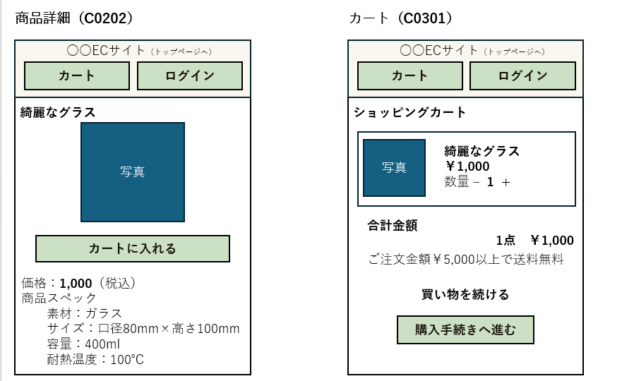
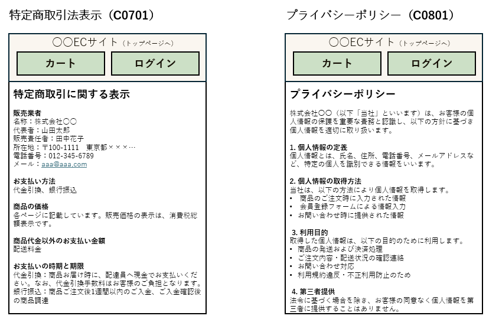
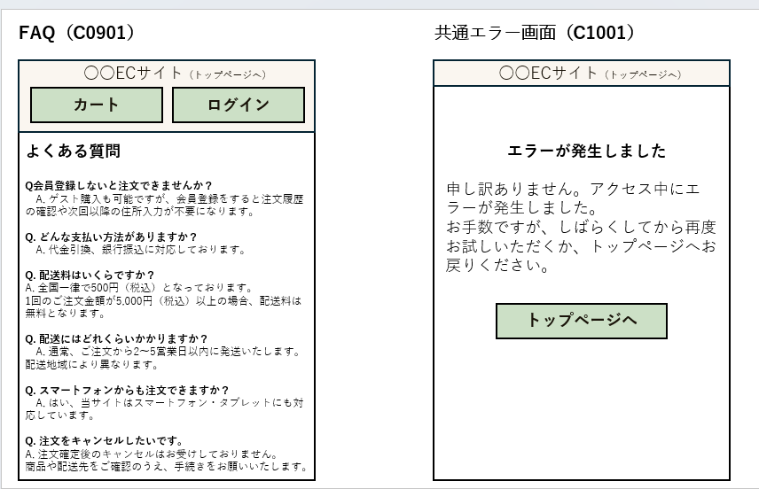

# 株式会社〇〇 オンライン販売サイト  詳細設計書

| ドキュメントバージョン | 1.0                                   |
| :------------------- | :------------------------------------ |
| 作成日               | 2025年7月7日                        |
| 作成チーム           | チームBacon                            |
| 更新履歴             | 2025/07/06: Ver.1.0 初版作成 (チームbacon) |

## 1. はじめに

### 1.1. 本書の目的

本書は、株式会社〇〇が展開する雑貨ブランドのECサイト構築プロジェクトにおける詳細設計の内容を定義するものです。「株式会社〇〇」オンライン販売サイト 基本設計書 Ver.1.0で定義された内容に基づき、実装担当者がプログラミング作業を迷いなく進められるように、システムの内部構造、処理フロー、インターフェース、データベース構造、画面項目などを具体的に記述します。

### 1.2. 前提となる基本設計書

本書は、以下の基本設計書の内容を前提としています。

-  株式会社〇〇 オンライン販売サイト 基本設計書 Ver.1.0

### 1.3. 対象読者

本書は、以下の担当者を対象としています。

- 本システムのバックエンド開発担当者
- 本システムのフロントエンド開発担当者
- 本システムのテスト担当者
- プロジェクト管理者

### 1.4. 参考文献

- 株式会社〇〇 オンライン販売サイト 基本設計書 Ver.1.0
- (チーム内で使用するコーディング規約などがあれば記載)
## 2.システム概要
対象ユーザーに関しては基本設計書「Version1.0」の「2 システム概要」に記載の通りです。


###　2.1システム概要図

<div class="mermaid">
graph LR
    subgraph ユーザー環境
        A[クライアント<br>（PC/スマホ/ブラウザ）<br>HTML/CSS/JavaScript]
    end

    subgraph クラウド環境
        subgraph Webサーバー
            B[Nginx]
        end

        subgraph APIサーバー Spring Boot
            C[Controller<br>（Spring MVC<br>+ HttpSession認証管理）]
            D[Service<br>（ビジネスロジック）]
            E[Repository<br>（JPA/Hibernate）]
        end

        subgraph DBサーバー
            F[PostgreSQL 15]
        end

        subgraph オブジェクトストレージ
            G[Amazon S3<br>（画像処理）]
        end

        subgraph 外部API
            H[Amazon SES<br>（メール送信）]
        end
    end

    %% ログイン処理フロー
    A -- ① ログインリクエスト<br>(ID/パスワードPOST) --> B
    B -- ② API転送 --> C
    C -- ③ 認証チェック --> D
    D -- ④ ユーザ情報照合 --> E
    E -- ⑤ 照合結果 --> D
    D -- ⑥ 認証結果 --> C
    C -- ⑦ セッショントークン発行<br>(Set-Cookie/SessionID) --> A

    %% 認証付きAPIアクセス
    A -- ⑧ APIリクエスト<br>(Cookie付与) --> B
    B -- ⑨ API転送 --> C
    C -- ⑩ セッション検証 --> D
    D -- ⑪ データアクセス --> E
    E -- ⑫ SQL実行 --> F
    F -- ⑬ データ --> E
    E -- ⑭ 結果 --> D
    D -- ⑮ 結果 --> C
    C -- ⑯ APIレスポンス<br>(JSON) --> B
    B -- ⑰ HTTPSレスポンス --> A

    %% さらにストレージや外部API呼び出し
    D -- ファイル保存/取得 --> G
    D -- メール送信API --> H

    %% スタイル
    style A fill:#f9f,stroke:#333,stroke-width:1.5px
    style B fill:#ffcc99,stroke:#333,stroke-width:1.5px
    style C fill:#ccffcc,stroke:#333,stroke-width:1.5px
    style D fill:#99ccff,stroke:#333,stroke-width:1.5px
    style E fill:#6699cc,stroke:#333,stroke-width:1.5px
    style F fill:#99ff99,stroke:#333,stroke-width:1.5px
    style G fill:#cccccc,stroke:#333,stroke-width:1.5px
    style H fill:#ff9999,stroke:#333,stroke-width:1.5px
</div>
# 3. 機能仕様
## 3.1. 機能一覧

本システムが提供する必須機能は以下の通りです。

| 機能ID | 機能名                   |
|--------|--------------------------|
| F0101  | トップページ表示          |
| F0201  | 商品一覧表示              |
| F0202  | 商品詳細表示              |
| F0301  | カート操作                |
| F0401  | 注文情報入力              |
| F0402  | 注文確認                  |
| F0403  | 注文完了                  |
| F0501  | 会員登録                  |
| F0502  | 会員情報変更              |
| F0601  | ログイン                  |
| F0602  | ログアウト                |
| F0603  | マイページ表示            |
| F0604  | 注文履歴表示              |
| F0605  | 購入前ログイン            |
| F0701  | 特定商取引法表示          |
| F0801  | プライバシーポリシー表示  |
| F0901  | FAQ表示                   |
| F1001  | 共通エラーページ表示      |
| F1101  | 自動入力                  |
| F1201  | 注文確定メール通知（銀行口座） |

---

## 3.2. 機能詳細

3.2.1	商品一覧表示フロー	
3.2.2	カテゴリ別一覧表示フロー
3.2.3	商品検索フロー	
3.2.4	商品詳細表示フロー
3.2.5	カート追加フロー	
3.2.6	カート内容確認・編集フロー	
3.2.7	注文情報入力フロー（会員自動入力含む）
3.2.8	注文確認・確定フロー	
3.2.9	非会員購入フロー	
3.2.10	会員購入フロー	
3.2.11	注文完了・通知フロー	
3.2.12	会員登録フロー	
3.2.13	ログインフロー	
3.2.14	ログアウトフロー	
3.2.15	注文履歴閲覧フロー	
3.2.16	支払い方法選択フロー	
3.2.17	配送料計算フロー
### 3.2.1. 商品一覧表示フロー


### 3.2.2. カテゴリ別一覧表示フロー


### 3.2.3. 商品検索フロー


### 3.2.4. 商品詳細表示フロー


### 3.2.5. カート追加フロー


### 3.2.6. カート内容確認・編集フロー


### 3.2.7. 注文情報入力フロー


### 3.2.8. 注文確認・確定フロー


### 3.2.9. 非会員購入フロー**


### 3.2.10. 会員購入フロー


### 3.2.11. 注文完了・通知フロー


### 3.2.12. 会員登録フロー


### 3.2.13. ログインフロー


### 3.2.14. ログアウトフロー


### 3.2.15. 注文履歴閲覧フロー


### 3.2.16. 支払い方法選択フロー


### 3.2.17. 配送料計算フロー


## 4. クラス設計

ここでは、「シンプル雑貨オンライン」バックエンド（Spring Boot）アプリケーションのクラス構造について定義します。主要なパッケージ構成、クラス図、主要クラスの説明、およびデータ転送オブジェクト（DTO）の定義を示します。

### 4.1. 主要パッケージ構成
com.example.ecsite
├── controller
│   ├── ProductController         // 商品一覧・詳細取得
│   ├── CartController            // カート操作（セッション）
│   ├── OrderController           // 注文処理（非会員含む）
│   └── CustomerController        // 会員登録・ログイン・プロフィール更新
│
├── service
│   ├── ProductService
│   ├── CartService
│   ├── OrderService
│   └── CustomerService
│
├── repository
│   ├── ProductRepository
│   ├── OrderRepository
│   ├── OrderDetailRepository
│   └── CustomerRepository
│
├── entity
│   ├── Product                  // 商品情報
│   ├── Order                    // 注文情報
│   ├── OrderDetail              // 注文明細
│   └── Customer                 // 会員情報
│
├── dto
│   ├── ProductListItemDto       // 商品一覧表示用
│   ├── ProductDetailDto         // 商品詳細表示用
│   ├── CartDto                  // カート情報（セッション用）
│   ├── CartItemDto              // カート内アイテム
│   ├── CartItemInfo             // カート追加リクエスト
│   ├── CartItemQuantityDto      // カート数量変更リクエスト
│   ├── OrderRequestDto          // 注文リクエスト
│   ├── CustomerInfo             // 注文時の顧客情報（非会員）
│   ├── OrderResponseDto         // 注文完了レスポンス
│   ├── CustomerRegisterRequest  // 会員登録リクエスト
│   ├── LoginRequest             // ログインリクエスト
│   ├── CustomerUpdateRequest    // 会員情報更新リクエスト
│   ├── CustomerResponse         // 会員情報レスポンス
│   ├── OrderSummary             // 注文履歴一覧用
│   └── OrderItemSummary         // 注文履歴内商品の概要
│
└── exception                    // エラーハンドリング関連


## 4.2 クラス図
### 4.2.1. 商品関連クラス図
<div class='mermaid'>
classDiagram
    class ProductController {
        +ProductService productService
        +getAllProducts() ResponseEntity~List~ProductListItem~~
        +getProductById(productId) ResponseEntity~ProductDetail~
        +getProductsByCategory(categoryId) ResponseEntity~List~ProductListItem~~
        +searchProducts(keyword) ResponseEntity~List~ProductListItem~~
    }

    class ProductService {
        +ProductRepository productRepository
        +findAllProducts() List~ProductListItem~
        +findProductById(productId) ProductDetail
        +findProductsByCategory(categoryId) List~ProductListItem~
        +searchProducts(keyword) List~ProductListItem~
    }

    class ProductRepository {
        <<Interface>>
        +JpaRepository~Product, Integer~
        +findAll() List~Product~
        +findById(productId) Optional~Product~
        +findByCategoryId(categoryId) List~Product~
        +findByNameContaining(keyword) List~Product~
    }

    class Product {
        <<Entity>>
        +Integer productId
        +String name
        +String description
        +Integer price
        +Integer stock
        +String imageUrl
        +Boolean isRecommended "Nullable"
        +LocalDateTime createdAt "Nullable"
        +LocalDateTime updatedAt "Nullable"
        +Integer categoryId
    }

    class ProductListItem {
        <<DTO>>
        +Integer productId
        +String name
        +Integer price
        +String imageUrl
    }

    class ProductDetail {
        <<DTO>>
        +Integer productId
        +String name
        +Integer price
        +String description
        +Integer stock
        +String imageUrl
    }

    %% 関連
    ProductController --> ProductService : uses
    ProductService --> ProductRepository : uses
    ProductRepository "1" -- "*" Product : manages

    ProductService ..> ProductListItem : creates
    ProductService ..> ProductDetail : creates
    ProductController ..> ProductListItem : returns
    ProductController ..> ProductDetail : returns
</div>

### 4.2.2. カート関連クラス図 (セッション管理)
<div class='mermaid'>
classDiagram
    class CartController {
        +CartService cartService
        +getCart(HttpSession) ResponseEntity~Cart~
        +addItem(CartItemInfo, HttpSession) ResponseEntity~Cart~
        +updateItem(itemId, CartItemQuantityDto, HttpSession) ResponseEntity~Cart~
        +removeItem(itemId, HttpSession) ResponseEntity~Cart~
    }

    class CartService {
        +ProductRepository productRepository
        +getCartFromSession(HttpSession) Cart
        +addItemToCart(productId, quantity, HttpSession) Cart
        +updateItemQuantity(itemId, quantity, HttpSession) Cart
        +removeItemFromCart(itemId, HttpSession) Cart
        +clearCart(HttpSession) void
    }

    class ProductRepository {
        <<Interface>>
        +findAll()
        +findById(id)
    }

    class Cart {
        <<DTO/Session Object>>
        +Map~String, CartItem~ items
        +int totalQuantity
        +int totalPrice
        +addItem(product, quantity) void
        +updateQuantity(itemId, quantity) void
        +removeItem(itemId) void
        +calculateTotals() void
    }

    class CartItem {
        <<DTO/Session Object>>
        +String id
        +Integer productId
        +String name
        +Integer price
        +String imageUrl
        +int quantity
        +int subtotal
    }

    class CartItemInfo {
        <<DTO>>
        +Integer productId
        +Integer quantity
    }

    class CartItemQuantityDto {
        <<DTO>>
        +Integer quantity
    }

    %% 関係
    CartController --> CartService : uses
    CartService --> ProductRepository : uses
    CartService ..> Cart : manages (in Session)
    CartService ..> CartItem : uses
    Cart "1" *-- "items *" CartItem : contains
    CartController ..> Cart : returns
    CartController ..> CartItemInfo : receives
    CartController ..> CartItemQuantityDto : receives

</div>

### 4.2.3. 注文関連クラス図 
<div class='mermaid'>
classDiagram
    %% ユーザー関連
    class User {
        +cart: Cart
        +addToCart()
        +viewProduct()
        +placeOrder()
    }

    class Guest {
        +register()
    }

    class Member {
        -email: String
        -password: String
        +login()
        +viewMyPage()
        +editProfile()
    }

    class LoggedInMember {
        +logout()
    }

    %% 商品関連
    class Product {
        <<Entity>>
        +Integer productId
        +String name
        +String description
        +Integer price
        +Integer stock
        +String imageUrl
    }

    %% カート関連
    class Cart {
        -items: List~CartItem~
        +addItem()
        +removeItem()
        +clearCart()
    }

    class CartItem {
        -product: Product
        -quantity: int
    }

    %% 注文関連
    class Order {
        <<Entity>>
        +Integer orderId
        +Member member "Nullable"
        +String orderEmail
        +String orderName
        +String orderPhoneNumber
        +String orderAddress
        +BigDecimal totalPrice
        +BigDecimal shippingFee
        +String paymentMethod
        +LocalDateTime orderDate
        +LocalDateTime createdAt
        +LocalDateTime updatedAt
        +String status
        +Boolean isGuest
        +calculateTotal()
    }

    class OrderDetail {
        <<Entity>>
        +Integer orderDetailId
        +Order order
        +Product product
        +Integer quantity
        +BigDecimal unitPrice
        +LocalDateTime createdAt
        +LocalDateTime updatedAt
    }

    %% DTO類
    class OrderRequest {
        <<DTO>>
        +CustomerInfo customerInfo
        +Integer memberId "Nullable"
        +Boolean isGuest
    }

    class CustomerInfo {
        <<DTO>>
        +String name
        +String email
        +String address
        +String phoneNumber
    }

    class OrderResponse {
        <<DTO>>
        +Integer orderId
        +String orderNumber
        +LocalDateTime orderDate
        +Integer totalAmount
        +BigDecimal shippingFee
        +String status
    }

    class OrderPreview {
        <<DTO>>
        +List~OrderItemPreview~ items
        +BigDecimal subtotal
        +BigDecimal shippingFee
        +BigDecimal totalAmount
        +String paymentMethod
        +CustomerInfo customerInfo
    }

    %% コントローラー・サービス・リポジトリ
    class OrderController {
        +OrderService orderService
        +CartService cartService
        +placeOrder(OrderRequest, HttpSession): ResponseEntity~OrderResponse~
        +getOrderHistory(memberId: Integer): ResponseEntity~List~OrderResponse~~
    }

    class OrderService {
        +OrderRepository orderRepository
        +OrderDetailRepository orderDetailRepository
        +ProductRepository productRepository
        +CartService cartService
        +placeOrder(Cart, OrderRequest): OrderResponse
        +getOrderHistoryByMember(memberId: Integer): List~OrderResponse~
        +calculateShippingFee(address, totalAmount): BigDecimal
    }

    class OrderRepository {
        <<Interface>>
        +JpaRepository~Order, Integer~
        +findByMember(member: Member): List~Order~
    }

    class OrderDetailRepository {
        <<Interface>>
        +JpaRepository~OrderDetail, Integer~
        +saveAll(details): List~OrderDetail~
        +findByOrderId(orderId: Integer): List~OrderDetail~
    }

    class ProductRepository {
        <<Interface>>
        +JpaRepository~Product, Integer~
    }

    class CustomerController {
        +register(request): ResponseEntity~CustomerResponse~
        +login(request): ResponseEntity~CustomerResponse~
        +logout(): ResponseEntity~Success~
    }

    class CustomerService {
        +registerCustomer(request): CustomerResponse
        +authenticate(loginRequest): CustomerResponse
        +getOrderHistory(customerId): List~OrderResponse~
    }

    class CustomerRepository {
        <<Interface>>
        +JpaRepository~Member, Integer~
        +findByEmail(email): Optional~Member~
    }

    %% 継承関係
    User <|-- Guest
    User <|-- Member
    Member <|-- LoggedInMember

    %% 関連
    User --> Cart : owns
    Member --> Order : places
    Order --> OrderDetail : contains
    OrderDetail --> Product : refers to
    Cart --> CartItem : contains
    CartItem --> Product : refers to

    OrderController --> OrderService : uses
    OrderController --> CartService : uses
    OrderService --> OrderRepository : uses
    OrderService --> OrderDetailRepository : uses
    OrderService --> ProductRepository : uses
    OrderService --> CartService : uses

    OrderRepository "1" -- "*" Order : manages
    OrderDetailRepository "1" -- "*" OrderDetail : manages
    OrderDetail "n" -- "1" Order : belongs to
    OrderDetail "n" -- "1" Product : refers to

    OrderController ..> OrderRequest : receives
    OrderController ..> OrderResponse : returns
    OrderController ..> OrderPreview : returns
    OrderService ..> OrderResponse : creates

</div>

### 4.2.4. 会員登録関連クラス図
<div class='mermaid'>
classDiagram
    class CustomerController {
        +CustomerService customerService
        +register(CustomerRegisterRequest) ResponseEntity~CustomerResponse~
        +login(LoginRequest) ResponseEntity~CustomerResponse~
        +updateProfile(CustomerUpdateRequest, HttpSession) ResponseEntity~CustomerResponse~
    }

    class CustomerService {
        +registerCustomer(CustomerRegisterRequest) CustomerResponse
        +authenticate(LoginRequest) CustomerResponse
        +updateCustomerInfo(CustomerUpdateRequest) CustomerResponse
        +getOrderHistory(customerId) List~OrderSummary~
    }

    class CustomerRepository {
        <<Interface>>
        +JpaRepository~Customer, Integer~
        +findByEmail(email) Optional~Customer~
    }

    class Customer {
        <<Entity>>
        +Integer customerId
        +String email
        +String password
        +String lastName
        +String firstName
        +String phoneNumber
        +String address
        +LocalDateTime createdAt
        +LocalDateTime updatedAt
    }

    class CustomerRegisterRequest {
        <<DTO>>
        +String name
        +String email
        +String password
        +String address
        +String phoneNumber
    }

    class LoginRequest {
        <<DTO>>
        +String email
        +String password
    }

    class CustomerUpdateRequest {
        <<DTO>>
        +String name
        +String email
        +String password "Optional"
        +String address
        +String phoneNumber
    }

    class CustomerResponse {
        <<DTO>>
        +Integer customerId
        +String name
        +String email
        +String address
        +String phoneNumber
    }

    class Order {
        <<Entity>>
        +Integer orderId
        +Customer customer
        +String orderEmail
        +String orderName
        +String orderPhoneNumber
        +String orderAddress
        +BigDecimal totalPrice
        +BigDecimal shippingFee
        +String paymentMethod
        +LocalDateTime orderDate
        +LocalDateTime createdAt
        +LocalDateTime updatedAt
    }

    class OrderSummary {
        <<DTO>>
        +Integer orderId
        +LocalDateTime orderDate
        +Integer totalAmount
        +List~OrderItemSummary~ items
    }

    class OrderItemSummary {
        <<DTO>>
        +String productName
        +Integer quantity
        +Integer price
    }

    %% 関連
    CustomerController --> CustomerService : uses
    CustomerService --> CustomerRepository : uses
    CustomerRepository --> Customer : manages
    Customer "1" -- "*" Order : places

    CustomerController ..> CustomerRegisterRequest : receives
    CustomerController ..> LoginRequest : receives
    CustomerController ..> CustomerUpdateRequest : receives
    CustomerController ..> CustomerResponse : returns
    CustomerService ..> CustomerResponse : creates
    CustomerService ..> OrderSummary : returns
</div>

## 4.3. 主要クラス説明

**Product**  
商品情報エンティティ（`productId`, `name`, `description`, `price`, `stock`, `imageUrl`, `isRecommended`, `createdAt`, `updatedAt`）

**Order**  
注文情報エンティティ（`orderId`, `orderNumber`, `orderDate`, `totalAmount`, `customerName`, `shippingAddress`, `shippingPhoneNumber`, `status`, `memberId`, `paymentMethod`, `paymentStatus`, `orderDetails`, `createdAt`, `updatedAt`）

**OrderDetail**  
注文明細エンティティ（`orderDetailId`, `order`, `product`, `productName`, `price`, `quantity`）

**Customer**  
会員情報エンティティ（`customerId`, `name`, `email`, `password`, `address`, `phoneNumber`, `createdAt`, `updatedAt`）

**CartDto**  
セッション保持用カート情報（`Map<String, CartItemDto> items`, `totalQuantity`, `totalPrice`）

**CartItemDto**  
カート内商品の情報（`id`, `productId`, `name`, `price`, `imageUrl`, `quantity`, `subtotal`）

**OrderRequestDto**  
注文リクエストDTO（`customerInfo`（非会員用）, `memberId`（会員注文用））

**CustomerInfo**  
非会員向け注文時の顧客情報DTO（`name`, `email`, `address`, `phoneNumber`）

**OrderResponseDto**  
注文完了レスポンスDTO（`orderId`, `orderNumber`, `orderDate`, `totalAmount`, `status`）

**CustomerRegisterRequest / LoginRequest / CustomerUpdateRequest**  
会員登録・ログイン・プロフィール更新用リクエストDTO（`name`, `email`, `password`, `address`, `phoneNumber` など）

**CustomerResponse**  
会員情報レスポンスDTO（`customerId`, `name`, `email`, `address`, `phoneNumber`）

**OrderSummary**  
注文履歴一覧表示用DTO（`orderId`, `orderDate`, `totalAmount`, `items`）

**OrderItemSummary**  
注文履歴の商品情報DTO（`productName`, `quantity`, `price`）

### 4.4. DTO定義
主要なAPIや機能で使用されるDTOの構造を示します。 (バリデーションルールは簡略化)

**商品関連 DTO**

```java
// 商品一覧用
public class ProductListItem {
    private Integer productId;
    private String name;
    private Integer price;
    private String imageUrl;

    public ProductListItem(Integer productId, String name, Integer price, String imageUrl) {
        this.productId = productId;
        this.name = name;
        this.price = price;
        this.imageUrl = imageUrl;
    }

    public Integer getProductId() { return productId; }
    public String getName() { return name; }
    public Integer getPrice() { return price; }
    public String getImageUrl() { return imageUrl; }
}

// 商品詳細用
public class ProductDetail {
    private Integer productId;
    private String name;
    private Integer price;
    private String description;
    private Integer stock;
    private String imageUrl;

    public ProductDetail(Integer productId, String name, Integer price, String description, Integer stock, String imageUrl) {
        this.productId = productId;
        this.name = name;
        this.price = price;
        this.description = description;
        this.stock = stock;
        this.imageUrl = imageUrl;
    }

    public Integer getProductId() { return productId; }
    public String getName() { return name; }
    public Integer getPrice() { return price; }
    public String getDescription() { return description; }
    public Integer getStock() { return stock; }
    public String getImageUrl() { return imageUrl; }
}
```
**カート関連 DTO** 

```java

// カート全体 (セッション格納/APIレスポンス用)
public class Cart {
    private Map<String, CartItem> items = new LinkedHashMap<>();
    private int totalQuantity;
    private int totalPrice;

    public Map<String, CartItem> getItems() { return items; }
    public int getTotalQuantity() { return totalQuantity; }
    public int getTotalPrice() { return totalPrice; }

    public void addItem(ProductListItem product, int quantity) {
        String key = product.getProductId().toString();
        if (items.containsKey(key)) {
            CartItem item = items.get(key);
            item.setQuantity(item.getQuantity() + quantity);
            item.updateSubtotal();
        } else {
            CartItem newItem = new CartItem(
                key,
                product.getProductId(),
                product.getName(),
                product.getPrice(),
                product.getImageUrl(),
                quantity
            );
            items.put(key, newItem);
        }
        calculateTotals();
    }

    public void updateQuantity(String id, int quantity) {
        CartItem item = items.get(id);
        if (item != null) {
            item.setQuantity(quantity);
            item.updateSubtotal();
        }
        calculateTotals();
    }

    public void removeItem(String id) {
        items.remove(id);
        calculateTotals();
    }

    public void calculateTotals() {
        totalQuantity = items.values().stream().mapToInt(CartItem::getQuantity).sum();
        totalPrice = items.values().stream().mapToInt(CartItem::getSubtotal).sum();
    }
}

// カート内商品 (セッション格納/APIレスポンス用)
public class CartItem {
    private String id;
    private Integer productId;
    private String name;
    private Integer price;
    private String imageUrl;
    private int quantity;
    private int subtotal;

    public CartItem(String id, Integer productId, String name, Integer price, String imageUrl, int quantity) {
        this.id = id;
        this.productId = productId;
        this.name = name;
        this.price = price;
        this.imageUrl = imageUrl;
        this.quantity = quantity;
        this.subtotal = price * quantity;
    }

    public String getId() { return id; }
    public Integer getProductId() { return productId; }
    public String getName() { return name; }
    public Integer getPrice() { return price; }
    public String getImageUrl() { return imageUrl; }
    public int getQuantity() { return quantity; }
    public int getSubtotal() { return subtotal; }

    public void setQuantity(int quantity) {
        this.quantity = quantity;
        updateSubtotal();
    }

    public void updateSubtotal() {
        this.subtotal = price * quantity;
    }
}

// カート追加APIリクエスト用
public class CartItemInfo {
    @NotNull
    private Integer productId;

    @NotNull
    @Min(1)
    private Integer quantity;

    public Integer getProductId() { return productId; }
    public void setProductId(Integer productId) { this.productId = productId; }

    public Integer getQuantity() { return quantity; }
    public void setQuantity(Integer quantity) { this.quantity = quantity; }
}

// カート数量更新APIリクエスト用
public class CartItemQuantityDto {
    @NotNull
    @Min(1)
    private Integer quantity;

    public Integer getQuantity() { return quantity; }
    public void setQuantity(Integer quantity) { this.quantity = quantity; }
}
```
**注文関連 DTO**

```java

// 注文APIリクエスト用
public class OrderRequest {
    @Valid
    @NotNull
    private CustomerInfo customerInfo;

    public CustomerInfo getCustomerInfo() { return customerInfo; }
    public void setCustomerInfo(CustomerInfo customerInfo) { this.customerInfo = customerInfo; }
}

// 注文APIリクエスト内の顧客情報用 (非会員用)
public class CustomerInfo {
    @NotBlank
    private String name;

    @NotBlank
    @Email
    private String email;

    @NotBlank
    private String address;

    @NotBlank
    private String phoneNumber;

    public String getName() { return name; }
    public void setName(String name) { this.name = name; }

    public String getEmail() { return email; }
    public void setEmail(String email) { this.email = email; }

    public String getAddress() { return address; }
    public void setAddress(String address) { this.address = address; }

    public String getPhoneNumber() { return phoneNumber; }
    public void setPhoneNumber(String phoneNumber) { this.phoneNumber = phoneNumber; }
}

// 注文APIレスポンス用
public class OrderResponse {
    private Integer orderId;
    private LocalDateTime orderDate;

    public OrderResponse(Integer orderId, LocalDateTime orderDate) {
        this.orderId = orderId;
        this.orderDate = orderDate;
    }

    public Integer getOrderId() { return orderId; }
    public LocalDateTime getOrderDate() { return orderDate; }
}
```

## 5. インターフェース仕様

### 5.1 API一覧
| API名   | API概要                               | HTTPメソッド | リクエストパラメータ                        | レスポンス内容                | エンドポイントURL         | 対象要素ID                             |
|---------|----------------------------------------|--------------|---------------------------------------------|-------------------------------|----------------------------|----------------------------------------|
| API_01  | カートに商品追加                       | POST         | 商品ID, 数量                                 | 成功可否／カート状態          | /api/cart/add              | C0202_B01                              |
| API_02  | ログイン処理                           | POST         | メールアドレス、パスワード                  | 成功可否／トークン等          | /api/login                 | C0601_B01                              |
| API_03  | ログアウト処理                         | POST         | セッションID                                | 成功可否                      | /api/logout                | C0603_B01                              |
| API_04  | 会員登録処理                           | POST         | 氏名、住所、電話番号、パスワード等          | 登録結果                      | /api/register              | C0501_B01                              |
| API_05  | 商品検索（商品一覧再表示）             | POST         | キーワード、カテゴリ、ページ番号等          | 商品一覧JSON                  | /api/products/search       | C0201_B01                              |
| API_06  | キーワード検索条件送信（トップページ） | POST         | キーワード                                  | 商品一覧JSON                  | /api/search                | C0101_TI01, C0201_TI01                 |
| API_07  | 商品一覧の繰り返し表示                 | GET          | カテゴリID、ページ番号など                   | 商品一覧JSON                  | /api/products/list         | C0201_L05                              |
| API_08  | 注文確定処理                           | POST         | 商品、顧客、配送先、支払情報等              | 注文番号／完了メッセージ      | /api/order/confirm         | C0402_B01                              |
| API_09  | 絞り込み解除（全商品表示）             | GET          | なし                                        | 全商品一覧JSON                | /api/products/all          | C0201_L04                              |
| API_10  | 注文情報確認（送料計算含む）           | POST         | カート商品、配送先、支払方法等              | 小計、送料、合計金額          | /api/order/preview         | C0401_B01                              |
| API_11  | 会員情報取得（マイページ等用）         | GET          | 認証トークン                                 | 氏名、住所、連絡先等          | /api/member/me             | C0603_D01                              |
| API_12  | 会員情報更新                           | PUT          | 氏名、住所、連絡先、パスワード等            | 更新結果                      | /api/member/me             | C0501_B01                              |
| API_13  | 注文履歴取得                           | GET          | 認証トークン                                 | 過去の注文一覧JSON            | /api/member/me/orders      | C0604_D01                              |


### 5.2 API詳細
本設計書では、代表的な2機能（カート追加・ログイン）についてAPI詳細（5.2）を記載し、それ以外のAPIは同様の形式・バリデーションに準拠して実装することを前提とする。
- カートに商品追加API
  - リクエスト JSON 形式
    ```
    {
    "email": "user@example.com",  // 必須、メールアドレス形式
    "password": "string"           // 必須、パスワード
    }
    ```

  - リクエストパラメータ詳細
    | パラメータ名   | 型      | 必須 | 説明             | バリデーション       |
    | -------- | ------ | -- | -------------- | ------------- |
    | email    | string | はい | 会員登録済みのメールアドレス | メールアドレス形式チェック |
    | password | string | はい | パスワード          | 空文字不可         |

  - パスパラメータ
    なし
  - レスポンスJSON形式
    ```
    {
    "success": true,
    "token": "eyJhbGciOiJIUzI1NiIsInR5cCI6IkpXVCJ9...",  // JWTなどの認証トークン
    "user": {
        "memberId": "string",
        "name": "string",
        "email": "user@example.com"
    }
    }
    ```

  - リクエスト JSON 形式
    ```
    {
    "productId": "string",    // 必須、商品ID
    "quantity": 1             // 必須、数量（1以上の整数）
    }
    ```
  - リクエストパラメータ詳細
    | パラメータ名    | 型      | 必須 | 説明        | バリデーション |
    | --------- | ------ | -- | --------- | ------- |
    | productId | string | はい | 追加する商品のID | 空文字不可   |
    | quantity  | int    | はい | 追加数量      | 1以上の整数  |
  - パスパラメータ
  なし
  - レスポンスJSON形式
    ```
    {
     "success": true,
    "cart": {
        "items": [
            {
            "productId": "string",
            "quantity": 1,
            "name": "string",
            "price": 1000
         }
        ],
        "totalPrice": 1000
        }
    }
     ```

   - レスポンスコード
        | コード | 説明                      |
        | --- | ----------------------- |
        | 200 | ログイン成功                  |
        | 400 | リクエストパラメータ不正            |
        | 401 | 認証失敗（メールアドレスまたはパスワード不正） |
        | 500 | サーバー内部エラー               |

  - エラー時のレスポンス例
     ```
    {
        "error": {
         "code": 401,
         "message": "Invalid email or password"
        }
     }
    ```
## 6. DB定義

本章では、本システムで使用するデータベース構造およびその設計方針を示す。以下の4つの項目で構成する。

---

### 6.1 テーブル定義書

本システムで使用する主要テーブルの物理設計を以下に示す。

---

#### CUSTOMER（顧客情報）

| 論理名           | 物理名        | 型        | サイズ | PK | NULL | UQ | FK | CHK | デフォルト値      | 備考             |
|------------------|---------------|-----------|--------|----|----|----|----|-----|-------------------|------------------|
| 顧客ID           | customer_id   | INT       | -      | ○  | NN  |    |    |     | 自動採番          | 主キー           |
| ログイン用メールアドレス | email         | VARCHAR   | 255    |   | NN  | NN  |    |     |                   |                  |
| パスワード       | password      | VARCHAR   | 255    |    | NN |    |    |     |                   | ハッシュ前提     |
| 姓               | last_name     | VARCHAR   | 50     |    | NN  |    |    |     |                   |                  |
| 名               | first_name    | VARCHAR   | 50     |    | NN  |    |    |     |                   |                  |
| 電話番号         | phone_number  | VARCHAR   | 20     |    | NN  |    |    |     |                   |                  |
| 配達先住所       | address       | TEXT      | -      |    | NN  |    |    |     |                   |                  |
| 登録日時         | created_at    | TIMESTAMP | -      |    | NN  |    |    |     | CURRENT_TIMESTAMP | 自動設定         |
| 更新日時         | updated_at    | TIMESTAMP | -      |    | NN  |    |    |     | CURRENT_TIMESTAMP | 自動更新（トリガ等） |

---

#### PRODUCT（商品情報）

| 論理名           | 物理名         | 型        | サイズ | PK | NULL | UQ | FK | CHK                    | デフォルト値      | 備考                   |
|------------------|----------------|-----------|--------|----|----|----|----|-------------------------|-------------------|------------------------|
| 商品ID           | product_id     | INT       | -      | ○  | NN |    |    |                         | 自動採番          |                        |
| 商品名           | product_name   | VARCHAR   | 255    |    | NN  |    |    |                         |                   |                        |
| 商品説明         | description    | TEXT      | -      |    |    |    |    |                         |                   |                        |
| 価格             | price          | DECIMAL   | 10     |    | NN |    |    | price > 0               |                   |                        |
| 画像URL          | image_url      | VARCHAR   | 500    |    |    |    |    |                         |                   |                        |
| 素材             | material       | VARCHAR   | 100    |    |    |    |    |                         |                   |                        |
| サイズ           | size           | VARCHAR   | 100    |    |    |    |    |                         |                   |                        |
| カテゴリID       | category_id    | INT       | -      |    | NN |    | NN  |                         |                   | → CATEGORY(category_id) |
| 在庫数           | stock_quantity | INT       | -      |    | NN |    |    | stock_quantity >= 0     | 0                 |                        |
| 登録日時         | created_at     | TIMESTAMP | -      |    | NN |    |    |                         | CURRENT_TIMESTAMP |                        |
| 更新日時         | updated_at     | TIMESTAMP | -      |    | NN |    |    |                         | CURRENT_TIMESTAMP |                        |

---

#### CATEGORY（カテゴリ情報）

| 論理名           | 物理名        | 型        | サイズ | PK | NULL | UQ | FK | CHK | デフォルト値      | 備考             |
|------------------|---------------|-----------|--------|----|----|----|----|-----|-------------------|------------------|
| カテゴリID       | category_id   | INT       | -      | ○  | NN |    |    |     | 自動採番          | 主キー           |
| カテゴリ名       | category_name | VARCHAR   | 100    |    | NN | ○  |    |     |                   | 一意制約あり     |
| 登録日時         | created_at    | TIMESTAMP | -      |    | NN |    |    |     | CURRENT_TIMESTAMP |                  |
| 更新日時         | updated_at    | TIMESTAMP | -      |    | NN |    |    |     | CURRENT_TIMESTAMP |                  |

---

#### ORDER（注文情報）

| 論理名              | 物理名           | 型        | サイズ | PK | NULL | UQ | FK | CHK                         | デフォルト値      | 備考                      |
|---------------------|------------------|-----------|--------|----|----|----|----|------------------------------|-------------------|---------------------------|
| 注文ID              | order_id         | INT       | -      | ○  | NN |    |    |                              | 自動採番          | 主キー                    |
| 顧客ID              | customer_id      | INT       | -      |    | NN |    | NN  |                              |                   | → CUSTOMER(customer_id)   |
| 注文者メールアドレス | order_email      | VARCHAR   | 255    |    | NN  |    |    |                              |                   | 顧客情報のコピー          |
| 注文者氏名          | order_name       | VARCHAR   | 100    |    | NN  |    |    |                              |                   |                            |
| 注文者電話番号      | order_phone_number | VARCHAR | 20     |    | NN  |    |    |                              |                   |                            |
| 注文者住所          | order_address    | TEXT      | -      |    | NN  |    |    |                              |                   |                            |
| 合計金額            | total_price      | DECIMAL   | 10     |    | NN |    |    | total_price > 0              |                   |                            |
| 配送料              | shipping_fee     | DECIMAL   | 10     |    | NN  |    |    |                              |                   |                            |
| 支払方法            | payment_method   | VARCHAR   | 50     |    | NN |    |    | payment_method IN ('credit', 'bank', 'cash') | | |
| 注文日時            | order_date       | TIMESTAMP | -      |    | NN |    |    |                              | CURRENT_TIMESTAMP |                            |
| データ登録日時      | created_at       | TIMESTAMP | -      |    | NN |    |    |                              | CURRENT_TIMESTAMP |                            |

---

#### ORDER_DETAIL（注文明細情報）

| 論理名      | 物理名          | 型        | サイズ | PK | NULL | UQ | FK | CHK                 | デフォルト値      | 備考                        |
|-------------|-----------------|-----------|--------|----|----|----|----|----------------------|-------------------|-----------------------------|
| 注文明細ID  | order_detail_id | INT       | -      | ○  | NN |    |    |                      | 自動採番          | 主キー                      |
| 注文ID      | order_id        | INT       | -      |    | NN |    | ○  |                      |                   | → ORDER(order_id)          |
| 商品ID      | product_id      | INT       | -      |    | NN |    | ○  |                      |                   | → PRODUCT(product_id)      |
| 数量        | quantity        | INT       | -      |    | NN |    |    | quantity > 0         |                   |                            |
| 購入時価格  | unit_price      | DECIMAL   | 10     |    | NN |    |    | unit_price > 0       |                   |                            |
| 登録日時    | created_at      | TIMESTAMP | -      |    | NN |    |    |                      | CURRENT_TIMESTAMP |                            |
| 更新日時    | updated_at      | TIMESTAMP | -      |    | NN |    |    |                      | CURRENT_TIMESTAMP |                            |

---

### 6.2 ER図


### 6.3 インデックス一覧

| テーブル名   | インデックス名       | 対象カラム   | 用途・補足                     |
|--------------|----------------------|--------------|-------------------------------|
| CUSTOMER     | idx_customer_email   | email        | ログイン認証用ユニーク検索     |
| PRODUCT      | idx_product_category | category_id  | 商品一覧のカテゴリ絞り込み     |
| ORDER        | idx_order_customer   | customer_id  | 顧客別注文履歴の高速検索       |
| ORDER_DETAIL | idx_detail_order     | order_id     | 注文明細の注文単位検索         |
| ORDER_DETAIL | idx_detail_product   | product_id   | 商品別の注文明細検索           |

※ 主キーにはデフォルトでユニークインデックスが作成される。

---

### 6.4 トランザクション設計方針

#### 基本方針

- 関連データ操作（特に注文処理・会員登録）においては、**トランザクション処理で整合性を担保**
- 複数テーブルにまたがる処理は原子性（Atomicity）を確保し、**失敗時にはロールバック**
- **排他制御（SELECT FOR UPDATEなど）**　を用いて同時更新を防止

#### トランザクション対象処理

| 処理名       | 対象テーブル              | ロールバック条件             |
|--------------|---------------------------|------------------------------|
| 注文確定処理 | ORDER, ORDER_DETAIL       | いずれかのINSERT失敗         |
| 会員登録処理 | CUSTOMER                  | INSERT失敗                   |
| 会員情報更新 | CUSTOMER                  | UPDATE失敗                   |
| 在庫更新     | PRODUCT                   | UPDATE失敗                   |


#### ロールバック時の処理内容

| 処理名      | 対象コントローラー | 時点・操作             | メッセージ                                                |
| -------- | --------- | ----------------- | ---------------------------------------------------- |
| 注文処理失敗   | ORDER     | 注文確定ボタン押下後、DB登録時  | 注文処理に失敗しました。ネットワーク環境や商品在庫をご確認のうえ、再度お試しください。          |
| 会員情報登録失敗 | CUSTOMER  | 会員登録フォーム送信後       | 会員登録に失敗しました。入力内容をご確認のうえ、再度お試しください。                   |
| 会員情報更新失敗 | CUSTOMER  | 会員情報更新ボタン押下後      | 会員情報の更新に失敗しました。再度お試しください。操作が繰り返し失敗する場合はサポートへご連絡ください。 |
| 在庫更新失敗   | PRODUCT   | 注文確定処理中、在庫UPDATE時 | 在庫の更新に失敗しました。在庫状況が変動した可能性があります。カート内容を確認してください。       |


#### 排他制御

- トランザクションの粒度は「画面単位」とし、ロックは必要最小限に限定

## 7. 画面項目定義
### 7.1 画面一覧







### 7.2 画面項目定義書
| 要素ID       | 画面ID | 項目名               | 要素種別           | 動作・備考                                   | 桁数制限     | バリデーションルール                               | エラーメッセージ                          |
|--------------|--------|----------------------|--------------------|----------------------------------------------|--------------|----------------------------------------------------|-------------------------------------------|
| C0101_L01    | C0101  | ○○ECサイト           | リンク             | トップページ(C0101)に遷移                    | なし         |                                                    |                                           |
| C0101_L02    | C0101  | カート               | リンク             | カート(C0301)に遷移                          | なし         |                                                    |                                           |
| C0101_L03    | C0101  | ログイン             | リンク             | ログイン(C0601)に遷移                        | なし         |                                                    |                                           |
| C0101_TI01   | C0101  | キーワード検索       | テキスト入力       | 入力内容を検索条件として送信                  | 最大50文字   | 全角・半角文字、数字を許容。記号（"・"など）も可 | キーワードは50文字以内で入力してください |
| C0101_B01    | C0101  | 検索                 | ボタン             | 入力値をパラメータとして送信、商品一覧（C0201）に遷移 | なし         |                                                    |                                           |
| C0101_D01    | C0101  | カテゴリから選ぶ     | 表示項目           | ラベル                                       | なし         |                                                    |                                           |
| C0101_L04    | C0101  | 文房具               | リンク             | カテゴリ絞り込みで商品一覧（C0201）に遷移   | なし         |                                                    |                                           |
| C0101_L05    | C0101  | キッチン用品         | リンク             | カテゴリ絞り込みで商品一覧（C0201）に遷移   | なし         |                                                    |                                           |
| C0101_L06    | C0101  | 生活雑貨             | リンク             | カテゴリ絞り込みで商品一覧（C0201）に遷移   | なし         |                                                    |                                           |
| C0101_L07    | C0101  | インテリア           | リンク             | カテゴリ絞り込みで商品一覧（C0201）に遷移   | なし         |                                                    |                                           |
| C0101_L08    | C0101  | 特定商取引法表示     | リンク             | 特定商取引法表示(C0701)に遷移                | なし         |                                                    |                                           |
| C0101_L09    | C0101  | プライバシーポリシー | リンク             | プライバシーポリシー(C0801)に遷移            | なし         |                                                    |                                           |
| C0101_L10    | C0101  | FAQ                  | リンク             | FAQ(C0901)に遷移                            | なし         |                                                    |                                           |
| C0201_L01    | C0201  | ○○ECサイト           | リンク             | トップページ(C0101)に遷移                    | なし         |                                                    |                                           |
| C0201_L02    | C0201  | カート               | リンク             | カート(C0301)に遷移                          | なし         |                                                    |                                           |
| C0201_L03    | C0201  | ログイン             | リンク             | ログイン(C0601)に遷移                        | なし         |                                                    |                                           |
| C0201_TI01   | C0201  | キーワード検索       | テキスト入力       | 入力内容を検索条件として送信                  | 最大50文字   | 全角・半角文字、数字を許容。記号（"・"など）も可 | キーワードは50文字以内で入力してください |
| C0201_B01    | C0201  | 検索                 | ボタン             | 入力値をパラメータとして送信、商品一覧再表示 | なし         |                                                    |                                           |
| C0201_SB01   | C0201  | カテゴリを絞り込む   | セレクトボックス   | 選択後、カテゴリに応じて商品一覧に遷移       | なし         |                                                    |                                           |
| C0201_L04    | C0201  | すべての商品を表示   | リンク             | 絞り込み解除、全商品一覧を表示               | なし         |                                                    |                                           |
| C0201_L05    | C0201  | 商品一覧リスト       | 繰り返しリンク     | 各商品ブロックリンクを繰り返し表示           | なし         |                                                    |                                           |
| C0201_D01    | C0201  | 画像                 | 表示項目           | 商品画像表示                                 | なし         |                                                    |                                           |
| C0201_D02    | C0201  | 商品名               | 表示項目           | 商品名テキスト表示                           | なし         |                                                    |                                           |
| C0201_D03    | C0201  | 価格                 | 表示項目           | 価格表示（税込）                             | なし         |                                                    |                                           |
| C0201_L06    | C0201  | >                    | リンク             | 商品詳細(0202)に遷移                         | なし         |                                                    |                                           |
| C0202_L01    | C0202  | ○○ECサイト           | リンク             | トップページ(C0101)に遷移                    | なし         |                                                    |                                           |
| C0202_L02    | C0202  | カート               | リンク             | カート(C0301)に遷移                          | なし         |                                                    |                                           |
| C0202_L03    | C0202  | ログイン             | リンク             | ログイン(C0601)に遷移                        | なし         |                                                    |                                           |
| C0202_D01    | C0202  | 商品名               | 表示項目           | 商品名を表示                               | なし         |                                                    |                                           |
| C0202_D02    | C0202  | 写真                 | 表示項目           | 商品画像の大きい表示                         | なし         |                                                    |                                           |
| C0202_B01    | C0202  | カートに入れる       | ボタン             | カート(C0301)へ商品追加                      | なし         |                                                    |                                           |
| C0202_D03    | C0202  | 価格                 | 表示項目           | 価格表示                                   | なし         |                                                    |                                           |
| C0202_D04    | C0202  | 商品スペック         | 表示項目           | 商品の詳細仕様（サイズ、素材など）           | なし         |                                                    |                                           |
| C0301_L01    | C0301  | ○○ECサイト           | リンク             | トップページ(C0101)に遷移                    | なし         |                                                    |                                           |
| C0301_L02    | C0301  | カート               | リンク             | カート(C0301)に遷移                          | なし         |                                                    |                                           |
| C0301_L03    | C0301  | ログイン             | リンク             | ログイン(C0601)に遷移                        | なし         |                                                    |                                           |
| C0301_D01    | C0301  | ショッピングカート   | 表示項目           | カート内商品の一覧表示                       | なし         |                                                    |                                           |
| C0301_D02    | C0301  | 商品ブロック         | 表示項目           | 各商品1件分の情報ブロック                   | なし         |                                                    |                                           |
| C0301_D03    | C0301  | 写真                 | 表示項目           | 商品画像表示                               | なし         |                                                    |                                           |
| C0301_D04    | C0301  | 商品名               | 表示項目           | 商品名表示                                 | なし         |                                                    |                                           |
| C0301_D05    | C0301  | 価格                 | 表示項目           | 価格表示                                   | なし         |                                                    |                                           |
| C0301_NS01   | C0301  | 数量                 | 数値入力＋スピンボタン | 「＋」「－」で数量を変更                  | 1～999       | （初期値1、0未満不可）                           |                                           |
| C0301_D06    | C0301  | 合計金額             | 表示項目           | 商品合計金額表示                           | なし         |                                                    |                                           |
| C0301_D07    | C0301  | 送料無料条件         | 表示項目           | ご注文金額￥5,000以上で送料無料表示         | なし         |                                                    |                                           |
| C0301_L04    | C0301  | 買い物を続ける       | リンク             | 商品一覧(C0201)に遷移                       | なし         |                                                    |                                           |
| C0301_L05    | C0301  | 購入手続きへ進む     | リンク             | 注文情報入力(C0401)に遷移                   | なし         |                                                    |                                           |
| C0401_L01    | C0401  | ○○ECサイト           | リンク             | トップページ(C0101)に遷移                    | なし         |                                                    |                                           |
| C0401_D01    | C0401  | ご注文商品           | 表示項目           | 注文商品一覧表示                           | なし         |                                                    |                                           |
| C0401_D02    | C0401  | 商品名               | 表示項目           | 商品名表示                                 | なし         |                                                    |                                           |
| C0401_D03    | C0401  | 数量                 | 表示項目           | 注文数量表示                               | なし         |                                                    |                                           |
| C0401_D04    | C0401  | 価格                 | 表示項目           | 単価表示                                   | なし         |                                                    |                                           |
| C0401_D05    | C0401  | 商品小計（点数）     | 表示項目           | 小計金額、購入点数表示                     | なし         |                                                    |                                           |
| C0401_D06    | C0401  | 送料                 | 表示項目           | ￥500（合計金額が￥5000未満）or￥０（合計金額が￥5000以上） | なし         |                                                    |                                           |
| C0401_D07    | C0401  | 合計金額             | 表示項目           | 合計金額表示                               | なし         |                                                    |                                           |
| C0401_D08    | C0401  | お届け先             | 表示項目           | お届け先情報ブロック                       | なし         |                                                    |                                           |
| C0401_D09    | C0401  | 氏名                 | 表示項目           | お届け先氏名表示                           | なし         |                                                    |                                           |
| C0401_TI01   | C0401  | 姓入力欄             | テキスト入力       | 氏名の姓入力                               | 最大20文字   | 全角・半角文字を許容。英字・日本語どちらも可     | 姓は20文字以内で入力してください           |
| C0401_TI02   | C0401  | 名入力欄             | テキスト入力       | 氏名の名入力                               | 最大20文字   | 全角・半角文字を許容。英字・日本語どちらも可     | 名は20文字以内で入力してください           |
| C0401_D10    | C0401  | 〒                    | 表示項目           | 郵便番号ラベル                           | なし         |                                                    |                                           |
| C0401_TI03   | C0401  | 郵便番号入力欄       | テキスト入力       | 郵便番号入力                               | 固定7桁     | 数字7桁（ハイフンなし）                           | 郵便番号はハイフンなし半角数字7桁で入力してください（例：1234567） |
| C0401_D11    | C0401  | 住所                 | 表示項目           | 住所ラベル                                 | なし         |                                                    |                                           |
| C0401_TI04   | C0401  | 住所入力欄           | テキスト入力       | 住所入力                                   | 最大100文字 | 全角・半角文字、数字、「-」等の記号を許容           | 住所は100文字以内で入力してください           |
| C0401_D12    | C0401  | 電話番号             | 表示項目           | 電話番号ラベル                             | なし         |                                                    |                                           |
| C0401_TI05   | C0401  | 電話番号入力欄       | テキスト入力       | 電話番号入力                               | 最大15文字  | 数字のみ（ハイフンなし）                           | 電話番号は15桁以内のハイフンなし半角数字で入力してください     |
| C0401_D13    | C0401  | メールアドレス       | 表示項目           | メールラベル                               | なし         |                                                    |                                           |
| C0401_TI06   | C0401  | メールアドレス入力欄 | テキスト入力       | メールアドレス入力                         | 最大254文字 | 「xxx@yyy.zzz」形式（RFC準拠）。（半角英数字）        | 有効なメールアドレスを入力してください             |
| C0401_D14    | C0401  | お支払方法           | 表示項目           | 支払方法ラベル                             | なし         |                                                    |                                           |
| C0401_RB01   | C0401  | 代金引換             | ラジオボタン       | 支払方法選択肢                             | なし         |                                                    |                                           |
| C0401_RB02   | C0401  | 銀行振込             | ラジオボタン       | 支払方法選択肢                             | なし         |                                                    |                                           |
| C0401_B01    | C0401  | 注文確認へ           | ボタン             | 注文確認画面(C0402)に遷移                 | なし         |                                                    |                                           |
| C0402_D01    | C0402  | ご注文商品           | 表示項目           | 注文商品一覧表示                           | なし         |                                                    |                                           |
| C0402_D02    | C0402  | 商品名               | 表示項目           | 商品名表示                                 | なし         |                                                    |                                           |
| C0402_D03    | C0402  | 数量                 | 表示項目           | 注文数量表示                               | なし         |                                                    |                                           |
| C0402_D04    | C0402  | 価格                 | 表示項目           | 単価表示                                   | なし         |                                                    |                                           |
| C0402_D05    | C0402  | 商品小計（点数）     | 表示項目           | 小計点数表示                               | なし         |                                                    |                                           |
| C0402_D06    | C0402  | 送料                 | 表示項目           | 送料表示                                   | なし         |                                                    |                                           |
| C0402_D07    | C0402  | 合計金額             | 表示項目           | 合計金額表示                               | なし         |                                                    |                                           |
| C0402_D08    | C0402  | お届け先             | 表示項目           | お届け先情報表示                           | なし         |                                                    |                                           |
| C0402_D09    | C0402  | 氏名                 | 表示項目           | 氏名表示                                   | なし         |                                                    |                                           |
| C0402_D10    | C0402  | 〒                    | 表示項目           | 郵便番号表示                             | なし         |                                                    |                                           |
| C0402_D11    | C0402  | 住所                 | 表示項目           | 住所表示                                   | なし         |                                                    |                                           |
| C0402_D12    | C0402  | 電話番号             | 表示項目           | 電話番号表示                               | なし         |                                                    |                                           |
| C0402_D13    | C0402  | メールアドレス       | 表示項目           | メールアドレス表示                         | なし         |                                                    |                                           |
| C0402_D14    | C0402  | お支払方法           | 表示項目           | 支払方法表示                               | なし         |                                                    |                                           |
| C0402_B01    | C0402  | 注文を確定する       | ボタン             | 注文確定処理実行                           | なし         |                                                    |                                           |
| C0403_L01    | C0403  | ○○ECサイト           | リンク             | トップページ(C0101)に遷移                  | なし         |                                                    |                                           |
| C0403_D01    | C0403  | 購入ありがとう       | 表示項目           | 購入ありがとうございます。注文明細をメールで送付しました。 | なし         |                                                    |                                           |
| C0403_D02    | C0403  | 注文番号             | 表示項目           | 注文番号表示                               | なし         |                                                    |                                           |
| C0403_L02    | C0403  | トップページへ       | リンク             | トップページ(C0101)に遷移                  | なし         |                                                    |                                           |
| C0501_L01    | C0501  | ○○ECサイト           | リンク             | トップページ(C0101)に遷移                  | なし         |                                                    |                                           |
| C0501_D01    | C0501  | 会員情報のご登録     | 表示項目           | 画面タイトル                               | なし         |                                                    |                                           |
| C0501_D02    | C0501  | 会員ID               | 表示項目           | 会員ID表示（変更不可）                     | なし         |                                                    |                                           |
| C0501_TI01   | C0501  | メールアドレス入力欄 | テキスト入力       | メールアドレス入力                         | 最大254文字 | 「xxx@yyy.zzz」形式（RFC準拠）。（半角英数字）        | 有効なメールアドレスを入力してください             |
| C0501_D03    | C0501  | パスワード           | 表示項目           | ラベル                                     | なし         |                                                    |                                           |
| C0501_TI02   | C0501  | パスワード入力欄     | テキスト入力       | パスワード入力                             | 8～32文字   | 半角英字・数字。記号（@#$など）も可                   | パスワードは8～32文字の半角英数字で入力してください     |
| C0501_D04    | C0501  | パスワード確認       | 表示項目           | ラベル                                     | なし         |                                                    |                                           |
| C0501_TI03   | C0501  | パスワード入力欄     | テキスト入力       | 確認用パスワード入力                       | 8～32文字   | 同一画面内のパスワード入力欄の値と一致していること     | 確認用パスワードが一致しません                   |
| C0501_D05    | C0501  | 氏名                 | 表示項目           | ラベル                                     | なし         |                                                    |                                           |
| C0501_TI04   | C0501  | 姓入力欄             | テキスト入力       | 氏名の姓入力                               | 最大20文字 | 全角・半角文字を許容。英字・日本語どちらも可           | 姓は20文字以内で入力してください                   |
| C0501_TI05   | C0501  | 名入力欄             | テキスト入力       | 氏名の名入力                               | 最大20文字 | 全角・半角文字を許容。英字・日本語どちらも可           | 名は20文字以内で入力してください                   |
| C0501_D06    | C0501  | 〒                    | 表示項目           | 郵便番号ラベル                             | なし         |                                                    |                                           |
| C0501_TI06   | C0501  | 郵便番号入力欄       | テキスト入力       | 郵便番号入力                               | 固定7桁     | 数字7桁（ハイフンなし）                               | 郵便番号はハイフンなし半角数字7桁で入力してください（例：1234567） |
| C0501_D07    | C0501  | 住所                 | 表示項目           | ラベル                                     | なし         |                                                    |                                           |
| C0501_TI07   | C0501  | 住所入力欄           | テキスト入力       | 住所入力                                   | 最大100文字 | 全角・半角文字、数字、「-」等の記号を許容               | 住所は100文字以内で入力してください                   |
| C0501_D08    | C0501  | 電話番号             | 表示項目           | ラベル                                     | なし         |                                                    |                                           |
| C0501_TI08   | C0501  | 電話番号入力欄       | テキスト入力       | 電話番号入力                               | 最大15文字 | 数字のみ（ハイフンなし）                               | 電話番号は15桁以内のハイフンなし半角数字で入力してください     |
| C0501_B01    | C0501  | 登録する             | ボタン             | 会員登録処理                               | なし         |                                                    |                                           |
| C0601_L01    | C0601  | ○○ECサイト           | リンク             | トップページ(C0101)に遷移                  | なし         |                                                    |                                           |
| C0601_D01    | C0601  | ログイン             | 表示項目           | 画面タイトル                               | なし         |                                                    |                                           |
| C0601_D02    | C0601  | 会員のお客様         | 表示項目           | ラベル                                     | なし         |                                                    |                                           |
| C0601_TI01   | C0601  | メールアドレス入力欄 | テキスト入力       | メールアドレス入力                         | 最大254文字 | 「xxx@yyy.zzz」形式（RFC準拠）。（半角英数字）            | 有効なメールアドレスを入力してください             |
| C0601_D03    | C0601  | パスワード           | 表示項目           | ラベル                                     | なし         |                                                    |                                           |
| C0601_TI02   | C0601  | パスワード入力欄     | テキスト入力       | パスワード入力                             | 8～32文字   | 半角英字・数字。記号（@#$など）も可                     | パスワードは8～32文字の半角英数字で入力してください     |
| C0601_B01    | C0601  | ログイン             | ボタン             | ログイン処理                               | なし         |                                                    |                                           |
| C0601_L02    | C0601  | はじめてご利用のお客様 | リンク             | 会員登録画面(C0501)に遷移                 | なし         |                                                    |                                           |
| C0603_L01    | C0603  | ○○ECサイト           | リンク             | トップページ(C0101)に遷移                  | なし         |                                                    |                                           |
| C0603_L02    | C0603  | カート               | リンク             | カート(C0301)に遷移                        | なし         |                                                    |                                           |
| C0603_L03    | C0603  | ログイン             | リンク             | ログイン(C0601)に遷移                      | なし         |                                                    |                                           |
| C0603_D01    | C0603  | 姓　さんの会員ページ | 表示項目           | ログインユーザー名表示                     | なし         |                                                    |                                           |
| C0603_L04    | C0603  | ご注文履歴           | リンク             | 注文履歴画面(C0604)に遷移                 | なし         |                                                    |                                           |
| C0603_L05    | C0603  | 登録情報の確認・変更 | リンク             | 会員情報変更画面(C0501)に遷移             | なし         |                                                    |                                           |
| C0603_B01    | C0603  | ログアウト           | ボタン             | ログアウト処理                             | なし         |                                                    |                                           |
| C0604_L01    | C0604  | ○○ECサイト           | リンク             | トップページ(C0101)に遷移                  | なし         |                                                    |                                           |
| C0604_L02    | C0604  | カート               | リンク             | カート(C0301)に遷移                        | なし         |                                                    |                                           |
| C0604_L03    | C0604  | ログイン             | リンク             | ログイン(C0601)に遷移                      | なし         |                                                    |                                           |
| C0604_D01    | C0604  | ご注文履歴           | 表示項目           | 注文履歴一覧表示                         | なし         |                                                    |                                           |
| C0604_D02    | C0604  | 注文日               | 表示項目           | 注文日表示                                 | なし         |                                                    |                                           |
| C0604_D03    | C0604  | 注文番号             | 表示項目           | 注文番号表示                               | なし         |                                                    |                                           |
| C0604_D04    | C0604  | 配達状況             | 表示項目           | 配達状況表示                               | なし         |                                                    |                                           |
| C0604_D05    | C0604  | 商品名               | 表示項目           | 商品名表示                                 | なし         |                                                    |                                           |
| C0604_D06    | C0604  | 価格                 | 表示項目           | 価格表示                                   | なし         |                                                    |                                           |
| C0604_D07    | C0604  | 数量                 | 表示項目           | 数量表示                                   | なし         |                                                    |                                           |
| C0604_B01    | C0604  | マイページへ         | ボタン             | マイページ(C0603)に遷移                   | なし         |                                                    |                                           |
| C0605_L01    | C0605  | ○○ECサイト           | リンク             | トップページ(C0101)に遷移                  | なし         |                                                    |                                           |
| C0605_D01    | C0605  | ご注文手続きを始めます | 表示項目           | 画面タイトル                               | なし         |                                                    |                                           |
| C0605_B01    | C0605  | ログインして購入する | ボタン             | ログイン画面(C0601)に遷移                 | なし         |                                                    |                                           |
| C0605_D02    | C0605  | 会員ID               | 表示項目           | ラベル                                     |              |                                                    |                                           |
| C0605_TI01   | C0605  | メールアドレス入力欄 | テキスト入力       | メールアドレス入力                         | 最大254文字 | 「xxx@yyy.zzz」形式（RFC準拠）。（半角英数字）            | 有効なメールアドレスを入力してください             |
| C0605_D03    | C0605  | パスワード           | 表示項目           | ラベル                                     | なし         |                                                    |                                           |
| C0605_TI02   | C0605  | パスワード入力欄     | テキスト入力       | パスワード入力                             | 8～32文字   | 半角英字・数字。記号（@#$など）も可                     | パスワードは8～32文字の半角英数字で入力してください     |
| C0605_B02    | C0605  | 会員登録して購入する | ボタン             | 会員登録画面(C0501)に遷移                 | なし         |                                                    |                                           |
| C0605_L02    | C0605  | 新規会員登録へ       | リンク             | 会員登録画面(C0501)に遷移                 | なし         |                                                    |                                           |
| C0605_B03    | C0605  | 会員登録しないで購入する | ボタン             | ゲスト購入手続き(C0401)に遷移             | なし         |                                                    |                                           |
| C0605_B04    | C0605  | 購入手続きへ         | ボタン             | 注文情報入力(C0401)に遷移                 | なし         |                                                    |                                           |
| C0701_L01    | C0701  | ○○ECサイト           | リンク             | トップページ(C0101)に遷移                  | なし         |                                                    |                                           |
| C0701_D01    | C0701  | 特定商取引法に関する表示 | 表示項目           | 特定商取引法表示表示                       | なし         |                                                    |                                           |
| C0801_L01    | C0801  | ○○ECサイト           | リンク             | トップページ(C0101)に遷移                  | なし         |                                                    |                                           |
| C0801_D01    | C0801  | プライバシーポリシー | 表示項目           | プライバシーポリシー表示                   | なし         |                                                    |                                           |
| C0901_L01    | C0901  | ○○ECサイト           | リンク             | トップページ(C0101)に遷移                  | なし         |                                                    |                                           |
| C0901_D01    | C0901  | FAQ                  | 表示項目           | FAQ表示                                   | なし         |                                                    |                                           |
| C1001_L01    | C1001  | ○○ECサイト           | リンク             | トップページ(C0101)に遷移                  | なし         |                                                    |                                           |
| C1001_D01    | C1001  | エラーが発生しました | 表示項目           | エラーメッセージ表示                       | なし         |                                                    |                                           |
| C1001_L02    | C1001  | トップページへ       | リンク             | トップページ(C0101)に遷移                  | なし         |                                                    |                                           |


### 7.3 共通エラーメッセージ一覧
共通エラー画面(C1001)を表示
## 8. 非機能要件詳細

### 8.1 セキュリティ

**認証・認可**
- 認証はセッションベース（HTTP Cookie）で実施し、ログイン後にセッションIDを発行し、ブラウザのCookieに格納して認証に利用する。
- 認可はロールベースアクセス制御（RBAC）を採用し、一般ユーザを対象に各画面・API単位でアクセス権限を定義する。
- セッションIDはHTTPOnly属性とSecure属性を設定し、JavaScriptから参照できないようにしつつHTTPS通信限定とする。

**通信の保護**
- 全ての通信はHTTPS（TLS1.2以上）により暗号化し、平文データが送信されないようにする。
- サーバ証明書の期限は監視対象とし、有効期限切れがないよう自動更新または計画的な差替を行う。

**アプリケーションレベルの対策**
- SQLインジェクション対策として、プリペアドステートメント（PreparedStatement）を使用し、ユーザ入力はすべてバインド変数を通じて処理する。
- XSS対策として、出力箇所で適切なHTMLエスケープを行い、ヘッダに `X-Frame-Options: DENY`、`X-Content-Type-Options: nosniff` を付与する。
- 外部からの入力は全項目でサーバサイドバリデーションを実施し、不正値が登録・処理されないようにする。

---

### 8.2 性能

**性能目標**
- API・画面表示のレスポンスは通常時に3秒以内の応答を目指す。
- データベースアクセス（一般的なSELECT）は0.1秒未満で完了することを基準とする。

**実現のための工夫**
- ページネーション（limit/offset）を用い、大量データを一括返却しない設計とする。
- 頻繁に検索されるカラムや条件にインデックスを設定し、テーブルフルスキャンを回避する。
- マスタ系データはアプリケーション起動時にメモリにキャッシュする方式を採用し、DBアクセス回数を抑制する。
- N+1問題を避けるため、ORM（JPA/Hibernate）のFetchTypeを適切に設定し、必要に応じてJOIN FETCHでまとめて取得する。

---

### 8.3 可用性

**可用性確保の方針**
- プロセスは `systemd` により監視し、異常終了時には自動再起動する設定を行う。
- データベースは単一構成（シンプルなマスタのみ）としつつ、障害発生時には手動で迅速に復旧できる手順を整備する。

---

### 8.4 バックアップ・リストア

**バックアップ**
- データベースは `pg_dump` による日次フルバックアップを取得し、必要に応じてWALアーカイブ（Write Ahead Log）を利用し、増分リカバリを可能とする。
- ファイルアップロードを伴う場合はアップロードディレクトリも同様に日次でスナップショットを取得する。

**リストア**
- 障害発生時は、直近の `pg_dump` バックアップをリストア後、WALファイルを適用して障害発生直前まで復旧する。
- アプリケーションサーバ障害時は、新規インスタンスへ再デプロイし設定ファイルを復元することで短時間で復旧する。
