# 株式会社〇〇 オンライン販売サイト  詳細設計書

| ドキュメントバージョン | 1.0                                   |
| :------------------- | :------------------------------------ |
| 作成日               | 2025年7月7日                        |
| 作成チーム           | チームBacon                            |
| 更新履歴             | 2025/07/06: Ver.1.0 初版作成 (チームbacon) |

## 1. はじめに

### 1.1. 本書の目的

本書は、株式会社〇〇が展開する雑貨ブランドのECサイト構築プロジェクトにおける詳細設計の内容を定義するものです。「株式会社〇〇」オンライン販売サイト 基本設計書 Ver.1.0で定義された内容に基づき、実装担当者がプログラミング作業を迷いなく進められるように、システムの内部構造、処理フロー、インターフェース、データベース構造、画面項目などを具体的に記述します。

### 1.2. 前提となる基本設計書

本書は、以下の基本設計書の内容を前提としています。

-  株式会社〇〇 オンライン販売サイト 基本設計書 Ver.1.0

### 1.3. 対象読者

本書は、以下の担当者を対象としています。

- 本システムのバックエンド開発担当者
- 本システムのフロントエンド開発担当者
- 本システムのテスト担当者
- プロジェクト管理者

### 1.4. 参考文献

- 株式会社〇〇 オンライン販売サイト 基本設計書 Ver.1.0
- (チーム内で使用するコーディング規約などがあれば記載)
## 2.システム概要
対象ユーザーに関しては基本設計書「Version1.0」の「2 システム概要」に記載の通りです。


###　2.1システム概要図

<div class="mermaid">
graph LR
    subgraph ユーザー環境
        A[クライアント<br>（PC/スマホ/ブラウザ）<br>HTML/CSS/JavaScript]
    end

    subgraph クラウド環境
        subgraph Webサーバー
            B[Nginx]
        end

        subgraph APIサーバー Spring Boot
            C[Controller<br>（Spring MVC<br>+ HttpSession認証管理）]
            D[Service<br>（ビジネスロジック）]
            E[Repository<br>（JPA/Hibernate）]
        end

        subgraph DBサーバー
            F[PostgreSQL 15]
        end

        subgraph オブジェクトストレージ
            G[Amazon S3<br>（画像処理）]
        end

        subgraph 外部API
            H[Amazon SES<br>（メール送信）]
        end
    end

    %% ログイン処理フロー
    A -- ① ログインリクエスト<br>(ID/パスワードPOST) --> B
    B -- ② API転送 --> C
    C -- ③ 認証チェック --> D
    D -- ④ ユーザ情報照合 --> E
    E -- ⑤ 照合結果 --> D
    D -- ⑥ 認証結果 --> C
    C -- ⑦ セッショントークン発行<br>(Set-Cookie/SessionID) --> A

    %% 認証付きAPIアクセス
    A -- ⑧ APIリクエスト<br>(Cookie付与) --> B
    B -- ⑨ API転送 --> C
    C -- ⑩ セッション検証 --> D
    D -- ⑪ データアクセス --> E
    E -- ⑫ SQL実行 --> F
    F -- ⑬ データ --> E
    E -- ⑭ 結果 --> D
    D -- ⑮ 結果 --> C
    C -- ⑯ APIレスポンス<br>(JSON) --> B
    B -- ⑰ HTTPSレスポンス --> A

    %% さらにストレージや外部API呼び出し
    D -- ファイル保存/取得 --> G
    D -- メール送信API --> H

    %% スタイル
    style A fill:#f9f,stroke:#333,stroke-width:1.5px
    style B fill:#ffcc99,stroke:#333,stroke-width:1.5px
    style C fill:#ccffcc,stroke:#333,stroke-width:1.5px
    style D fill:#99ccff,stroke:#333,stroke-width:1.5px
    style E fill:#6699cc,stroke:#333,stroke-width:1.5px
    style F fill:#99ff99,stroke:#333,stroke-width:1.5px
    style G fill:#cccccc,stroke:#333,stroke-width:1.5px
    style H fill:#ff9999,stroke:#333,stroke-width:1.5px
</div>
# 3. 機能仕様
## 3.1. 機能一覧

本システムが提供する必須機能は以下の通りです。

| 機能ID | 機能名                   |
|--------|--------------------------|
| F0101  | トップページ表示          |
| F0201  | 商品一覧表示              |
| F0202  | 商品詳細表示              |
| F0301  | カート操作                |
| F0401  | 注文情報入力              |
| F0402  | 注文確認                  |
| F0403  | 注文完了                  |
| F0501  | 会員登録                  |
| F0502  | 会員情報変更              |
| F0601  | ログイン                  |
| F0602  | ログアウト                |
| F0603  | マイページ表示            |
| F0604  | 注文履歴表示              |
| F0605  | 購入前ログイン            |
| F0701  | 特定商取引法表示          |
| F0801  | プライバシーポリシー表示  |
| F0901  | FAQ表示                   |
| F1001  | 共通エラーページ表示      |
| F1101  | 自動入力                  |
| F1201  | 注文確定メール通知（銀行口座） |

---

## 3.2. 機能詳細

### 3.2.1. 商品一覧表示フロー

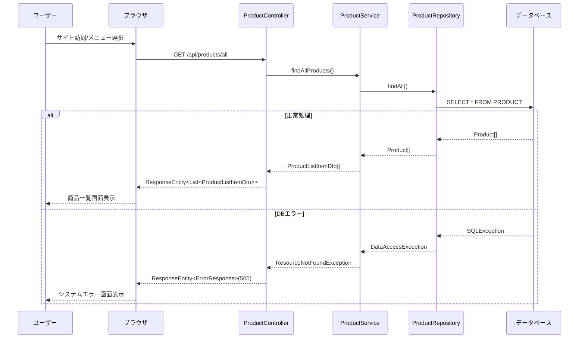
```mermaid
sequenceDiagram
    participant U as ユーザー
    participant B as ブラウザ
    participant PC as ProductController
    participant PS as ProductService
    participant PR as ProductRepository
    participant DB as データベース

    U->>B: サイト訪問/メニュー選択
    B->>PC: GET /api/products/all
    PC->>PS: findAllProducts()
    PS->>PR: findAll()
    PR->>DB: SELECT * FROM PRODUCT
    
    alt 正常処理
        DB-->>PR: Product[]
        PR-->>PS: Product[]
        PS-->>PC: ProductListItemDto[]
        PC-->>B: ResponseEntity<List<ProductListItemDto>>
        B-->>U: 商品一覧画面表示
    else DBエラー
        DB-->>PR: SQLException
        PR-->>PS: DataAccessException
        PS-->>PC: ResourceNotFoundException
        PC-->>B: ResponseEntity<ErrorResponse>(500)
        B-->>U: システムエラー画面表示
    end
```


### 3.2.2. カテゴリ別一覧表示フロー

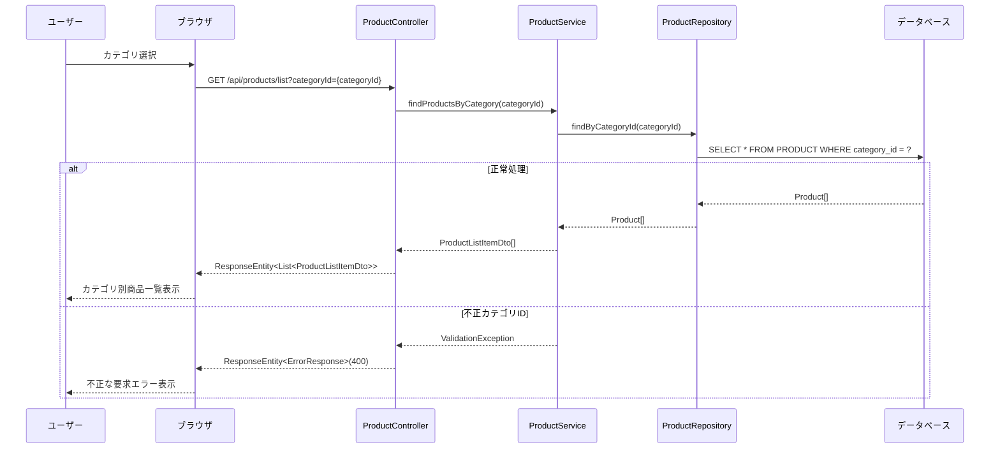
```mermaid
sequenceDiagram
    participant U as ユーザー
    participant B as ブラウザ
    participant PC as ProductController
    participant PS as ProductService
    participant PR as ProductRepository
    participant DB as データベース

    U->>B: カテゴリ選択
    B->>PC: GET /api/products/list?categoryId={categoryId}
    PC->>PS: findProductsByCategory(categoryId)
    PS->>PR: findByCategoryId(categoryId)
    PR->>DB: SELECT * FROM PRODUCT WHERE category_id = ?
    
    alt 正常処理
        DB-->>PR: Product[]
        PR-->>PS: Product[]
        PS-->>PC: ProductListItemDto[]
        PC-->>B: ResponseEntity<List<ProductListItemDto>>
        B-->>U: カテゴリ別商品一覧表示
    else 不正カテゴリID
        PS-->>PC: ValidationException
        PC-->>B: ResponseEntity<ErrorResponse>(400)
        B-->>U: 不正な要求エラー表示
    end
```

### 3.2.3. 商品検索フロー

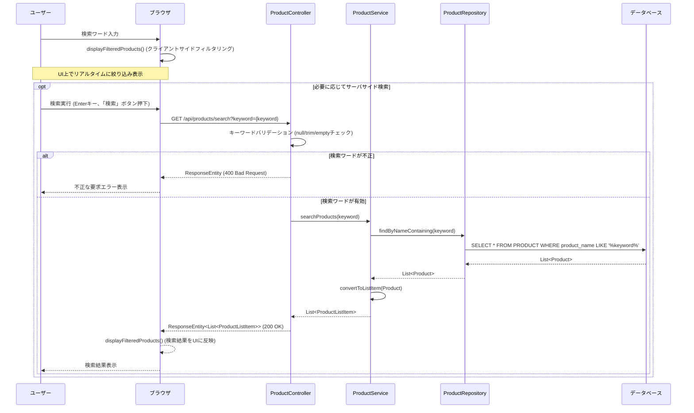
```mermaid
sequenceDiagram
    participant U as ユーザー
    participant B as ブラウザ
    participant PC as ProductController
    participant PS as ProductService
    participant PR as ProductRepository
    participant DB as データベース

    U->>B: 検索ワード入力
    B->>B: displayFilteredProducts() (クライアントサイドフィルタリング)
    Note over B,U: UI上でリアルタイムに絞り込み表示
    
    opt 必要に応じてサーバサイド検索
        U->>B: 検索実行 (Enterキー、「検索」ボタン押下)
        B->>PC: GET /api/products/search?keyword={keyword}
        PC->>PC: キーワードバリデーション (null/trim/emptyチェック)
        alt 検索ワードが不正
            PC-->>B: ResponseEntity (400 Bad Request)
            B-->>U: 不正な要求エラー表示
        else 検索ワードが有効
            PC->>PS: searchProducts(keyword)
            PS->>PR: findByNameContaining(keyword)
            PR->>DB: SELECT * FROM PRODUCT WHERE product_name LIKE '%keyword%'
            DB-->>PR: List<Product>
            PR-->>PS: List<Product>
            PS->>PS: convertToListItem(Product)
            PS-->>PC: List<ProductListItem>
            PC-->>B: ResponseEntity<List<ProductListItem>> (200 OK)
            B-->>B: displayFilteredProducts() (検索結果をUIに反映)
            B-->>U: 検索結果表示
        end
    end
```

### 3.2.4. 商品詳細表示フロー

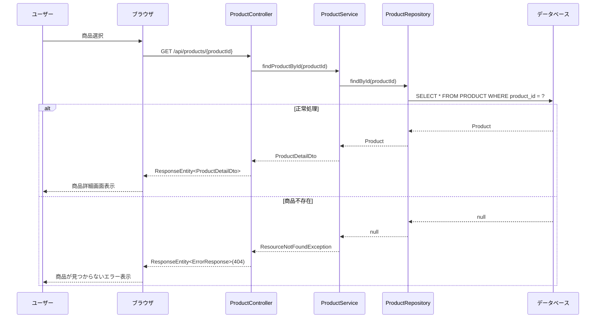
```mermaid
sequenceDiagram
    participant U as ユーザー
    participant B as ブラウザ
    participant PC as ProductController
    participant PS as ProductService
    participant PR as ProductRepository
    participant DB as データベース

    U->>B: 商品選択
    B->>PC: GET /api/products/{productId}
    PC->>PS: findProductById(productId)
    PS->>PR: findById(productId)
    PR->>DB: SELECT * FROM PRODUCT WHERE product_id = ?
    
    alt 正常処理
        DB-->>PR: Product
        PR-->>PS: Product
        PS-->>PC: ProductDetailDto
        PC-->>B: ResponseEntity<ProductDetailDto>
        B-->>U: 商品詳細画面表示
    else 商品不存在
        DB-->>PR: null
        PR-->>PS: null
        PS-->>PC: ResourceNotFoundException
        PC-->>B: ResponseEntity<ErrorResponse>(404)
        B-->>U: 商品が見つからないエラー表示
    end
```

### 3.2.5. カート追加フロー

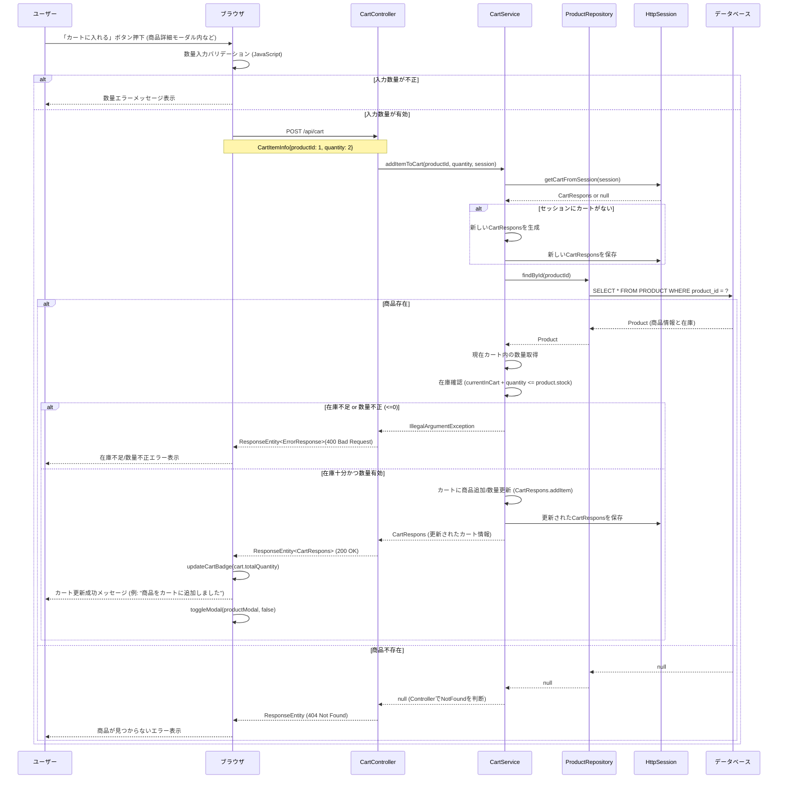
```mermaid
sequenceDiagram
    participant U as ユーザー
    participant B as ブラウザ
    participant CC as CartController
    participant CS as CartService
    participant PR as ProductRepository
    participant S as HttpSession
    participant DB as データベース

    U->>B: 「カートに入れる」ボタン押下 (商品詳細モーダル内など)
    B->>B: 数量入力バリデーション (JavaScript)
    alt 入力数量が不正
        B-->>U: 数量エラーメッセージ表示
    else 入力数量が有効
        B->>CC: POST /api/cart
        Note over B,CC: CartItemInfo{productId: 1, quantity: 2}
        CC->>CS: addItemToCart(productId, quantity, session)
        CS->>S: getCartFromSession(session)
        S-->>CS: CartRespons or null
        alt セッションにカートがない
            CS->>CS: 新しいCartResponsを生成
            CS->>S: 新しいCartResponsを保存
        end
        CS->>PR: findById(productId)
        PR->>DB: SELECT * FROM PRODUCT WHERE product_id = ?
        
        alt 商品存在
            DB-->>PR: Product (商品情報と在庫)
            PR-->>CS: Product
            CS->>CS: 現在カート内の数量取得
            CS->>CS: 在庫確認 (currentInCart + quantity <= product.stock)
            alt 在庫不足 or 数量不正 (<=0)
                CS-->>CC: IllegalArgumentException
                CC-->>B: ResponseEntity<ErrorResponse>(400 Bad Request)
                B-->>U: 在庫不足/数量不正エラー表示
            else 在庫十分かつ数量有効
                CS->>CS: カートに商品追加/数量更新 (CartRespons.addItem)
                CS->>S: 更新されたCartResponsを保存
                CS-->>CC: CartRespons (更新されたカート情報)
                CC-->>B: ResponseEntity<CartRespons> (200 OK)
                B->>B: updateCartBadge(cart.totalQuantity)
                B-->>U: カート更新成功メッセージ (例: "商品をカートに追加しました")
                B->>B: toggleModal(productModal, false)
            end
        else 商品不存在
            DB-->>PR: null
            PR-->>CS: null
            CS-->>CC: null (ControllerでNotFoundを判断)
            CC-->>B: ResponseEntity (404 Not Found)
            B-->>U: 商品が見つからないエラー表示
        end
    end
```

### 3.2.6.1．カート内容確認フロー

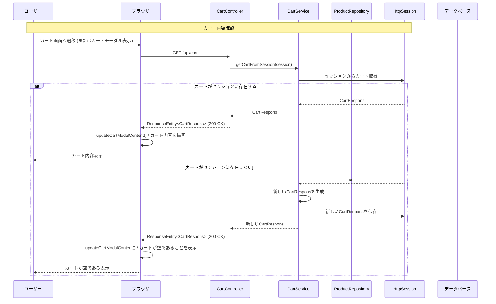
```mermaid
sequenceDiagram
    participant U as ユーザー
    participant B as ブラウザ
    participant CC as CartController
    participant CS as CartService
    participant PR as ProductRepository
    participant S as HttpSession
    participant DB as データベース

    Note over U,S: カート内容確認
    U->>B: カート画面へ遷移 (またはカートモーダル表示)
    B->>CC: GET /api/cart
    CC->>CS: getCartFromSession(session)
    CS->>S: セッションからカート取得
    
    alt カートがセッションに存在する
        S-->>CS: CartRespons
        CS-->>CC: CartRespons
        CC-->>B: ResponseEntity<CartRespons> (200 OK)
        B->>B: updateCartModalContent() / カート内容を描画
        B-->>U: カート内容表示
    else カートがセッションに存在しない
        S-->>CS: null
        CS->>CS: 新しいCartResponsを生成
        CS->>S: 新しいCartResponsを保存
        CS-->>CC: 新しいCartRespons
        CC-->>B: ResponseEntity<CartRespons> (200 OK)
        B->>B: updateCartModalContent() / カートが空であることを表示
        B-->>U: カートが空である表示
    end
```
### 3.2.6.2. カート内容数量変更フロー

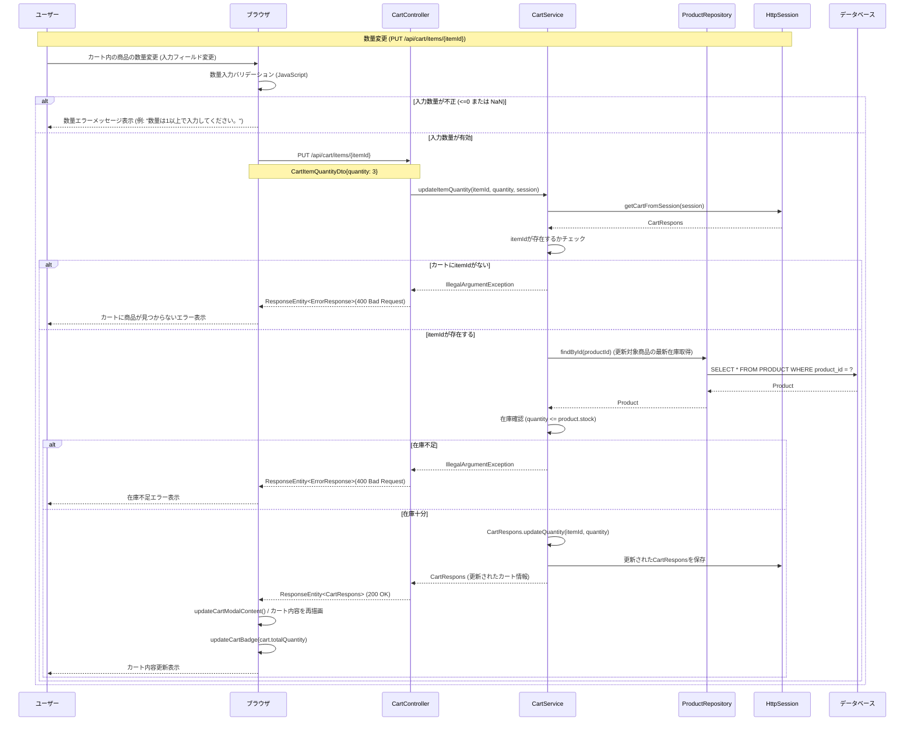
```mermaid
sequenceDiagram
    participant U as ユーザー
    participant B as ブラウザ
    participant CC as CartController
    participant CS as CartService
    participant PR as ProductRepository
    participant S as HttpSession
    participant DB as データベース

    Note over U,S: 数量変更 (PUT /api/cart/items/{itemId})
    U->>B: カート内の商品の数量変更 (入力フィールド変更)
    B->>B: 数量入力バリデーション (JavaScript)
    alt 入力数量が不正 (<=0 または NaN)
        B-->>U: 数量エラーメッセージ表示 (例: "数量は1以上で入力してください。")
    else 入力数量が有効
        B->>CC: PUT /api/cart/items/{itemId}
        Note over B,CC: CartItemQuantityDto{quantity: 3}
        CC->>CS: updateItemQuantity(itemId, quantity, session)
        CS->>S: getCartFromSession(session)
        S-->>CS: CartRespons
        CS->>CS: itemIdが存在するかチェック
        alt カートにitemIdがない
            CS-->>CC: IllegalArgumentException
            CC-->>B: ResponseEntity<ErrorResponse>(400 Bad Request)
            B-->>U: カートに商品が見つからないエラー表示
        else itemIdが存在する
            CS->>PR: findById(productId) (更新対象商品の最新在庫取得)
            PR->>DB: SELECT * FROM PRODUCT WHERE product_id = ?
            DB-->>PR: Product
            PR-->>CS: Product
            CS->>CS: 在庫確認 (quantity <= product.stock)
            alt 在庫不足
                CS-->>CC: IllegalArgumentException
                CC-->>B: ResponseEntity<ErrorResponse>(400 Bad Request)
                B-->>U: 在庫不足エラー表示
            else 在庫十分
                CS->>CS: CartRespons.updateQuantity(itemId, quantity)
                CS->>S: 更新されたCartResponsを保存
                CS-->>CC: CartRespons (更新されたカート情報)
                CC-->>B: ResponseEntity<CartRespons> (200 OK)
                B->>B: updateCartModalContent() / カート内容を再描画
                B->>B: updateCartBadge(cart.totalQuantity)
                B-->>U: カート内容更新表示
            end
        end
    end
```
### 3.2.6.3 カート内容削除フロー

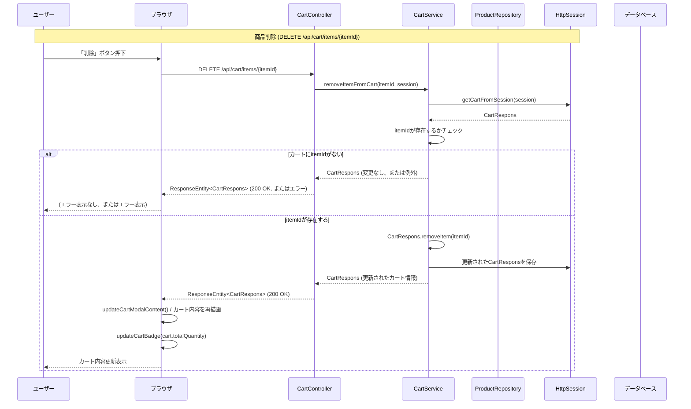
```mermaid
sequenceDiagram
    participant U as ユーザー
    participant B as ブラウザ
    participant CC as CartController
    participant CS as CartService
    participant PR as ProductRepository
    participant S as HttpSession
    participant DB as データベース
    Note over U,S: 商品削除 (DELETE /api/cart/items/{itemId})
    U->>B: 「削除」ボタン押下
    B->>CC: DELETE /api/cart/items/{itemId}
    CC->>CS: removeItemFromCart(itemId, session)
    CS->>S: getCartFromSession(session)
    S-->>CS: CartRespons
    CS->>CS: itemIdが存在するかチェック
    alt カートにitemIdがない
        CS-->>CC: CartRespons (変更なし、または例外)
        CC-->>B: ResponseEntity<CartRespons> (200 OK, またはエラー)
        B-->>U: (エラー表示なし、またはエラー表示)
    else itemIdが存在する
        CS->>CS: CartRespons.removeItem(itemId)
        CS->>S: 更新されたCartResponsを保存
        CS-->>CC: CartRespons (更新されたカート情報)
        CC-->>B: ResponseEntity<CartRespons> (200 OK)
        B->>B: updateCartModalContent() / カート内容を再描画
        B->>B: updateCartBadge(cart.totalQuantity)
        B-->>U: カート内容更新表示
    end
```

### 3.2.7. 注文情報入力フロー
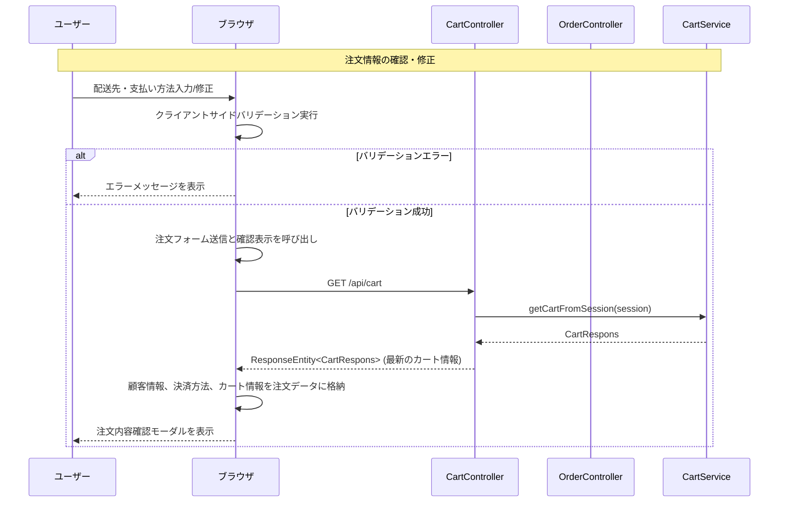
```mermaid
sequenceDiagram
    participant U as ユーザー
    participant B as ブラウザ
    participant CC as CartController
    participant OC as OrderController
    participant CS as CartService

    Note over U,CS: 注文情報の確認・修正
    U->>B: 配送先・支払い方法入力/修正
    B->>B: クライアントサイドバリデーション実行
    alt バリデーションエラー
        B-->>U: エラーメッセージを表示
    else バリデーション成功
        B->>B: 注文フォーム送信と確認表示を呼び出し
        B->>CC: GET /api/cart
        CC->>CS: getCartFromSession(session)
        CS-->>CC: CartRespons
        CC-->>B: ResponseEntity<CartRespons> (最新のカート情報)
        B->>B: 顧客情報、決済方法、カート情報を注文データに格納
        B-->>U: 注文内容確認モーダルを表示
    end
```

### 3.2.8. 注文確認フロー

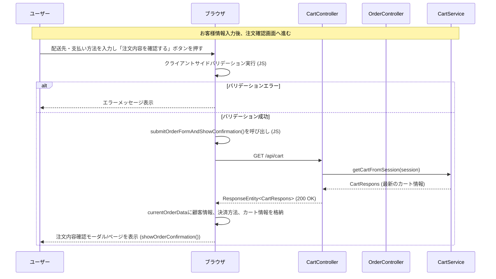
```mermaid
sequenceDiagram
    participant U as ユーザー
    participant B as ブラウザ
    participant CC as CartController
    participant OC as OrderController
    participant CS as CartService

    Note over U,CS: お客様情報入力後、注文確認画面へ進む
    U->>B: 配送先・支払い方法を入力し「注文内容を確認する」ボタンを押す
    B->>B: クライアントサイドバリデーション実行 (JS)
    alt バリデーションエラー
        B-->>U: エラーメッセージ表示
    else バリデーション成功
        B->>B: submitOrderFormAndShowConfirmation()を呼び出し (JS)
        B->>CC: GET /api/cart
        CC->>CS: getCartFromSession(session)
        CS-->>CC: CartRespons (最新のカート情報)
        CC-->>B: ResponseEntity<CartRespons> (200 OK)
        B->>B: currentOrderDataに顧客情報、決済方法、カート情報を格納
        B-->>U: 注文内容確認モーダル/ページを表示 (showOrderConfirmation())
    end
```
### 3.2.9. 非会員購入フロー(お客様情報入力ページ出力)

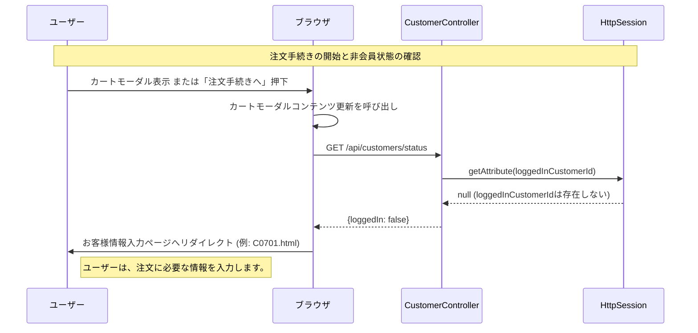
```mermaid
sequenceDiagram
    participant U as ユーザー
    participant B as ブラウザ
    participant CUC as CustomerController
    participant S as HttpSession

    Note over U,S: 注文手続きの開始と非会員状態の確認
    U->>B: カートモーダル表示 または「注文手続きへ」押下
    B->>B: カートモーダルコンテンツ更新を呼び出し
    B->>CUC: GET /api/customers/status
    CUC->>S: getAttribute(loggedInCustomerId)
    S-->>CUC: null (loggedInCustomerIdは存在しない)
    CUC-->>B: {loggedIn: false}
    B->>U: お客様情報入力ページへリダイレクト (例: C0701.html)
    Note right of U: ユーザーは、注文に必要な情報を入力します。
```

### 3.2.10. 会員購入フロー(お客様情報入力ページ出力)

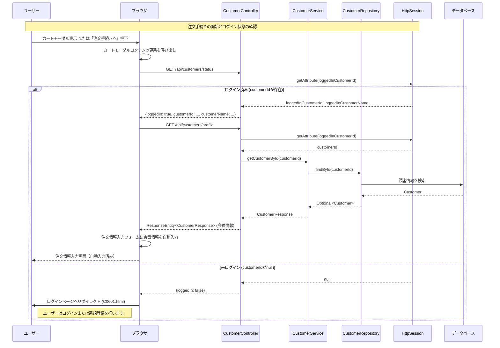
```mermaid
sequenceDiagram
    participant U as ユーザー
    participant B as ブラウザ
    participant CUC as CustomerController
    participant CUS as CustomerService
    participant CR as CustomerRepository
    participant S as HttpSession
    participant DB as データベース

    Note over U,S: 注文手続きの開始とログイン状態の確認
    U->>B: カートモーダル表示 または「注文手続きへ」押下
    B->>B: カートモーダルコンテンツ更新を呼び出し
    B->>CUC: GET /api/customers/status
    CUC->>S: getAttribute(loggedInCustomerId)
    alt ログイン済み (customerIdが存在)
        S-->>CUC: loggedInCustomerId, loggedInCustomerName
        CUC-->>B: {loggedIn: true, customerId: ..., customerName: ...}
        B->>CUC: GET /api/customers/profile
        CUC->>S: getAttribute(loggedInCustomerId)
        S-->>CUC: customerId
        CUC->>CUS: getCustomerById(customerId)
        CUS->>CR: findById(customerId)
        CR->>DB: 顧客情報を検索
        DB-->>CR: Customer
        CR-->>CUS: Optional<Customer>
        CUS-->>CUC: CustomerResponse
        CUC-->>B: ResponseEntity<CustomerResponse> (会員情報)
        B->>B: 注文情報入力フォームに会員情報を自動入力
        B-->>U: 注文情報入力画面（自動入力済み）
    else 未ログイン (customerIdがnull)
        S-->>CUC: null
        CUC-->>B: {loggedIn: false}
        B->>U: ログインページへリダイレクト (C0601.html)
        Note right of U: ユーザーはログインまたは新規登録を行います。
    end
```
### 3.2.11. 注文確定フロー（正常系）

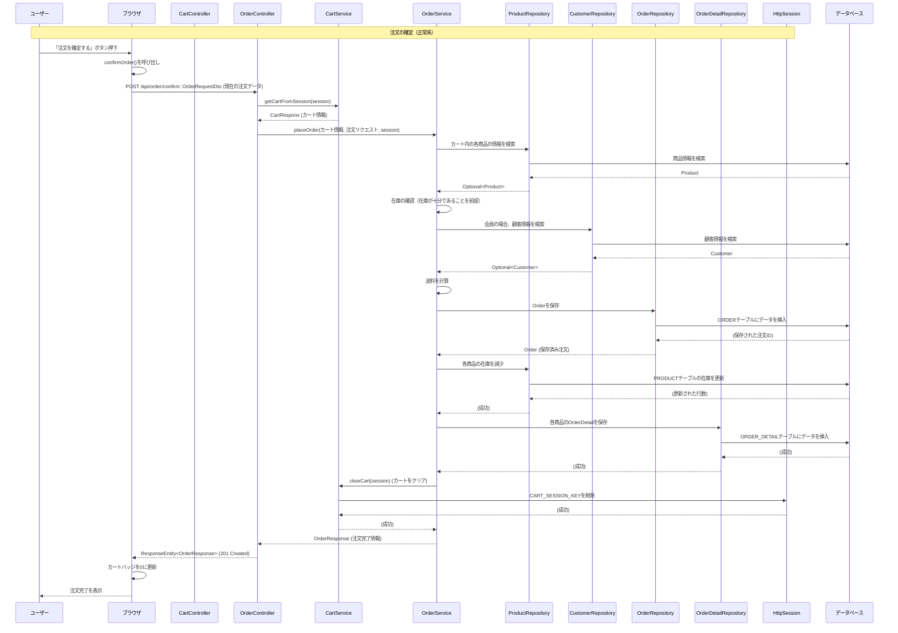
```mermaid
sequenceDiagram
    participant U as ユーザー
    participant B as ブラウザ
    participant CC as CartController
    participant OC as OrderController
    participant CS as CartService
    participant OS as OrderService
    participant PR as ProductRepository
    participant CR as CustomerRepository
    participant OR as OrderRepository
    participant ODR as OrderDetailRepository
    participant S as HttpSession
    participant DB as データベース

    Note over U,S: 注文の確定（正常系）
    U->>B: 「注文を確定する」ボタン押下
    B->>B: confirmOrder()を呼び出し
    B->>OC: POST /api/order/confirm: OrderRequestDto (現在の注文データ)
    OC->>CS: getCartFromSession(session)
    CS-->>OC: CartRespons (カート情報)
    OC->>OS: placeOrder(カート情報, 注文リクエスト, session)
    OS->>PR: カート内の各商品の情報を検索
    PR->>DB: 商品情報を検索
    DB-->>PR: Product
    PR-->>OS: Optional<Product>
    OS->>OS: 在庫の確認（在庫が十分であることを前提）
    OS->>CR: 会員の場合、顧客情報を検索
    CR->>DB: 顧客情報を検索
    DB-->>CR: Customer
    CR-->>OS: Optional<Customer>
    OS->>OS: 送料を計算
    OS->>OR: Orderを保存
    OR->>DB: ORDERテーブルにデータを挿入
    DB-->>OR: (保存された注文ID)
    OR-->>OS: Order (保存済み注文)
    OS->>PR: 各商品の在庫を減少
    PR->>DB: PRODUCTテーブルの在庫を更新
    DB-->>PR: (更新された行数)
    PR-->>OS: (成功)
    OS->>ODR: 各商品のOrderDetailを保存
    ODR->>DB: ORDER_DETAILテーブルにデータを挿入
    DB-->>ODR: (成功)
    ODR-->>OS: (成功)
    OS->>CS: clearCart(session) (カートをクリア)
    CS->>S: CART_SESSION_KEYを削除
    S-->>CS: (成功)
    CS-->>OS: (成功)
    OS-->>OC: OrderResponse (注文完了情報)
    OC-->>B: ResponseEntity<OrderResponse> (201 Created)
    B->>B: カートバッジを0に更新
    B-->>U: 注文完了を表示
```


### 3.2.12. 新規会員登録フロー

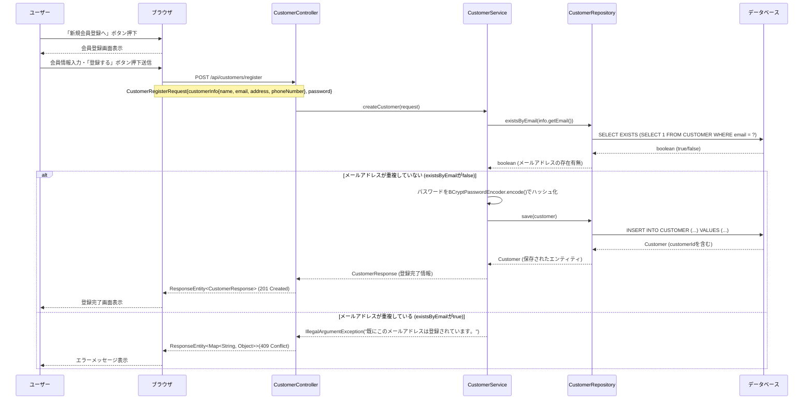
```mermaid
sequenceDiagram
    participant U as ユーザー
    participant B as ブラウザ
    participant CuC as CustomerController
    participant CS as CustomerService
    participant CR as CustomerRepository
    participant DB as データベース

    U->>B: 「新規会員登録へ」ボタン押下
    B-->>U: 会員登録画面表示
    
    U->>B: 会員情報入力・「登録する」ボタン押下送信
    B->>CuC: POST /api/customers/register
    Note over B,CuC: CustomerRegisterRequest{customerInfo{name, email, address, phoneNumber}, password}
    CuC->>CS: createCustomer(request)
    CS->>CR: existsByEmail(info.getEmail())
    CR->>DB: SELECT EXISTS (SELECT 1 FROM CUSTOMER WHERE email = ?)
    DB-->>CR: boolean (true/false)
    CR-->>CS: boolean (メールアドレスの存在有無)
    
    alt メールアドレスが重複していない (existsByEmailがfalse)
        CS->>CS: パスワードをBCryptPasswordEncoder.encode()でハッシュ化
        CS->>CR: save(customer)
        CR->>DB: INSERT INTO CUSTOMER (...) VALUES (...)
        DB-->>CR: Customer (customerIdを含む)
        CR-->>CS: Customer (保存されたエンティティ)
        CS-->>CuC: CustomerResponse (登録完了情報)
        CuC-->>B: ResponseEntity<CustomerResponse> (201 Created)
        B-->>U: 登録完了画面表示
    else メールアドレスが重複している (existsByEmailがtrue)
        CS-->>CuC: IllegalArgumentException("既にこのメールアドレスは登録されています。")
        CuC-->>B: ResponseEntity<Map<String, Object>>(409 Conflict)
        B-->>U: エラーメッセージ表示
    end
```

### 3.2.13. ログインフロー

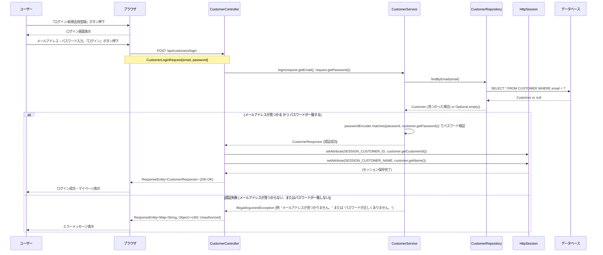
```mermaid
sequenceDiagram
    participant U as ユーザー
    participant B as ブラウザ
    participant CuC as CustomerController
    participant CS as CustomerService
    participant CR as CustomerRepository
    participant S as HttpSession
    participant DB as データベース

    U->>B:「ログイン/新規会員登録」ボタン押下
    B-->>U: ログイン画面表示
    
    U->>B: メールアドレス・パスワード入力、「ログイン」ボタン押下
    B->>CuC: POST /api/customers/login
    Note over B,CuC: CustomerLoginRequest{email, password}
    CuC->>CS: login(request.getEmail(), request.getPassword())
    CS->>CR: findByEmail(email)
    CR->>DB: SELECT * FROM CUSTOMER WHERE email = ?
    DB-->>CR: Customer or null
    CR-->>CS: Customer (見つかった場合) or Optional.empty()
    
    alt メールアドレスが見つかる かつ パスワードが一致する
        CS->>CS: passwordEncoder.matches(password, customer.getPassword()) でパスワード検証
        CS-->>CuC: CustomerResponse (認証成功)
        CuC->>S: setAttribute(SESSION_CUSTOMER_ID, customer.getCustomerId())
        CuC->>S: setAttribute(SESSION_CUSTOMER_NAME, customer.getName())
        S-->>CuC: (セッション保存完了)
        CuC-->>B: ResponseEntity<CustomerResponse> (200 OK)
        B-->>U: ログイン成功・マイページ表示
    else 認証失敗 (メールアドレスが見つからない、またはパスワードが一致しない)
        CS-->>CuC: IllegalArgumentException (例: "メールアドレスが見つかりません。" または "パスワードが正しくありません。")
        CuC-->>B: ResponseEntity<Map<String, Object>>(401 Unauthorized)
        B-->>U: エラーメッセージ表示
    end
```

### 3.2.14. ログアウトフロー

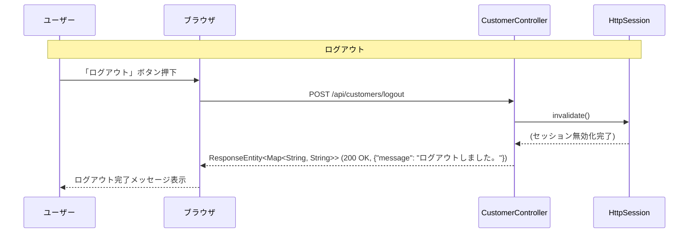
```mermaid
sequenceDiagram
    participant U as ユーザー
    participant B as ブラウザ
    participant CuC as CustomerController
    participant S as HttpSession

    Note over U,S: ログアウト
    U->>B: 「ログアウト」ボタン押下
    B->>CuC: POST /api/customers/logout
    CuC->>S: invalidate()
    S-->>CuC: (セッション無効化完了)
    CuC-->>B: ResponseEntity<Map<String, String>> (200 OK, {"message": "ログアウトしました。"})
    B-->>U: ログアウト完了メッセージ表示
```


## 4. クラス設計

ここでは、「シンプル雑貨オンライン」バックエンド（Spring Boot）アプリケーションのクラス構造について定義します。主要なパッケージ構成、クラス図、主要クラスの説明、およびデータ転送オブジェクト（DTO）の定義を示します。

### 4.1. 主要パッケージ構成
com.example.ecsite
├── controller
│   ├── ProductController         // 商品一覧・詳細取得、検索、カテゴリ別
│   ├── CartController            // カート操作（セッション：追加、削除、変更、取得）
│   ├── OrderController           // 注文処理、履歴取得、注文詳細取得（非会員対応含む）
│   └── CustomerController        // 会員登録、ログイン、プロフィール更新
│
├── service
│   ├── ProductService            // 商品検索、カテゴリ検索、詳細取得
│   ├── CartService               // セッションからのカート操作ロジック
│   ├── OrderService              // 注文処理、履歴取得、明細取得、送料計算など
│   └── CustomerService           // 会員認証、登録、更新処理
│
├── repository
│   ├── ProductRepository         // 商品情報の取得
│   ├── OrderRepository           // 注文エンティティのCRUD操作
│   ├── OrderDetailRepository     // 注文明細の一括保存・取得
│   └── CustomerRepository        // 会員情報の取得、メールアドレス検索など
│
├── entity
│   ├── Product                   // 商品情報（名前、説明、価格、カテゴリなど）
│   ├── Category                  // カテゴリ情報（商品に関連付け）
│   ├── Order                     // 注文情報（会員・非会員共通）
│   ├── OrderDetail               // 注文明細（商品、数量、価格）
│   └── Customer                  // 会員情報（名前、メール、パスワードなど）
│
├── dto
│   ├── ProductListItemDto        // 商品一覧表示用（名前、画像、価格）
│   ├── ProductDetailDto          // 商品詳細表示用（説明、在庫含む）
│   ├── CartDto                   // カート全体情報（合計、アイテムリスト）
│   ├── CartItemDto               // カート内アイテム表示用（商品名、数量、小計）
│   ├── CartItemInfo              // カート追加時のリクエスト（商品ID・数量）
│   ├── CartItemQuantityDto       // 数量更新用DTO（数量のみ）
│   ├── OrderRequestDto           // 注文登録用リクエストDTO（会員ID/非会員顧客情報など）
│   ├── CustomerInfo              // 非会員注文時の配送・連絡先情報
│   ├── OrderResponseDto          // 注文登録完了時に返すDTO（注文番号、日付、合計など）
│   ├── CustomerRegisterRequest   // 会員登録フォーム入力情報
│   ├── LoginRequest              // ログイン時に送信される認証情報
│   ├── CustomerUpdateRequest     // 会員情報更新時の入力
│   ├── CustomerResponse          // 会員情報返却用（登録・ログイン・更新後）
│   ├── OrderSummary              // 注文履歴一覧表示用（注文ID、日付、金額など）
│   └── OrderItemSummary          // 注文内商品明細（商品名、単価、数量、小計）
│
└── exception
    ├── GlobalExceptionHandler    // 例外を一元的に処理（@ControllerAdvice）
    ├── ResourceNotFoundException // リソース未検出時
    └── ValidationException       // 入力バリデーション失敗時


## 4.2 クラス図
### 4.2.1. 商品関連クラス図
<div class='mermaid'>
classDiagram
    class ProductController {
        +ProductService productService
        +getAllProducts(): ResponseEntity~List~ProductListItem~~
        +getProductById(productId): ResponseEntity~ProductDetail~
        +getProductsByCategory(categoryId): ResponseEntity~List~ProductListItem~~
        +searchProducts(keyword): ResponseEntity~List~ProductListItem~~
    }

    class ProductService {
        +ProductRepository productRepository
        +findAllProducts(): List~ProductListItem~
        +findProductById(productId): ProductDetail
        +findProductsByCategory(categoryId): List~ProductListItem~
        +searchProducts(keyword): List~ProductListItem~
    }

    class ProductRepository {
        <<Interface>>
        +JpaRepository~Product, Integer~
        +findAll(): List~Product~
        +findById(productId): Optional~Product~
        +findByCategoryId(categoryId): List~Product~
        +findByNameContaining(keyword): List~Product~
    }

    class Product {
        <<Entity>>
        +Integer productId
        +String name
        +String description
        +Integer price
        +Integer stock
        +String imageUrl
        +Boolean isRecommended "Nullable"
        +LocalDateTime createdAt "Nullable"
        +LocalDateTime updatedAt "Nullable"
        +Category category
    }

    class Category {
        <<Entity>>
        +Integer categoryId
        +String categoryName
        +LocalDateTime createdAt
        +LocalDateTime updatedAt
    }

    class ProductListItem {
        <<DTO>>
        +Integer productId
        +String name
        +Integer price
        +String imageUrl
    }

    class ProductDetail {
        <<DTO>>
        +Integer productId
        +String name
        +Integer price
        +String description
        +Integer stock
        +String imageUrl
    }

    %% 関連
    ProductController --> ProductService : uses
    ProductService --> ProductRepository : uses

    ProductRepository "1" -- "*" Product : manages
    Product --> Category : belongs to

    ProductService ..> ProductListItem : creates
    ProductService ..> ProductDetail : creates

    ProductController ..> ProductListItem : returns
    ProductController ..> ProductDetail : returns

</div>

### 4.2.2. カート関連クラス図 (セッション管理)
<div class='mermaid'>
classDiagram
    class CartController {
        +CartService cartService
        +getCart(HttpSession): ResponseEntity~CartResponse~
        +addItem(CartItemInfo, HttpSession): ResponseEntity~CartResponse~
        +updateItem(itemId, CartItemQuantityDto, HttpSession): ResponseEntity~CartResponse~
        +removeItem(itemId, HttpSession): ResponseEntity~CartResponse~
    }

    class CartService {
        +ProductRepository productRepository
        +getCartFromSession(HttpSession): Cart
        +addItemToCart(productId, quantity, HttpSession): Cart
        +updateItemQuantity(itemId, quantity, HttpSession): Cart
        +removeItemFromCart(itemId, HttpSession): Cart
        +clearCart(HttpSession): void
    }

    class ProductRepository {
        <<Interface>>
        +findAll()
        +findById(id)
    }

    class Cart {
        <<Session Object>>
        +Map~String, CartItem~ items
        +int totalQuantity
        +int totalPrice
        +addItem(product, quantity): void
        +updateQuantity(itemId, quantity): void
        +removeItem(itemId): void
        +calculateTotals(): void
    }

    class CartItem {
        <<Session Object>>
        +String id
        +Integer productId
        +String name
        +Integer price
        +String imageUrl
        +int quantity
        +int subtotal
    }

    %% DTO類

    class CartResponse {
        <<DTO>>
        +List~CartItemResponse~ items
        +int totalQuantity
        +int totalPrice
    }

    class CartItemResponse {
        <<DTO>>
        +String id
        +Integer productId
        +String name
        +Integer price
        +String imageUrl
        +int quantity
        +int subtotal
    }

    class CartItemInfo {
        <<DTO>>
        +Integer productId
        +Integer quantity
    }

    class CartItemQuantityDto {
        <<DTO>>
        +Integer quantity
    }

    %% 関係

    CartController --> CartService : uses
    CartService --> ProductRepository : uses
    CartService ..> Cart : manages (in Session)
    CartService ..> CartItem : uses

    Cart "1" *-- "items *" CartItem : contains

    CartController ..> CartResponse : returns
    CartController ..> CartItemInfo : receives
    CartController ..> CartItemQuantityDto : receives

    CartResponse "1" *-- "items *" CartItemResponse : contains

    CartService ..> CartResponse : creates
    CartService ..> CartItemResponse : creates
</div>

### 4.2.3. 注文関連クラス図 
<div class='mermaid'>
classDiagram
    %% ユーザー関連
    class User {
        +cart: Cart
        +addToCart()
        +viewProduct()
        +placeOrder()
    }

    class Guest {
        +register()
    }

    class Member {
        -email: String
        -password: String
        +login()
        +viewMyPage()
        +editProfile()
    }

    class LoggedInMember {
        +logout()
    }

    %% 商品関連
    class Product {
        <<Entity>>
        +Integer productId
        +String name
        +String description
        +BigDecimal price
        +Integer stock
        +String imageUrl
    }

    %% カート関連
    class Cart {
        -items: List~CartItem~
        +addItem()
        +removeItem()
        +clearCart()
    }

    class CartItem {
        -product: Product
        -quantity: int
    }

    %% 注文関連
    class Order {
        <<Entity>>
        +Integer orderId
        +Member member "Nullable"
        +String orderEmail
        +String orderName
        +String orderPhoneNumber
        +String orderAddress
        +BigDecimal totalPrice
        +BigDecimal shippingFee
        +String paymentMethod
        +LocalDateTime orderDate
        +LocalDateTime createdAt
        +LocalDateTime updatedAt
        +String status
        +Boolean isGuest
        +calculateTotal()
    }

    class OrderDetail {
        <<Entity>>
        +Integer orderDetailId
        +Order order
        +Product product
        +Integer quantity
        +BigDecimal unitPrice
        +LocalDateTime createdAt
        +LocalDateTime updatedAt
    }

    %% DTO類

    class OrderRequest {
        <<DTO>>
        +CustomerInfo customerInfo
        +Integer memberId "Nullable"
        +Boolean isGuest
    }

    class CustomerInfo {
        <<DTO>>
        +String name
        +String email
        +String address
        +String phoneNumber
    }

    class OrderResponse {
        <<DTO>>
        +Integer orderId
        +String orderNumber
        +LocalDateTime orderDate
        +BigDecimal totalAmount
        +BigDecimal shippingFee
        +String status
    }

    class OrderSummaryResponse {
        <<DTO>>
        +Integer orderId
        +LocalDateTime orderDate
        +BigDecimal totalPrice
        +String status
    }

    class OrderDetailResponse {
        <<DTO>>
        +Integer orderId
        +CustomerInfo customerInfo
        +LocalDateTime orderDate
        +BigDecimal shippingFee
        +BigDecimal totalPrice
        +String paymentMethod
        +String status
        +List~OrderItemDetailResponse~ items
    }

    class OrderItemDetailResponse {
        <<DTO>>
        +String productName
        +Integer quantity
        +BigDecimal unitPrice
        +BigDecimal subtotal
    }

    class OrderPreview {
        <<DTO>>
        +List~OrderItemPreview~ items
        +BigDecimal subtotal
        +BigDecimal shippingFee
        +BigDecimal totalAmount
        +String paymentMethod
        +CustomerInfo customerInfo
    }

    class OrderItemPreview {
        <<DTO>>
        +Product product
        +Integer quantity
        +BigDecimal unitPrice
    }

    %% コントローラー・サービス・リポジトリ
    class OrderController {
        +OrderService orderService
        +CartService cartService
        +placeOrder(OrderRequest, HttpSession): ResponseEntity~OrderResponse~
        +getOrderHistory(memberId: Integer): ResponseEntity~List~OrderSummaryResponse~~
        +getOrderDetail(orderId: Integer): ResponseEntity~OrderDetailResponse~
    }

    class OrderService {
        +OrderRepository orderRepository
        +OrderDetailRepository orderDetailRepository
        +ProductRepository productRepository
        +CartService cartService
        +placeOrder(Cart, OrderRequest): OrderResponse
        +getOrderHistoryByMember(memberId: Integer): List~OrderSummaryResponse~
        +getOrderDetail(orderId: Integer): OrderDetailResponse
        +calculateShippingFee(address, totalAmount): BigDecimal
    }

    class OrderRepository {
        <<Interface>>
        +JpaRepository~Order, Integer~
        +findByMember(member: Member): List~Order~
    }

    class OrderDetailRepository {
        <<Interface>>
        +JpaRepository~OrderDetail, Integer~
        +saveAll(details): List~OrderDetail~
        +findByOrderId(orderId: Integer): List~OrderDetail~
    }

    class ProductRepository {
        <<Interface>>
        +JpaRepository~Product, Integer~
    }

    %% 継承関係
    User <|-- Guest
    User <|-- Member
    Member <|-- LoggedInMember

    %% 関連
    User --> Cart : owns
    Member --> Order : places
    Order --> OrderDetail : contains
    OrderDetail --> Product : refers to
    Cart --> CartItem : contains
    CartItem --> Product : refers to

    OrderController --> OrderService : uses
    OrderController --> CartService : uses
    OrderService --> OrderRepository : uses
    OrderService --> OrderDetailRepository : uses
    OrderService --> ProductRepository : uses
    OrderService --> CartService : uses

    OrderRepository "1" -- "*" Order : manages
    OrderDetailRepository "1" -- "*" OrderDetail : manages
    OrderDetail "n" -- "1" Order : belongs to
    OrderDetail "n" -- "1" Product : refers to

    OrderController ..> OrderRequest : receives
    OrderController ..> OrderResponse : returns
    OrderController ..> OrderPreview : returns
    OrderController ..> OrderSummaryResponse : returns
    OrderController ..> OrderDetailResponse : returns
    OrderDetailResponse --> OrderItemDetailResponse : contains

    %% ServiceがDTOを作成する関係を追加
    OrderService ..> OrderResponse : creates
    OrderService ..> OrderSummaryResponse : creates
    OrderService ..> OrderDetailResponse : creates
    OrderService ..> OrderPreview : creates

</div>

### 4.2.4. 会員登録関連クラス図
<div class='mermaid'>
classDiagram
    class CustomerController {
        +CustomerService customerService
        +register(CustomerRegisterRequest) ResponseEntity~CustomerRegisterResponse~
        +login(LoginRequest) ResponseEntity~LoginResponse~
        +updateProfile(CustomerUpdateRequest, HttpSession) ResponseEntity~CustomerUpdateResponse~
    }

    class CustomerService {
        +registerCustomer(CustomerRegisterRequest) CustomerRegisterResponse
        +authenticate(LoginRequest) LoginResponse
        +updateCustomerInfo(CustomerUpdateRequest) CustomerUpdateResponse
    }

    class CustomerRepository {
        <<Interface>>
        +extends JpaRepository~Customer, Integer~
        +findByEmail(email) Optional~Customer~
    }

    class Customer {
        <<Entity>>
        +Integer customerId
        +String email
        +String password
        +String lastName
        +String firstName
        +String phoneNumber
        +String address
        +LocalDateTime createdAt
        +LocalDateTime updatedAt
    }

    class CustomerRegisterRequest {
        <<DTO>>
        +String lastName
        +String firstName
        +String email
        +String password
        +String address
        +String phoneNumber
    }

    class LoginRequest {
        <<DTO>>
        +String email
        +String password
    }

    class CustomerUpdateRequest {
        <<DTO>>
        +String lastName
        +String firstName
        +String email
        +String password
        +String address
        +String phoneNumber
    }

    class CustomerRegisterResponse {
        <<DTO>>
        +Integer customerId
        +String lastName
        +String firstName
        +String email
    }

    class LoginResponse {
        <<DTO>>
        +Integer customerId
        +String lastName
        +String firstName
        +String email
        +String authToken
    }

    class CustomerUpdateResponse {
        <<DTO>>
        +Integer customerId
        +String lastName
        +String firstName
        +String email
        +String address
        +String phoneNumber
        +LocalDateTime updatedAt
    }

    %% 関連
    CustomerController --> CustomerService : uses
    CustomerService --> CustomerRepository : uses
    CustomerRepository --> Customer : manages
    CustomerService --> Customer : uses

    CustomerController ..> CustomerRegisterRequest : receives
    CustomerController ..> LoginRequest : receives
    CustomerController ..> CustomerUpdateRequest : receives

    CustomerController ..> CustomerRegisterResponse : returns
    CustomerController ..> LoginResponse : returns
    CustomerController ..> CustomerUpdateResponse : returns

    %% ServiceがDTO（Response）を生成する関係
    CustomerService ..> CustomerRegisterResponse : creates
    CustomerService ..> LoginResponse : creates
    CustomerService ..> CustomerUpdateResponse : creates

</div>

## 4.3. 主要クラス説明

**Product**  
商品情報エンティティ（`productId`, `name`, `description`, `price`, `stock`, `imageUrl`, `isRecommended`, `createdAt`, `updatedAt`, `category`）

**Order**  
注文情報エンティティ（`orderId`, `member`, `orderEmail`, `orderName`, `orderPhoneNumber`, `orderAddress`, `totalPrice`, `shippingFee`, `paymentMethod`, `orderDate`, `status`, `isGuest`, `createdAt`, `updatedAt`）

**OrderDetail**  
注文明細エンティティ（`orderDetailId`, `order`, `product`, `quantity`, `unitPrice`, `createdAt`, `updatedAt`）

**Customer**  
会員情報エンティティ（`customerId`, `email`, `password`, `lastName`, `firstName`, `phoneNumber`, `address`, `createdAt`, `updatedAt`）

**Cart**  
セッション保持用カートオブジェクト（`Map<String, CartItem> items`, `totalQuantity`, `totalPrice`）

**CartItem**  
カート内商品の情報（`id`, `productId`, `name`, `price`, `imageUrl`, `quantity`, `subtotal`）

**OrderRequest**  
注文リクエストDTO（`customerInfo`, `memberId`, `isGuest`）

**CustomerInfo**  
非会員向け注文時の顧客情報DTO（`name`, `email`, `address`, `phoneNumber`）

**OrderResponse**  
注文完了レスポンスDTO（`orderId`, `orderNumber`, `orderDate`, `totalAmount`, `shippingFee`, `status`）

**CustomerRegisterRequest / LoginRequest / CustomerUpdateRequest**  
会員登録・ログイン・プロフィール更新用リクエストDTO（`lastName`, `firstName`, `email`, `password`, `address`, `phoneNumber`）

**CustomerRegisterResponse / LoginResponse / CustomerUpdateResponse**  
会員登録・ログイン・更新時のレスポンスDTO（`customerId`, `lastName`, `firstName`, `email`, `address`, `phoneNumber`, `authToken`, `updatedAt`）

**OrderSummaryResponse**  
注文履歴一覧表示用DTO（`orderId`, `orderDate`, `totalPrice`, `status`）

**OrderItemDetailResponse**  
注文詳細の商品の情報DTO（`productName`, `quantity`, `unitPrice`, `subtotal`）

**OrderPreview**  
注文確定前のプレビュー表示用DTO（`items`, `subtotal`, `shippingFee`, `totalAmount`, `paymentMethod`, `customerInfo`）

**OrderItemPreview**  
注文プレビュー時の商品明細DTO（`product`, `quantity`, `unitPrice`）

**ProductListItem**  
商品一覧用DTO（`productId`, `name`, `price`, `imageUrl`）

**ProductDetail**  
商品詳細用DTO（`productId`, `name`, `price`, `description`, `stock`, `imageUrl`）

**CartResponse**  
カート表示用DTO（`items`, `totalQuantity`, `totalPrice`）

**CartItemResponse**  
カート内商品情報のDTO版（`id`, `productId`, `name`, `price`, `imageUrl`, `quantity`, `subtotal`）

### 4.4. DTO定義
主要なAPIや機能で使用されるDTOの構造を示します。 (バリデーションルールは簡略化)

**商品関連 DTO**

```java
// 商品一覧用 DTO
public class ProductListItem {
    private Integer productId;
    private String name;
    private Integer price;
    private String imageUrl;

    public ProductListItem(Integer productId, String name, Integer price, String imageUrl) {
        this.productId = productId;
        this.name = name;
        this.price = price;
        this.imageUrl = imageUrl;
    }

    public Integer getProductId() { return productId; }
    public String getName() { return name; }
    public Integer getPrice() { return price; }
    public String getImageUrl() { return imageUrl; }
}

// 商品詳細用 DTO
public class ProductDetailResponse {
    private Integer productId;
    private String name;
    private Integer price;
    private String description;
    private Integer stock;
    private String imageUrl;

    public ProductDetailResponse(Integer productId, String name, Integer price, String description, Integer stock, String imageUrl) {
        this.productId = productId;
        this.name = name;
        this.price = price;
        this.description = description;
        this.stock = stock;
        this.imageUrl = imageUrl;
    }

    public Integer getProductId() { return productId; }
    public String getName() { return name; }
    public Integer getPrice() { return price; }
    public String getDescription() { return description; }
    public Integer getStock() { return stock; }
    public String getImageUrl() { return imageUrl; }
}

```
**カート関連 DTO** 

```java
// カート全体（セッション・レスポンス用）
public class Cart {
    private Map<String, CartItem> items = new LinkedHashMap<>();
    private int totalQuantity;
    private int totalPrice;

    public Map<String, CartItem> getItems() { return items; }
    public int getTotalQuantity() { return totalQuantity; }
    public int getTotalPrice() { return totalPrice; }

    public void addItem(ProductListItem product, int quantity) {
        String key = product.getProductId().toString();
        if (items.containsKey(key)) {
            CartItem item = items.get(key);
            item.setQuantity(item.getQuantity() + quantity);
            item.updateSubtotal();
        } else {
            CartItem newItem = new CartItem(
                key,
                product.getProductId(),
                product.getName(),
                product.getPrice(),
                product.getImageUrl(),
                quantity
            );
            items.put(key, newItem);
        }
        calculateTotals();
    }

    public void updateQuantity(String id, int quantity) {
        CartItem item = items.get(id);
        if (item != null) {
            item.setQuantity(quantity);
            item.updateSubtotal();
        }
        calculateTotals();
    }

    public void removeItem(String id) {
        items.remove(id);
        calculateTotals();
    }

    public void calculateTotals() {
        totalQuantity = items.values().stream().mapToInt(CartItem::getQuantity).sum();
        totalPrice = items.values().stream().mapToInt(CartItem::getSubtotal).sum();
    }
}

// カート内アイテム
public class CartItem {
    private String id;
    private Integer productId;
    private String name;
    private Integer price;
    private String imageUrl;
    private int quantity;
    private int subtotal;

    public CartItem(String id, Integer productId, String name, Integer price, String imageUrl, int quantity) {
        this.id = id;
        this.productId = productId;
        this.name = name;
        this.price = price;
        this.imageUrl = imageUrl;
        this.quantity = quantity;
        this.subtotal = price * quantity;
    }

    public String getId() { return id; }
    public Integer getProductId() { return productId; }
    public String getName() { return name; }
    public Integer getPrice() { return price; }
    public String getImageUrl() { return imageUrl; }
    public int getQuantity() { return quantity; }
    public int getSubtotal() { return subtotal; }

    public void setQuantity(int quantity) {
        this.quantity = quantity;
        updateSubtotal();
    }

    public void updateSubtotal() {
        this.subtotal = price * quantity;
    }
}
// カート商品追加リクエスト用
public class CartItemInfo {
    @NotNull
    private Integer productId;

    @NotNull
    @Min(1)
    private Integer quantity;

    public Integer getProductId() { return productId; }
    public void setProductId(Integer productId) { this.productId = productId; }

    public Integer getQuantity() { return quantity; }
    public void setQuantity(Integer quantity) { this.quantity = quantity; }
}

// 数量更新用
public class CartItemQuantityDto {
    @NotNull
    @Min(1)
    private Integer quantity;

    public Integer getQuantity() { return quantity; }
    public void setQuantity(Integer quantity) { this.quantity = quantity; }
}


```
**注文関連 DTO**

```java
// 注文リクエストDTO
public class OrderRequest {
    @Valid
    private CustomerInfo customerInfo;

    private Integer memberId;
    private Boolean isGuest;

    public CustomerInfo getCustomerInfo() { return customerInfo; }
    public void setCustomerInfo(CustomerInfo customerInfo) { this.customerInfo = customerInfo; }

    public Integer getMemberId() { return memberId; }
    public void setMemberId(Integer memberId) { this.memberId = memberId; }

    public Boolean getIsGuest() { return isGuest; }
    public void setIsGuest(Boolean isGuest) { this.isGuest = isGuest; }
}

// 顧客情報（非会員）
public class CustomerInfo {
    @NotBlank
    private String name;

    @NotBlank
    @Email
    private String email;

    @NotBlank
    private String address;

    @NotBlank
    private String phoneNumber;

    public String getName() { return name; }
    public void setName(String name) { this.name = name; }

    public String getEmail() { return email; }
    public void setEmail(String email) { this.email = email; }

    public String getAddress() { return address; }
    public void setAddress(String address) { this.address = address; }

    public String getPhoneNumber() { return phoneNumber; }
    public void setPhoneNumber(String phoneNumber) { this.phoneNumber = phoneNumber; }
}

// 注文完了レスポンスDTO
public class OrderResponse {
    private Integer orderId;
    private String orderNumber;
    private LocalDateTime orderDate;
    private BigDecimal totalAmount;
    private BigDecimal shippingFee;
    private String status;

    public OrderResponse(Integer orderId, String orderNumber, LocalDateTime orderDate, BigDecimal totalAmount, BigDecimal shippingFee, String status) {
        this.orderId = orderId;
        this.orderNumber = orderNumber;
        this.orderDate = orderDate;
        this.totalAmount = totalAmount;
        this.shippingFee = shippingFee;
        this.status = status;
    }

    public Integer getOrderId() { return orderId; }
    public String getOrderNumber() { return orderNumber; }
    public LocalDateTime getOrderDate() { return orderDate; }
    public BigDecimal getTotalAmount() { return totalAmount; }
    public BigDecimal getShippingFee() { return shippingFee; }
    public String getStatus() { return status; }
}

// 注文履歴一覧表示用DTO
public class OrderSummaryResponse {
    private Integer orderId;
    private LocalDateTime orderDate;
    private BigDecimal totalPrice;
    private String status;

    public OrderSummaryResponse(Integer orderId, LocalDateTime orderDate, BigDecimal totalPrice, String status) {
        this.orderId = orderId;
        this.orderDate = orderDate;
        this.totalPrice = totalPrice;
        this.status = status;
    }

    public Integer getOrderId() { return orderId; }
    public LocalDateTime getOrderDate() { return orderDate; }

// 注文明細の商品情報DTO
public class OrderItemDetailResponse {
    private String productName;
    private Integer quantity;
    private BigDecimal unitPrice;
    private BigDecimal subtotal;

    public OrderItemDetailResponse(String productName, Integer quantity, BigDecimal unitPrice, BigDecimal subtotal) {
        this.productName = productName;
        this.quantity = quantity;
        this.unitPrice = unitPrice;
        this.subtotal = subtotal;
    }

    public String getProductName() { return productName; }
    public Integer getQuantity() { return quantity; }
    public BigDecimal getUnitPrice() { return unitPrice; }
    public BigDecimal getSubtotal() { return subtotal; }
}

// 注文詳細画面全体のレスポンスDTO
public class OrderDetailResponse {
    private Integer orderId;
    private CustomerInfo customerInfo;
    private LocalDateTime orderDate;
    private BigDecimal shippingFee;
    private BigDecimal totalPrice;
    private String paymentMethod;
    private String status;
    private List<OrderItemDetailResponse> items;

    public OrderDetailResponse(Integer orderId, CustomerInfo customerInfo, LocalDateTime orderDate, BigDecimal shippingFee,
                               BigDecimal totalPrice, String paymentMethod, String status, List<OrderItemDetailResponse> items) {
        this.orderId = orderId;
        this.customerInfo = customerInfo;
        this.orderDate = orderDate;
        this.shippingFee = shippingFee;
        this.totalPrice = totalPrice;
        this.paymentMethod = paymentMethod;
        this.status = status;
        this.items = items;
    }

    public Integer getOrderId() { return orderId; }
    public CustomerInfo getCustomerInfo() { return customerInfo; }
    public LocalDateTime getOrderDate() { return orderDate; }
    public BigDecimal getShippingFee() { return shippingFee; }
    public BigDecimal getTotalPrice() { return totalPrice; }
    public String getPaymentMethod() { return paymentMethod; }
    public String getStatus() { return status; }
    public List<OrderItemDetailResponse> getItems() { return items; }
}

// 注文プレビュー画面用DTO
public class OrderPreview {
    private List<OrderItemPreview> items;
    private BigDecimal subtotal;
    private BigDecimal shippingFee;
    private BigDecimal totalAmount;
    private String paymentMethod;
    private CustomerInfo customerInfo;

    public OrderPreview(List<OrderItemPreview> items, BigDecimal subtotal, BigDecimal shippingFee,
                        BigDecimal totalAmount, String paymentMethod, CustomerInfo customerInfo) {
        this.items = items;
        this.subtotal = subtotal;
        this.shippingFee = shippingFee;
        this.totalAmount = totalAmount;
        this.paymentMethod = paymentMethod;
        this.customerInfo = customerInfo;
    }

    public List<OrderItemPreview> getItems() { return items; }
    public BigDecimal getSubtotal() { return subtotal; }
    public BigDecimal getShippingFee() { return shippingFee; }
    public BigDecimal getTotalAmount() { return totalAmount; }
    public String getPaymentMethod() { return paymentMethod; }
    public CustomerInfo getCustomerInfo() { return customerInfo; }
}

// 注文プレビュー用の各商品情報DTO
public class OrderItemPreview {
    private ProductListItem product;
    private Integer quantity;
    private BigDecimal unitPrice;

    public OrderItemPreview(ProductListItem product, Integer quantity, BigDecimal unitPrice) {
        this.product = product;
        this.quantity = quantity;
        this.unitPrice = unitPrice;
    }

    public ProductListItem getProduct() { return product; }
    public Integer getQuantity() { return quantity; }
    public BigDecimal getUnitPrice() { return unitPrice; }
}

```


## 5. インターフェース仕様

### 5.1 外部API
ここでは、注文完了時に自動送信されるメールに関するAPIについて記載する。

- 注文完了メール
  - API名: EXT_API_01
  - HTTPメソッド：POST
  - リクエストパラメータ：from,to,件名,本文（商品、数量、- 金額、顧客、配送先、支払情報、注文ID等）
  - レスポンス内容：成功可否
  - エンドポイントURL：	/api/notifications/email/send
  
- 詳細
  - リクエスト(JSON形式）)
    ```
      {
      "from": "no-reply@example.com",
      "to": "user@example.com",
      "subject": "ご注文ありがとうございました",
      "body": "◯◯様、ご注文ありがとうございます。注文番号：123456、合計金額：¥5,000..."
      }
    ```
  - リクエストパラメータ詳細
    | パラメータ名  | 型      | 必須 | 説明               |
    | ------- | ------ | -- | ---------------- |
    | from    | string | ○  | 差出人メールアドレス       |
    | to      | string | ○  | 宛先メールアドレス        |
    | subject | string | ○  | 件名               |
    | body    | string | ○  | 本文（テキスト or HTML） |

  
   - レスポンス例（成功）
      ```
        {
        "status": "success",
        "messageId": "msg-20250707-abcdef123456"
      }
      ```  
  - レスポンス例（失敗）
      ```
        {
        "status": "error",
        "errorCode": "550",
        "message": "Recipient address rejected: User unknown"
      }
      ```

  - レスポンスコード
  250：メール送信成功（SMTP）
  550：宛先不明エラー
  554：メール送信失敗
  - レスポンス例（エラー）
    ```
      {
      "status": "error",
      "errorCode": "550",
      "message": "Recipient address rejected: User unknown"
    }
    ```


### 5.2 REST API一覧
| API名   | API概要                               | HTTPメソッド | リクエストパラメータ                        | レスポンス内容                | エンドポイントURL         | 対象要素ID                             |
|---------|----------------------------------------|--------------|---------------------------------------------|-------------------------------|----------------------------|----------------------------------------|
| API_01  | カートに商品追加                       | POST         | 商品ID, 数量                                 | 成功可否／カート状態          | /api/cart/add              | C0202_B01                              |
| API_02  | ログイン処理                           | POST         | メールアドレス、パスワード                  | 成功可否／トークン等          | /api/login                 | C0601_B01                              |
| API_03  | ログアウト処理                         | POST         | セッションID                                | 成功可否                      | /api/logout                | C0603_B01                              |
| API_04  | 会員登録処理                           | POST         | 氏名、住所、電話番号、パスワード等          | 登録結果                      | /api/register              | C0501_B01                              |
| API_05  | 商品検索（商品一覧再表示）             | POST         | キーワード、カテゴリ、ページ番号等          | 商品一覧JSON                  | /api/products/search       | C0201_B01                              |
| API_06  | キーワード検索条件送信（トップページ） | POST         | キーワード                                  | 商品一覧JSON                  | /api/search                | C0101_TI01, C0201_TI01                 |
| API_07  | 商品一覧の繰り返し表示                 | GET          | カテゴリID、ページ番号など                   | 商品一覧JSON                  | /api/products/list         | C0201_L05                              |
| API_08  | 注文確定処理                           | POST         | 商品、顧客、配送先、支払情報等              | 注文番号／完了メッセージ      | /api/order/confirm         | C0402_B01                              |
| API_09  | 絞り込み解除（全商品表示）             | GET          | なし                                        | 全商品一覧JSON                | /api/products/all          | C0201_L04                              |
| API_10  | 注文情報確認（送料計算含む）           | POST         | カート商品、配送先、支払方法等              | 小計、送料、合計金額          | /api/order/preview         | C0401_B01                              |
| API_11  | 会員情報取得（マイページ等用）         | GET          | 認証トークン                                 | 氏名、住所、連絡先等          | /api/member/me             | C0603_D01                              |
| API_12  | 会員情報更新                           | PUT          | 氏名、住所、連絡先、パスワード等            | 更新結果                      | /api/member/me             | C0501_B01                              |
| API_13  | 注文履歴取得                           | GET          | 認証トークン                                 | 過去の注文一覧JSON            | /api/member/me/orders      | C0604_D01                              |


### 5.3 REST API詳細
上記REST APIの詳細について記載する。

- 01.カートに商品追加API
  - リクエスト JSON 形式
    ```
    {
    "productId": "string",    // 必須、商品ID
    "quantity": 1             // 必須、数量（1以上の整数）
    }
    ```
  - リクエストパラメータ詳細
    | パラメータ名    | 型      | 必須 | 説明        | バリデーション |
    | --------- | ------ | -- | --------- | ------- |
    | productId | string | はい | 追加する商品のID | 空文字不可   |
    | quantity  | int    | はい | 追加数量      | 1以上の整数  |
  - パスパラメータ
  なし
  - レスポンスJSON形式
    ```
    {
     "success": true,
    "cart": {
        "items": [
            {
            "productId": "string",
            "quantity": 1,
            "name": "string",
            "price": 1000
         }
        ],
        "totalPrice": 1000
        }
    }
     ```
  - レスポンスコード
   
    200：正常に商品がカートに追加された 
    400：リクエストパラメータ不正    
    404：指定した商品IDが存在しない  
    500：サーバー内部エラー       
   -  エラー時のレスポンス例
      ```
      {
      "error": {
        "code": 400,
        "message": "quantity must be greater than 0"
        }
      }
      ```

   
- 02.ログイン処理API
  - リクエスト JSON 形式
    ```
    {
    "email": "user@example.com",  // 必須、メールアドレス形式
    "password": "string"           // 必須、パスワード
    }
    ```

  - リクエストパラメータ詳細
    | パラメータ名   | 型      | 必須 | 説明             | バリデーション       |
    | -------- | ------ | -- | -------------- | ------------- |
    | email    | string | はい | 会員登録済みのメールアドレス | メールアドレス形式チェック |
    | password | string | はい | パスワード          | 空文字不可         |

  - パスパラメータ
    なし
  - レスポンスJSON形式
    ```
    {
    "success": true,
    "token": "eyJhbGciOiJIUzI1NiIsInR5cCI6IkpXVCJ9...",  // JWTなどの認証トークン
    "user": {
        "memberId": "string",
        "name": "string",
        "email": "user@example.com"
    }
    }
    ```
  - レスポンスコード

     200：ログイン成功               
     400：リクエストパラメータ不正          
    401：認証失敗（メールアドレスまたはパスワード不正）
    500：サーバー内部エラー         

  - エラー時のレスポンス例
     ```
    {
        "error": {
         "code": 401,
         "message": "Invalid email or password"
        }
     }
    ```
- 03.ログアウト処理API
  - リクエスト JSON 形式
    ```
    {
      "sessionId": "abc123"
    }
    ```

  - リクエストパラメータ詳細
    | パラメータ名    | 型      | 必須 | 説明         |
      | --------- | ------ | -- | ---------- |
      | sessionId | string | はい | 現在のセッションID |


  - パスパラメータ
    なし
  - レスポンスJSON形式
    ```
    {
      "success": true
    }
    ```
  - レスポンスコード
      200: ログアウト成功
      401: 認証エラー
  - エラー時のレスポンス例
     ```
      {
      "errorCode": "AUTH_EXPIRED",
      "message": "セッションが無効です。"
    }
    ```
- 04.会員登録処理API
  - リクエスト JSON 形式
    ```
    {
      "firstName": "山田",
      "lastName": "太郎",
      "email": "taro@example.com",
      "password": "password123",
      "address": "東京都港区1-1-1",
      "phone": "0312345678"
    }
    ```

  - リクエストパラメータ詳細
    | パラメータ名    | 型      | 必須 | 説明               |
    | --------- | ------ | -- | ---------------- |
    | firstName | string | はい | 姓                |
    | lastName  | string | はい | 名                |
    | email     | string | はい | メールアドレス          |
    | password  | string | はい | パスワード（平文またはハッシュ） |
    | address   | string | はい | 住所               |
    | phone     | string | はい | 電話番号             |
  - パスパラメータ
    なし
  - レスポンスJSON形式
    ```
    {
      "memberId": "M000001",
      "message": "登録が完了しました。"
    }

    ```
  - レスポンスコード
  201: 登録成功

    400: バリデーションエラー（入力不備）
  409: 重複登録
  - エラー時のレスポンス例
     ```
        {
          "errorCode": "EMAIL_DUPLICATE",
          "message": "すでに登録済みのメールアドレスです。"
        }
        ```
- 05.商品検索（商品一覧再表示）API
    - リクエスト JSON 形式
      ```
        {
      "keyword": "文房具",
      "category": "stationery",
      "page": 1
      }
      ```
    
  - リクエストパラメータ詳細
    | パラメータ名   | 型      | 必須 | 説明            |
      | -------- | ------ | -- | ------------- |
      | keyword  | string | 任意 | 検索キーワード       |
      | category | string | 任意 | カテゴリID        |
      | page     | int    | 任意 | ページ番号（デフォルト1） |

  - パスパラメータ
    なし
  - レスポンスJSON形式
    ```
    {
      "products": [
        {
          "productId": "P001",
          "name": "シャープペンシル",
          "price": 330
        }
      ],
      "totalPages": 3,
      "currentPage": 1
    }
    ```
  - レスポンスコード
  200: 成功
  - エラー時のレスポンス例
     ```
    {
    "errorCode": "INVALID_PAGE",
    "message": "ページ番号が不正です。"
    }
    ```

- 06.キーワード検索条件送信（トップページ）API
    - リクエスト JSON 形式
      ```
      {
        "keyword": "キッチン用品"
      }
      ```
    
  - リクエストパラメータ詳細
    | パラメータ名  | 型      | 必須 | 説明      |
    | ------- | ------ | -- | ------- |
    | keyword | string | はい | 検索キーワード |

  - パスパラメータ
    なし
  - レスポンスJSON形式
    ```
      {
      "products": [
        {
          "productId": "K001",
          "name": "フライパン",
          "price": 2200
        }
      ]
    }
    ```
  - レスポンスコード
  200: 成功
  - エラー時のレスポンス例
     ```
    {
      "errorCode": "NO_RESULTS",
      "message": "検索結果が見つかりません。"
    }
    ```


- 07.商品一覧の繰り返し表示API
    - リクエスト JSON 形式
      ```
      {
        "categoryId": "cat001",
        "page": 2
      }
      ```
    
  - リクエストパラメータ詳細
    | パラメータ名     | 型      | 必須 | 説明         |
    | ---------- | ------ | -- | ---------- |
    | categoryId | string | 任意 | カテゴリID     |
    | page       | int    | 任意 | ページ番号（1以上） |

  - パスパラメータ
    なし
  - レスポンスJSON形式
    ```
    {
      "products": [
        {
          "productId": "P021",
          "name": "ノート",
          "price": 120
        }
      ],
      "currentPage": 2,
      "totalPages": 5
    }
    ```
  - レスポンスコード
  200: 成功
  - エラー時のレスポンス例
     ```
    {
      "errorCode": "INVALID_CATEGORY",
      "message": "指定されたカテゴリは存在しません。"
    }
    ```

- 08.注文確定処理API
    - リクエスト JSON 形式
      ```
      {
        "memberId": "M0001",
        "items": [
          {
            "productId": "P001",
            "quantity": 2
          }
        ],
        "shippingAddress": "東京都港区1-1-1",
        "paymentMethod": "credit"
      }
      ```
    
  - リクエストパラメータ詳細
    | パラメータ名          | 型      | 必須 | 説明             |
    | --------------- | ------------- | -- | -------------- |
    | memberId        | string     | はい | 会員ID           |
    | items           | array| はい | 注文商品リスト        |
    | productId     | string        | はい | 商品ID           |
    | quantity      | int           | はい | 数量（1以上）        |
    | shippingAddress | string        | はい | 配送先住所          |
    | paymentMethod   | string        | はい | 支払い方法（credit等） |

  - パスパラメータ
    なし
  - レスポンスJSON形式
    ```
    {
      "orderId": "O2025001",
      "message": "ご注文ありがとうございました。"
    }
    ```
  - レスポンスコード
    201: 注文完了
    400: 入力不備
    409: 商品在庫不足など
  - エラー時のレスポンス例
     ```
    {
      "errorCode": "OUT_OF_STOCK",
      "message": "一部商品が在庫切れです。"
    }
    ```

- 09.絞り込み解除（全商品表示）API
    - リクエスト JSON 形式
      なし
  - リクエストパラメータ詳細
   なし
  - パスパラメータ
    なし
  - レスポンスJSON形式
    ```
    {
      "products": [
        {
          "productId": "P001",
          "name": "鉛筆",
          "price": 100
        },
        ...
      ]
    }
    ```
  - レスポンスコードなど
    200：成功
  - エラー時のレスポンス例
     ```
    {
      "errorCode": "SERVER_ERROR",
      "message": "商品一覧の取得に失敗しました。"
    }
    ```

- 10.注文情報確認API
    - リクエスト JSON 形式
      ```
      {
        "cartItems": [
          {
            "productId": "P001",
            "quantity": 2
          }
        ],
        "shippingAddress": "東京都千代田区1-1-1",
        "paymentMethod": "credit"
      }
      ```
    
  - リクエストパラメータ詳細
    | パラメータ名          | 型             | 必須 | 説明         |
    | --------------- | ------------- | -- | ---------- |
    | cartItems       | array | はい | カート内商品のリスト |
    | productId     | string        | はい | 商品ID       |
    | quantity      | int           | はい | 数量         |
    | shippingAddress | string        | はい | 配送先住所      |
    | paymentMethod   | string        | はい | 支払い方法      |

  - パスパラメータ
    なし
  - レスポンスJSON形式
    ```
    {
      "subtotal": 2000,
      "shippingFee": 500,
      "total": 2500
    }
    ```
  - レスポンスコード
  200: 成功
  - エラー時のレスポンス例
     ```
    {
      "errorCode": "INVALID_ADDRESS",
      "message": "配送先住所が不正です。"
    }
    ```

- 11.会員情報取得API
   - リクエスト 
      なし
  - リクエストパラメータ詳細
   なし

  - パスパラメータ
    なし
  - レスポンスJSON形式
    ```
    {
      "memberId": "M0001",
      "name": "山田 太郎",
      "email": "taro@example.com",
      "address": "東京都港区1-1-1"
    }
    ```
  - レスポンスコード
  200: 成功
  401：認証失敗
  - エラー時のレスポンス例
     ```
    {
      "errorCode": "UNAUTHORIZED",
      "message": "ログインが必要です。"
    }
    ```


- 12.会員情報更新API
    - リクエスト JSON 形式
      ```
      {
        "name": "山田 太郎",
        "email": "taro@example.com",
        "address": "東京都港区1-1-1",
        "password": "newpassword123"
      }
      ```
    
  - リクエストパラメータ詳細
    | パラメータ名   | 型      | 必須 | 説明      |
    | -------- | ------ | -- | ------- |
    | name     | string | はい | 氏名      |
    | email    | string | はい | メールアドレス |
    | address  | string | はい | 住所      |
    | password | string | 任意 | パスワード   |


  - パスパラメータ
    なし
  - レスポンスJSON形式
    ```
    {
      "message": "更新が完了しました。"
    }
    ```
  - レスポンスコード
    200: 成功
    400: 入力エラー
  - エラー時のレスポンス例
     ```
    {
      "errorCode": "INVALID_EMAIL",
      "message": "メールアドレスの形式が不正です。"
    }
    ```
- 13.注文履歴取得API
    - リクエスト JSON 形式
    なし
  - リクエストパラメータ詳細
    なし
  - パスパラメータ
    なし
  - レスポンスJSON形式
    ```
    {
      "subtotal": 2000,
      "shippingFee": 500,
      "total": 2500
    }
    ```
  - レスポンスコード
    200: 成功
    401: 未認証
  - エラー時のレスポンス例
     ```
    {
      "errorCode": "AUTH_REQUIRED",
      "message": "この操作にはログインが必要です。"
    }
    ```
## 6. DB定義

本章では、本システムで使用するデータベース構造およびその設計方針を示す。以下の4つの項目で構成する。

---

### 6.1 テーブル定義書

本システムで使用する主要テーブルの物理設計を以下に示す。

---

#### CUSTOMER（顧客情報）

| 論理名           | 物理名        | 型        | サイズ | PK | NULL | UQ | FK | CHK | デフォルト値      | 備考             |
|------------------|---------------|-----------|--------|----|----|----|----|-----|-------------------|------------------|
| 顧客ID           | customer_id   | INT       | -      | ○  | NN  |    |    |     | 自動採番          | 主キー           |
| ログイン用メールアドレス | email         | VARCHAR   | 255    |   | NN  | NN  |    |     |                   |                  |
| パスワード       | password      | VARCHAR   | 255    |    | NN |    |    |     |                   | ハッシュ前提     |
| 姓               | last_name     | VARCHAR   | 50     |    | NN  |    |    |     |                   |                  |
| 名               | first_name    | VARCHAR   | 50     |    | NN  |    |    |     |                   |                  |
| 電話番号         | phone_number  | VARCHAR   | 20     |    | NN  |    |    |     |                   |                  |
| 配達先住所       | address       | TEXT      | -      |    | NN  |    |    |     |                   |                  |
| 登録日時         | created_at    | TIMESTAMP | -      |    | NN  |    |    |     | CURRENT_TIMESTAMP | 自動設定         |
| 更新日時         | updated_at    | TIMESTAMP | -      |    | NN  |    |    |     | CURRENT_TIMESTAMP | 自動更新（トリガ等） |

---

#### PRODUCT（商品情報）

| 論理名           | 物理名         | 型        | サイズ | PK | NULL | UQ | FK | CHK                    | デフォルト値      | 備考                   |
|------------------|----------------|-----------|--------|----|----|----|----|-------------------------|-------------------|------------------------|
| 商品ID           | product_id     | INT       | -      | ○  | NN |    |    |                         | 自動採番          |                        |
| 商品名           | product_name   | VARCHAR   | 255    |    | NN  |    |    |                         |                   |                        |
| 商品説明         | description    | TEXT      | -      |    |    |    |    |                         |                   |                        |
| 価格             | price          | DECIMAL   | 10     |    | NN |    |    | price > 0               |                   |                        |
| 画像URL          | image_url      | VARCHAR   | 500    |    |    |    |    |                         |                   |                        |
| 素材             | material       | VARCHAR   | 100    |    |    |    |    |                         |                   |                        |
| サイズ           | size           | VARCHAR   | 100    |    |    |    |    |                         |                   |                        |
| カテゴリID       | category_id    | INT       | -      |    | NN |    | NN  |                         |                   | → CATEGORY(category_id) |
| 在庫数           | stock_quantity | INT       | -      |    | NN |    |    | stock_quantity >= 0     | 0                 |                        |
| 登録日時         | created_at     | TIMESTAMP | -      |    | NN |    |    |                         | CURRENT_TIMESTAMP |                        |
| 更新日時         | updated_at     | TIMESTAMP | -      |    | NN |    |    |                         | CURRENT_TIMESTAMP |                        |

---

#### CATEGORY（カテゴリ情報）

| 論理名           | 物理名        | 型        | サイズ | PK | NULL | UQ | FK | CHK | デフォルト値      | 備考             |
|------------------|---------------|-----------|--------|----|----|----|----|-----|-------------------|------------------|
| カテゴリID       | category_id   | INT       | -      | ○  | NN |    |    |     | 自動採番          | 主キー           |
| カテゴリ名       | category_name | VARCHAR   | 100    |    | NN | ○  |    |     |                   | 一意制約あり     |
| 登録日時         | created_at    | TIMESTAMP | -      |    | NN |    |    |     | CURRENT_TIMESTAMP |                  |
| 更新日時         | updated_at    | TIMESTAMP | -      |    | NN |    |    |     | CURRENT_TIMESTAMP |                  |

---

#### ORDER（注文情報）

| 論理名              | 物理名           | 型        | サイズ | PK | NULL | UQ | FK | CHK                         | デフォルト値      | 備考                      |
|---------------------|------------------|-----------|--------|----|----|----|----|------------------------------|-------------------|---------------------------|
| 注文ID              | order_id         | INT       | -      | ○  | NN |    |    |                              | 自動採番          | 主キー                    |
| 顧客ID              | customer_id      | INT       | -      |    | NN |    | NN  |                              |                   | → CUSTOMER(customer_id)   |
| 注文者メールアドレス | order_email      | VARCHAR   | 255    |    | NN  |    |    |                              |                   | 顧客情報のコピー          |
| 注文者氏名          | order_name       | VARCHAR   | 100    |    | NN  |    |    |                              |                   |                            |
| 注文者電話番号      | order_phone_number | VARCHAR | 20     |    | NN  |    |    |                              |                   |                            |
| 注文者住所          | order_address    | TEXT      | -      |    | NN  |    |    |                              |                   |                            |
| 合計金額            | total_price      | DECIMAL   | 10     |    | NN |    |    | total_price > 0              |                   |                            |
| 配送料              | shipping_fee     | DECIMAL   | 10     |    | NN  |    |    |                              |                   |                            |
| 支払方法            | payment_method   | VARCHAR   | 50     |    | NN |    |    | payment_method IN ('credit', 'bank', 'cash') | | |
| 注文日時            | order_date       | TIMESTAMP | -      |    | NN |    |    |                              | CURRENT_TIMESTAMP |                            |
| データ登録日時      | created_at       | TIMESTAMP | -      |    | NN |    |    |                              | CURRENT_TIMESTAMP |                            |

---

#### ORDER_DETAIL（注文明細情報）

| 論理名      | 物理名          | 型        | サイズ | PK | NULL | UQ | FK | CHK                 | デフォルト値      | 備考                        |
|-------------|-----------------|-----------|--------|----|----|----|----|----------------------|-------------------|-----------------------------|
| 注文明細ID  | order_detail_id | INT       | -      | ○  | NN |    |    |                      | 自動採番          | 主キー                      |
| 注文ID      | order_id        | INT       | -      |    | NN |    | ○  |                      |                   | → ORDER(order_id)          |
| 商品ID      | product_id      | INT       | -      |    | NN |    | ○  |                      |                   | → PRODUCT(product_id)      |
| 数量        | quantity        | INT       | -      |    | NN |    |    | quantity > 0         |                   |                            |
| 購入時価格  | unit_price      | DECIMAL   | 10     |    | NN |    |    | unit_price > 0       |                   |                            |
| 登録日時    | created_at      | TIMESTAMP | -      |    | NN |    |    |                      | CURRENT_TIMESTAMP |                            |
| 更新日時    | updated_at      | TIMESTAMP | -      |    | NN |    |    |                      | CURRENT_TIMESTAMP |                            |

---

### 6.2 ER図

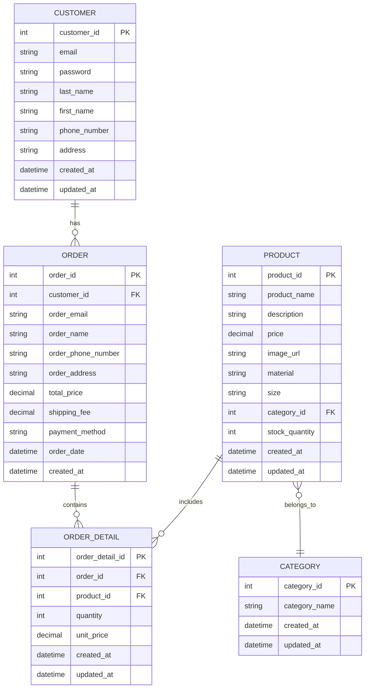
```mermaid
erDiagram
    CUSTOMER ||--o{ ORDER : has
    ORDER ||--o{ ORDER_DETAIL : contains
    PRODUCT ||--o{ ORDER_DETAIL : includes
    PRODUCT }o--|| CATEGORY : belongs_to

    CUSTOMER {
        int customer_id PK
        string email
        string password
        string last_name
        string first_name
        string phone_number
        string address
        datetime created_at
        datetime updated_at
    }

    PRODUCT {
        int product_id PK
        string product_name
        string description
        decimal price
        string image_url
        string material
        string size
        int category_id FK
        int stock_quantity
        datetime created_at
        datetime updated_at
    }

    CATEGORY {
        int category_id PK
        string category_name
        datetime created_at
        datetime updated_at
    }

    ORDER {
        int order_id PK
        int customer_id FK
        string order_email
        string order_name
        string order_phone_number
        string order_address
        decimal total_price
        decimal shipping_fee
        string payment_method
        datetime order_date
        datetime created_at
    }

    ORDER_DETAIL {
        int order_detail_id PK
        int order_id FK
        int product_id FK
        int quantity
        decimal unit_price
        datetime created_at
        datetime updated_at
    }
```

### 6.3 インデックス一覧

| テーブル名   | インデックス名       | 対象カラム   | 用途・補足                     |
|--------------|----------------------|--------------|-------------------------------|
| CUSTOMER     | idx_customer_email   | email        | ログイン認証用ユニーク検索     |
| PRODUCT      | idx_product_category | category_id  | 商品一覧のカテゴリ絞り込み     |
| ORDER        | idx_order_customer   | customer_id  | 顧客別注文履歴の高速検索       |
| ORDER_DETAIL | idx_detail_order     | order_id     | 注文明細の注文単位検索         |
| ORDER_DETAIL | idx_detail_product   | product_id   | 商品別の注文明細検索           |

※ 主キーにはデフォルトでユニークインデックスが作成される。

---

### 6.4 トランザクション設計方針

#### 基本方針

- 関連データ操作（特に注文処理・会員登録）においては、**トランザクション処理で整合性を担保**
- 複数テーブルにまたがる処理は原子性（Atomicity）を確保し、**失敗時にはロールバック**
- **排他制御（SELECT FOR UPDATEなど）**　を用いて同時更新を防止

#### トランザクション対象処理

| 処理名       | 対象テーブル              | ロールバック条件             |
|--------------|---------------------------|------------------------------|
| 注文確定処理 | ORDER, ORDER_DETAIL       | いずれかのINSERT失敗         |
| 会員登録処理 | CUSTOMER                  | INSERT失敗                   |
| 会員情報更新 | CUSTOMER                  | UPDATE失敗                   |
| 在庫更新     | PRODUCT                   | UPDATE失敗                   |


#### ロールバック時の処理内容

| 処理名      | 対象コントローラー | 時点・操作             | メッセージ                                                |
| -------- | --------- | ----------------- | ---------------------------------------------------- |
| 注文処理失敗   | ORDER     | 注文確定ボタン押下後、DB登録時  | 注文処理に失敗しました。ネットワーク環境や商品在庫をご確認のうえ、再度お試しください。          |
| 会員情報登録失敗 | CUSTOMER  | 会員登録フォーム送信後       | 会員登録に失敗しました。入力内容をご確認のうえ、再度お試しください。                   |
| 会員情報更新失敗 | CUSTOMER  | 会員情報更新ボタン押下後      | 会員情報の更新に失敗しました。再度お試しください。操作が繰り返し失敗する場合はサポートへご連絡ください。 |
| 在庫更新失敗   | PRODUCT   | 注文確定処理中、在庫UPDATE時 | 在庫の更新に失敗しました。在庫状況が変動した可能性があります。カート内容を確認してください。       |


#### 排他制御

- トランザクションの粒度は「画面単位」とし、ロックは必要最小限に限定

## 7. 画面項目定義
### 7.1 画面一覧
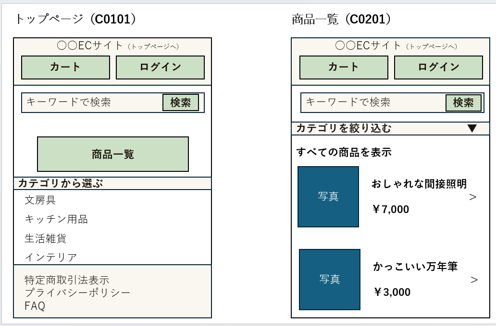
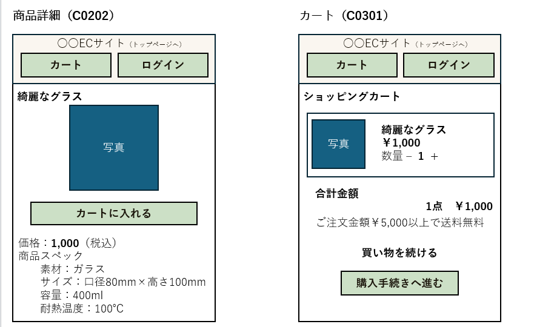

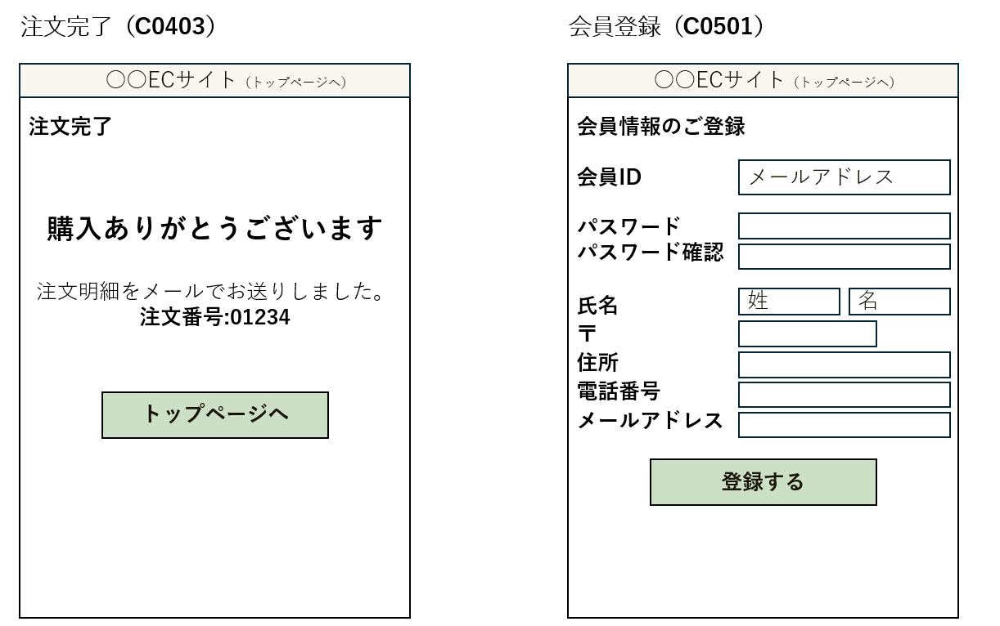
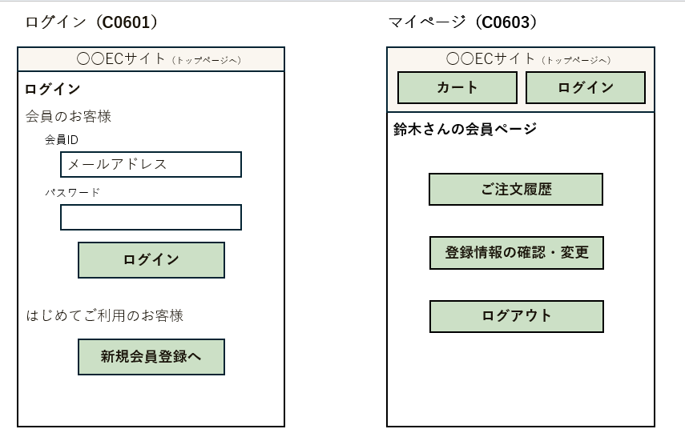
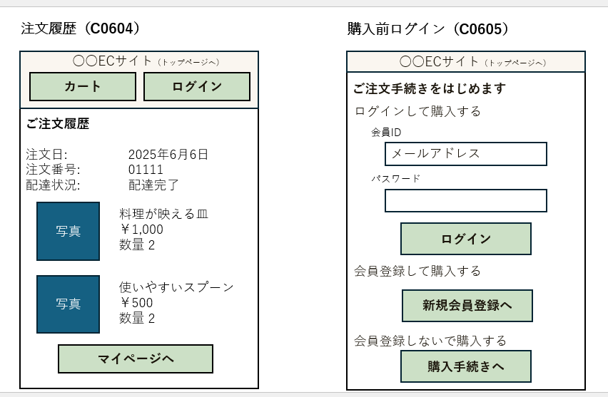
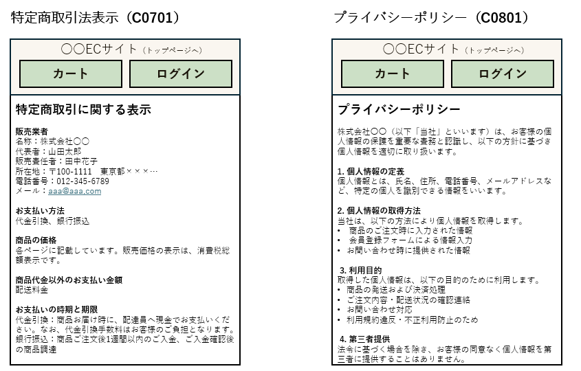
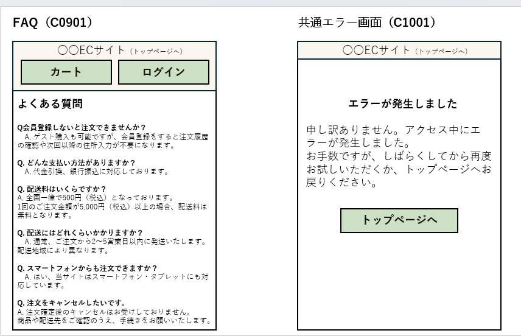

### 7.2 画面項目定義書
| 要素ID       | 画面ID | 項目名               | 要素種別           | 動作・備考                                   | 桁数制限     | バリデーションルール                               | エラーメッセージ                          |
|--------------|--------|----------------------|--------------------|----------------------------------------------|--------------|----------------------------------------------------|-------------------------------------------|
| C0101_L01    | C0101  | ○○ECサイト           | リンク             | トップページ(C0101)に遷移                    | なし         |                                                    |                                           |
| C0101_L02    | C0101  | カート               | リンク             | カート(C0301)に遷移                          | なし         |                                                    |                                           |
| C0101_L03    | C0101  | ログイン             | リンク             | ログイン(C0601)に遷移                        | なし         |                                                    |                                           |
| C0101_TI01   | C0101  | キーワード検索       | テキスト入力       | 入力内容を検索条件として送信                  | 最大50文字   | 全角・半角文字、数字を許容。記号（"・"など）も可 | キーワードは50文字以内で入力してください |
| C0101_B01    | C0101  | 検索                 | ボタン             | 入力値をパラメータとして送信、商品一覧（C0201）に遷移 | なし         |                                                    |                                           |
| C0101_D01    | C0101  | カテゴリから選ぶ     | 表示項目           | ラベル                                       | なし         |                                                    |                                           |
| C0101_L04    | C0101  | 文房具               | リンク             | カテゴリ絞り込みで商品一覧（C0201）に遷移   | なし         |                                                    |                                           |
| C0101_L05    | C0101  | キッチン用品         | リンク             | カテゴリ絞り込みで商品一覧（C0201）に遷移   | なし         |                                                    |                                           |
| C0101_L06    | C0101  | 生活雑貨             | リンク             | カテゴリ絞り込みで商品一覧（C0201）に遷移   | なし         |                                                    |                                           |
| C0101_L07    | C0101  | インテリア           | リンク             | カテゴリ絞り込みで商品一覧（C0201）に遷移   | なし         |                                                    |                                           |
| C0101_L08    | C0101  | 特定商取引法表示     | リンク             | 特定商取引法表示(C0701)に遷移                | なし         |                                                    |                                           |
| C0101_L09    | C0101  | プライバシーポリシー | リンク             | プライバシーポリシー(C0801)に遷移            | なし         |                                                    |                                           |
| C0101_L10    | C0101  | FAQ                  | リンク             | FAQ(C0901)に遷移                            | なし         |                                                    |                                           |
| C0201_L01    | C0201  | ○○ECサイト           | リンク             | トップページ(C0101)に遷移                    | なし         |                                                    |                                           |
| C0201_L02    | C0201  | カート               | リンク             | カート(C0301)に遷移                          | なし         |                                                    |                                           |
| C0201_L03    | C0201  | ログイン             | リンク             | ログイン(C0601)に遷移                        | なし         |                                                    |                                           |
| C0201_TI01   | C0201  | キーワード検索       | テキスト入力       | 入力内容を検索条件として送信                  | 最大50文字   | 全角・半角文字、数字を許容。記号（"・"など）も可 | キーワードは50文字以内で入力してください |
| C0201_B01    | C0201  | 検索                 | ボタン             | 入力値をパラメータとして送信、商品一覧再表示 | なし         |                                                    |                                           |
| C0201_SB01   | C0201  | カテゴリを絞り込む   | セレクトボックス   | 選択後、カテゴリに応じて商品一覧に遷移       | なし         |                                                    |                                           |
| C0201_L04    | C0201  | すべての商品を表示   | リンク             | 絞り込み解除、全商品一覧を表示               | なし         |                                                    |                                           |
| C0201_L05    | C0201  | 商品一覧リスト       | 繰り返しリンク     | 各商品ブロックリンクを繰り返し表示           | なし         |                                                    |                                           |
| C0201_D01    | C0201  | 画像                 | 表示項目           | 商品画像表示                                 | なし         |                                                    |                                           |
| C0201_D02    | C0201  | 商品名               | 表示項目           | 商品名テキスト表示                           | なし         |                                                    |                                           |
| C0201_D03    | C0201  | 価格                 | 表示項目           | 価格表示（税込）                             | なし         |                                                    |                                           |
| C0201_L06    | C0201  | >                    | リンク             | 商品詳細(0202)に遷移                         | なし         |                                                    |                                           |
| C0202_L01    | C0202  | ○○ECサイト           | リンク             | トップページ(C0101)に遷移                    | なし         |                                                    |                                           |
| C0202_L02    | C0202  | カート               | リンク             | カート(C0301)に遷移                          | なし         |                                                    |                                           |
| C0202_L03    | C0202  | ログイン             | リンク             | ログイン(C0601)に遷移                        | なし         |                                                    |                                           |
| C0202_D01    | C0202  | 商品名               | 表示項目           | 商品名を表示                               | なし         |                                                    |                                           |
| C0202_D02    | C0202  | 写真                 | 表示項目           | 商品画像の大きい表示                         | なし         |                                                    |                                           |
| C0202_B01    | C0202  | カートに入れる       | ボタン             | カート(C0301)へ商品追加                      | なし         |                                                    |                                           |
| C0202_D03    | C0202  | 価格                 | 表示項目           | 価格表示                                   | なし         |                                                    |                                           |
| C0202_D04    | C0202  | 商品スペック         | 表示項目           | 商品の詳細仕様（サイズ、素材など）           | なし         |                                                    |                                           |
| C0301_L01    | C0301  | ○○ECサイト           | リンク             | トップページ(C0101)に遷移                    | なし         |                                                    |                                           |
| C0301_L02    | C0301  | カート               | リンク             | カート(C0301)に遷移                          | なし         |                                                    |                                           |
| C0301_L03    | C0301  | ログイン             | リンク             | ログイン(C0601)に遷移                        | なし         |                                                    |                                           |
| C0301_D01    | C0301  | ショッピングカート   | 表示項目           | カート内商品の一覧表示                       | なし         |                                                    |                                           |
| C0301_D02    | C0301  | 商品ブロック         | 表示項目           | 各商品1件分の情報ブロック                   | なし         |                                                    |                                           |
| C0301_D03    | C0301  | 写真                 | 表示項目           | 商品画像表示                               | なし         |                                                    |                                           |
| C0301_D04    | C0301  | 商品名               | 表示項目           | 商品名表示                                 | なし         |                                                    |                                           |
| C0301_D05    | C0301  | 価格                 | 表示項目           | 価格表示                                   | なし         |                                                    |                                           |
| C0301_NS01   | C0301  | 数量                 | 数値入力＋スピンボタン | 「＋」「－」で数量を変更                  | 1～999       | （初期値1、0未満不可）                           |                                           |
| C0301_D06    | C0301  | 合計金額             | 表示項目           | 商品合計金額表示                           | なし         |                                                    |                                           |
| C0301_D07    | C0301  | 送料無料条件         | 表示項目           | ご注文金額￥5,000以上で送料無料表示         | なし         |                                                    |                                           |
| C0301_L04    | C0301  | 買い物を続ける       | リンク             | 商品一覧(C0201)に遷移                       | なし         |                                                    |                                           |
| C0301_L05    | C0301  | 購入手続きへ進む     | リンク             | 注文情報入力(C0401)に遷移                   | なし         |                                                    |                                           |
| C0401_L01    | C0401  | ○○ECサイト           | リンク             | トップページ(C0101)に遷移                    | なし         |                                                    |                                           |
| C0401_D01    | C0401  | ご注文商品           | 表示項目           | 注文商品一覧表示                           | なし         |                                                    |                                           |
| C0401_D02    | C0401  | 商品名               | 表示項目           | 商品名表示                                 | なし         |                                                    |                                           |
| C0401_D03    | C0401  | 数量                 | 表示項目           | 注文数量表示                               | なし         |                                                    |                                           |
| C0401_D04    | C0401  | 価格                 | 表示項目           | 単価表示                                   | なし         |                                                    |                                           |
| C0401_D05    | C0401  | 商品小計（点数）     | 表示項目           | 小計金額、購入点数表示                     | なし         |                                                    |                                           |
| C0401_D06    | C0401  | 送料                 | 表示項目           | ￥500（合計金額が￥5000未満）or￥０（合計金額が￥5000以上） | なし         |                                                    |                                           |
| C0401_D07    | C0401  | 合計金額             | 表示項目           | 合計金額表示                               | なし         |                                                    |                                           |
| C0401_D08    | C0401  | お届け先             | 表示項目           | お届け先情報ブロック                       | なし         |                                                    |                                           |
| C0401_D09    | C0401  | 氏名                 | 表示項目           | お届け先氏名表示                           | なし         |                                                    |                                           |
| C0401_TI01   | C0401  | 姓入力欄             | テキスト入力       | 氏名の姓入力                               | 最大20文字   | 全角・半角文字を許容。英字・日本語どちらも可     | 姓は20文字以内で入力してください           |
| C0401_TI02   | C0401  | 名入力欄             | テキスト入力       | 氏名の名入力                               | 最大20文字   | 全角・半角文字を許容。英字・日本語どちらも可     | 名は20文字以内で入力してください           |
| C0401_D10    | C0401  | 〒                    | 表示項目           | 郵便番号ラベル                           | なし         |                                                    |                                           |
| C0401_TI03   | C0401  | 郵便番号入力欄       | テキスト入力       | 郵便番号入力                               | 固定7桁     | 数字7桁（ハイフンなし）                           | 郵便番号はハイフンなし半角数字7桁で入力してください（例：1234567） |
| C0401_D11    | C0401  | 住所                 | 表示項目           | 住所ラベル                                 | なし         |                                                    |                                           |
| C0401_TI04   | C0401  | 住所入力欄           | テキスト入力       | 住所入力                                   | 最大100文字 | 全角・半角文字、数字、「-」等の記号を許容           | 住所は100文字以内で入力してください           |
| C0401_D12    | C0401  | 電話番号             | 表示項目           | 電話番号ラベル                             | なし         |                                                    |                                           |
| C0401_TI05   | C0401  | 電話番号入力欄       | テキスト入力       | 電話番号入力                               | 最大15文字  | 数字のみ（ハイフンなし）                           | 電話番号は15桁以内のハイフンなし半角数字で入力してください     |
| C0401_D13    | C0401  | メールアドレス       | 表示項目           | メールラベル                               | なし         |                                                    |                                           |
| C0401_TI06   | C0401  | メールアドレス入力欄 | テキスト入力       | メールアドレス入力                         | 最大254文字 | 「xxx@yyy.zzz」形式（RFC準拠）。（半角英数字）        | 有効なメールアドレスを入力してください             |
| C0401_D14    | C0401  | お支払方法           | 表示項目           | 支払方法ラベル                             | なし         |                                                    |                                           |
| C0401_RB01   | C0401  | 代金引換             | ラジオボタン       | 支払方法選択肢                             | なし         |                                                    |                                           |
| C0401_RB02   | C0401  | 銀行振込             | ラジオボタン       | 支払方法選択肢                             | なし         |                                                    |                                           |
| C0401_B01    | C0401  | 注文確認へ           | ボタン             | 注文確認画面(C0402)に遷移                 | なし         |                                                    |                                           |
| C0402_D01    | C0402  | ご注文商品           | 表示項目           | 注文商品一覧表示                           | なし         |                                                    |                                           |
| C0402_D02    | C0402  | 商品名               | 表示項目           | 商品名表示                                 | なし         |                                                    |                                           |
| C0402_D03    | C0402  | 数量                 | 表示項目           | 注文数量表示                               | なし         |                                                    |                                           |
| C0402_D04    | C0402  | 価格                 | 表示項目           | 単価表示                                   | なし         |                                                    |                                           |
| C0402_D05    | C0402  | 商品小計（点数）     | 表示項目           | 小計点数表示                               | なし         |                                                    |                                           |
| C0402_D06    | C0402  | 送料                 | 表示項目           | 送料表示                                   | なし         |                                                    |                                           |
| C0402_D07    | C0402  | 合計金額             | 表示項目           | 合計金額表示                               | なし         |                                                    |                                           |
| C0402_D08    | C0402  | お届け先             | 表示項目           | お届け先情報表示                           | なし         |                                                    |                                           |
| C0402_D09    | C0402  | 氏名                 | 表示項目           | 氏名表示                                   | なし         |                                                    |                                           |
| C0402_D10    | C0402  | 〒                    | 表示項目           | 郵便番号表示                             | なし         |                                                    |                                           |
| C0402_D11    | C0402  | 住所                 | 表示項目           | 住所表示                                   | なし         |                                                    |                                           |
| C0402_D12    | C0402  | 電話番号             | 表示項目           | 電話番号表示                               | なし         |                                                    |                                           |
| C0402_D13    | C0402  | メールアドレス       | 表示項目           | メールアドレス表示                         | なし         |                                                    |                                           |
| C0402_D14    | C0402  | お支払方法           | 表示項目           | 支払方法表示                               | なし         |                                                    |                                           |
| C0402_B01    | C0402  | 注文を確定する       | ボタン             | 注文確定処理実行                           | なし         |                                                    |                                           |
| C0403_L01    | C0403  | ○○ECサイト           | リンク             | トップページ(C0101)に遷移                  | なし         |                                                    |                                           |
| C0403_D01    | C0403  | 購入ありがとう       | 表示項目           | 購入ありがとうございます。注文明細をメールで送付しました。 | なし         |                                                    |                                           |
| C0403_D02    | C0403  | 注文番号             | 表示項目           | 注文番号表示                               | なし         |                                                    |                                           |
| C0403_L02    | C0403  | トップページへ       | リンク             | トップページ(C0101)に遷移                  | なし         |                                                    |                                           |
| C0501_L01    | C0501  | ○○ECサイト           | リンク             | トップページ(C0101)に遷移                  | なし         |                                                    |                                           |
| C0501_D01    | C0501  | 会員情報のご登録     | 表示項目           | 画面タイトル                               | なし         |                                                    |                                           |
| C0501_D02    | C0501  | 会員ID               | 表示項目           | 会員ID表示（変更不可）                     | なし         |                                                    |                                           |
| C0501_TI01   | C0501  | メールアドレス入力欄 | テキスト入力       | メールアドレス入力                         | 最大254文字 | 「xxx@yyy.zzz」形式（RFC準拠）。（半角英数字）        | 有効なメールアドレスを入力してください             |
| C0501_D03    | C0501  | パスワード           | 表示項目           | ラベル                                     | なし         |                                                    |                                           |
| C0501_TI02   | C0501  | パスワード入力欄     | テキスト入力       | パスワード入力                             | 8～32文字   | 半角英字・数字。記号（@#$など）も可                   | パスワードは8～32文字の半角英数字で入力してください     |
| C0501_D04    | C0501  | パスワード確認       | 表示項目           | ラベル                                     | なし         |                                                    |                                           |
| C0501_TI03   | C0501  | パスワード入力欄     | テキスト入力       | 確認用パスワード入力                       | 8～32文字   | 同一画面内のパスワード入力欄の値と一致していること     | 確認用パスワードが一致しません                   |
| C0501_D05    | C0501  | 氏名                 | 表示項目           | ラベル                                     | なし         |                                                    |                                           |
| C0501_TI04   | C0501  | 姓入力欄             | テキスト入力       | 氏名の姓入力                               | 最大20文字 | 全角・半角文字を許容。英字・日本語どちらも可           | 姓は20文字以内で入力してください                   |
| C0501_TI05   | C0501  | 名入力欄             | テキスト入力       | 氏名の名入力                               | 最大20文字 | 全角・半角文字を許容。英字・日本語どちらも可           | 名は20文字以内で入力してください                   |
| C0501_D06    | C0501  | 〒                    | 表示項目           | 郵便番号ラベル                             | なし         |                                                    |                                           |
| C0501_TI06   | C0501  | 郵便番号入力欄       | テキスト入力       | 郵便番号入力                               | 固定7桁     | 数字7桁（ハイフンなし）                               | 郵便番号はハイフンなし半角数字7桁で入力してください（例：1234567） |
| C0501_D07    | C0501  | 住所                 | 表示項目           | ラベル                                     | なし         |                                                    |                                           |
| C0501_TI07   | C0501  | 住所入力欄           | テキスト入力       | 住所入力                                   | 最大100文字 | 全角・半角文字、数字、「-」等の記号を許容               | 住所は100文字以内で入力してください                   |
| C0501_D08    | C0501  | 電話番号             | 表示項目           | ラベル                                     | なし         |                                                    |                                           |
| C0501_TI08   | C0501  | 電話番号入力欄       | テキスト入力       | 電話番号入力                               | 最大15文字 | 数字のみ（ハイフンなし）                               | 電話番号は15桁以内のハイフンなし半角数字で入力してください     |
| C0501_B01    | C0501  | 登録する             | ボタン             | 会員登録処理                               | なし         |                                                    |                                           |
| C0601_L01    | C0601  | ○○ECサイト           | リンク             | トップページ(C0101)に遷移                  | なし         |                                                    |                                           |
| C0601_D01    | C0601  | ログイン             | 表示項目           | 画面タイトル                               | なし         |                                                    |                                           |
| C0601_D02    | C0601  | 会員のお客様         | 表示項目           | ラベル                                     | なし         |                                                    |                                           |
| C0601_TI01   | C0601  | メールアドレス入力欄 | テキスト入力       | メールアドレス入力                         | 最大254文字 | 「xxx@yyy.zzz」形式（RFC準拠）。（半角英数字）            | 有効なメールアドレスを入力してください             |
| C0601_D03    | C0601  | パスワード           | 表示項目           | ラベル                                     | なし         |                                                    |                                           |
| C0601_TI02   | C0601  | パスワード入力欄     | テキスト入力       | パスワード入力                             | 8～32文字   | 半角英字・数字。記号（@#$など）も可                     | パスワードは8～32文字の半角英数字で入力してください     |
| C0601_B01    | C0601  | ログイン             | ボタン             | ログイン処理                               | なし         |                                                    |                                           |
| C0601_L02    | C0601  | はじめてご利用のお客様 | リンク             | 会員登録画面(C0501)に遷移                 | なし         |                                                    |                                           |
| C0603_L01    | C0603  | ○○ECサイト           | リンク             | トップページ(C0101)に遷移                  | なし         |                                                    |                                           |
| C0603_L02    | C0603  | カート               | リンク             | カート(C0301)に遷移                        | なし         |                                                    |                                           |
| C0603_L03    | C0603  | ログイン             | リンク             | ログイン(C0601)に遷移                      | なし         |                                                    |                                           |
| C0603_D01    | C0603  | 姓　さんの会員ページ | 表示項目           | ログインユーザー名表示                     | なし         |                                                    |                                           |
| C0603_L04    | C0603  | ご注文履歴           | リンク             | 注文履歴画面(C0604)に遷移                 | なし         |                                                    |                                           |
| C0603_L05    | C0603  | 登録情報の確認・変更 | リンク             | 会員情報変更画面(C0501)に遷移             | なし         |                                                    |                                           |
| C0603_B01    | C0603  | ログアウト           | ボタン             | ログアウト処理                             | なし         |                                                    |                                           |
| C0604_L01    | C0604  | ○○ECサイト           | リンク             | トップページ(C0101)に遷移                  | なし         |                                                    |                                           |
| C0604_L02    | C0604  | カート               | リンク             | カート(C0301)に遷移                        | なし         |                                                    |                                           |
| C0604_L03    | C0604  | ログイン             | リンク             | ログイン(C0601)に遷移                      | なし         |                                                    |                                           |
| C0604_D01    | C0604  | ご注文履歴           | 表示項目           | 注文履歴一覧表示                         | なし         |                                                    |                                           |
| C0604_D02    | C0604  | 注文日               | 表示項目           | 注文日表示                                 | なし         |                                                    |                                           |
| C0604_D03    | C0604  | 注文番号             | 表示項目           | 注文番号表示                               | なし         |                                                    |                                           |
| C0604_D04    | C0604  | 配達状況             | 表示項目           | 配達状況表示                               | なし         |                                                    |                                           |
| C0604_D05    | C0604  | 商品名               | 表示項目           | 商品名表示                                 | なし         |                                                    |                                           |
| C0604_D06    | C0604  | 価格                 | 表示項目           | 価格表示                                   | なし         |                                                    |                                           |
| C0604_D07    | C0604  | 数量                 | 表示項目           | 数量表示                                   | なし         |                                                    |                                           |
| C0604_B01    | C0604  | マイページへ         | ボタン             | マイページ(C0603)に遷移                   | なし         |                                                    |                                           |
| C0605_L01    | C0605  | ○○ECサイト           | リンク             | トップページ(C0101)に遷移                  | なし         |                                                    |                                           |
| C0605_D01    | C0605  | ご注文手続きを始めます | 表示項目           | 画面タイトル                               | なし         |                                                    |                                           |
| C0605_B01    | C0605  | ログインして購入する | ボタン             | ログイン画面(C0601)に遷移                 | なし         |                                                    |                                           |
| C0605_D02    | C0605  | 会員ID               | 表示項目           | ラベル                                     |              |                                                    |                                           |
| C0605_TI01   | C0605  | メールアドレス入力欄 | テキスト入力       | メールアドレス入力                         | 最大254文字 | 「xxx@yyy.zzz」形式（RFC準拠）。（半角英数字）            | 有効なメールアドレスを入力してください             |
| C0605_D03    | C0605  | パスワード           | 表示項目           | ラベル                                     | なし         |                                                    |                                           |
| C0605_TI02   | C0605  | パスワード入力欄     | テキスト入力       | パスワード入力                             | 8～32文字   | 半角英字・数字。記号（@#$など）も可                     | パスワードは8～32文字の半角英数字で入力してください     |
| C0605_B02    | C0605  | 会員登録して購入する | ボタン             | 会員登録画面(C0501)に遷移                 | なし         |                                                    |                                           |
| C0605_L02    | C0605  | 新規会員登録へ       | リンク             | 会員登録画面(C0501)に遷移                 | なし         |                                                    |                                           |
| C0605_B03    | C0605  | 会員登録しないで購入する | ボタン             | ゲスト購入手続き(C0401)に遷移             | なし         |                                                    |                                           |
| C0605_B04    | C0605  | 購入手続きへ         | ボタン             | 注文情報入力(C0401)に遷移                 | なし         |                                                    |                                           |
| C0701_L01    | C0701  | ○○ECサイト           | リンク             | トップページ(C0101)に遷移                  | なし         |                                                    |                                           |
| C0701_D01    | C0701  | 特定商取引法に関する表示 | 表示項目           | 特定商取引法表示表示                       | なし         |                                                    |                                           |
| C0801_L01    | C0801  | ○○ECサイト           | リンク             | トップページ(C0101)に遷移                  | なし         |                                                    |                                           |
| C0801_D01    | C0801  | プライバシーポリシー | 表示項目           | プライバシーポリシー表示                   | なし         |                                                    |                                           |
| C0901_L01    | C0901  | ○○ECサイト           | リンク             | トップページ(C0101)に遷移                  | なし         |                                                    |                                           |
| C0901_D01    | C0901  | FAQ                  | 表示項目           | FAQ表示                                   | なし         |                                                    |                                           |
| C1001_L01    | C1001  | ○○ECサイト           | リンク             | トップページ(C0101)に遷移                  | なし         |                                                    |                                           |
| C1001_D01    | C1001  | エラーが発生しました | 表示項目           | エラーメッセージ表示                       | なし         |                                                    |                                           |
| C1001_L02    | C1001  | トップページへ       | リンク             | トップページ(C0101)に遷移                  | なし         |                                                    |                                           |


### 7.3 共通エラーメッセージ一覧
共通エラー画面(C1001)を表示
## 8. 非機能要件詳細

### 8.1 セキュリティ

**認証・認可**
- 認証はセッションベース（HTTP Cookie）で実施し、ログイン後にセッションIDを発行し、ブラウザのCookieに格納して認証に利用する。
- 認可はロールベースアクセス制御（RBAC）を採用し、一般ユーザを対象に各画面・API単位でアクセス権限を定義する。
- セッションIDはHTTPOnly属性とSecure属性を設定し、JavaScriptから参照できないようにしつつHTTPS通信限定とする。

**通信の保護**
- 全ての通信はHTTPS（TLS1.2以上）により暗号化し、平文データが送信されないようにする。
- サーバ証明書の期限は監視対象とし、有効期限切れがないよう自動更新または計画的な差替を行う。

**アプリケーションレベルの対策**
- SQLインジェクション対策として、プリペアドステートメント（PreparedStatement）を使用し、ユーザ入力はすべてバインド変数を通じて処理する。
- XSS対策として、出力箇所で適切なHTMLエスケープを行い、ヘッダに `X-Frame-Options: DENY`、`X-Content-Type-Options: nosniff` を付与する。
- 外部からの入力は全項目でサーバサイドバリデーションを実施し、不正値が登録・処理されないようにする。

---

### 8.2 性能

**性能目標**
- API・画面表示のレスポンスは通常時に3秒以内の応答を目指す。
- データベースアクセス（一般的なSELECT）は0.1秒未満で完了することを基準とする。

**実現のための工夫**
- ページネーション（limit/offset）を用い、大量データを一括返却しない設計とする。
- 頻繁に検索されるカラムや条件にインデックスを設定し、テーブルフルスキャンを回避する。
- マスタ系データはアプリケーション起動時にメモリにキャッシュする方式を採用し、DBアクセス回数を抑制する。
- N+1問題を避けるため、ORM（JPA/Hibernate）のFetchTypeを適切に設定し、必要に応じてJOIN FETCHでまとめて取得する。

---

### 8.3 可用性

**可用性確保の方針**
- プロセスは `systemd` により監視し、異常終了時には自動再起動する設定を行う。
- データベースは単一構成（シンプルなマスタのみ）としつつ、障害発生時には手動で迅速に復旧できる手順を整備する。

---

### 8.4 バックアップ・リストア

**バックアップ**
- データベースは `pg_dump` による日次フルバックアップを取得し、必要に応じてWALアーカイブ（Write Ahead Log）を利用し、増分リカバリを可能とする。
- ファイルアップロードを伴う場合はアップロードディレクトリも同様に日次でスナップショットを取得する。

**リストア**
- 障害発生時は、直近の `pg_dump` バックアップをリストア後、WALファイルを適用して障害発生直前まで復旧する。
- アプリケーションサーバ障害時は、新規インスタンスへ再デプロイし設定ファイルを復元することで短時間で復旧する。
